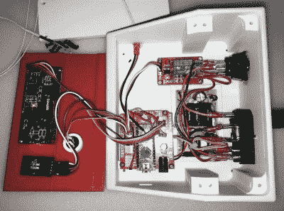

# Arduino 看门狗嗅出热的 3D 打印机

> 原文：<https://hackaday.com/2018/06/18/arduino-watchdog-sniffs-out-hot-3d-printers/>

我们知道我们已经告诉过你了，但是你真的应该密切关注你的 3D 打印机。更便宜的进口机器开始显示出令人担忧的烧毁趋势，要么是因为便宜的部件，要么是因为设计缺陷。可悲的是，这种事情发生的事实已经不存在争议。我们现在能做的最好的事情就是想办法降低已经部署在现场的所有打印机的风险。

 恕我一概而论，大多数 3D 打印机火灾似乎都是由于部件过热引起的。当然，这并不令人惊讶，因为 3D 打印机的零件会加热到数百度，并且必须在那里保持数小时。因此，[【孙斌】创造了一个非常精巧的装置，它可以密切关注各个地方打印机的温度](https://create.arduino.cc/projecthub/binsun148/3d-printer-thermal-runaway-watchdog-thermistor-tester-4a0ebb)，如果温度超出可接受的范围，就会切断电源。

该设备由 Arduino Nano 供电，并使用 1602 串行 LCD 和 KY040 旋转编码器来提供用户界面。用户可以用编码器旋钮设置关机温度，16×2 字符的 LCD 将实时显示当前温度和电源状态。

一旦达到或超过用户定义的温度，该设备就会通过光耦合器继电器切断打印机的电源。它还会发出一分钟的警报，这样该地区的任何人都会知道打印机需要立即处理。

我们最近报道了一种类似的设备，[最大限度地减少了打印机通电的时间](https://hackaday.com/2018/05/29/put-the-3d-printer-to-sleep-so-you-can-rest-easy/)，但检查温度并实时采取行动似乎是一个更好的选择。无论如何，我们仍然建议在你的基本 3D 打印机配件清单中增加一个烟雾探测器和灭火器[。](https://hackaday.com/2018/03/28/you-got-a-3d-printer-now-what-do-you-buy/)

 [https://www.youtube.com/embed/VQW4jaopT00?version=3&rel=1&showsearch=0&showinfo=1&iv_load_policy=1&fs=1&hl=en-US&autohide=2&wmode=transparent](https://www.youtube.com/embed/VQW4jaopT00?version=3&rel=1&showsearch=0&showinfo=1&iv_load_policy=1&fs=1&hl=en-US&autohide=2&wmode=transparent)

