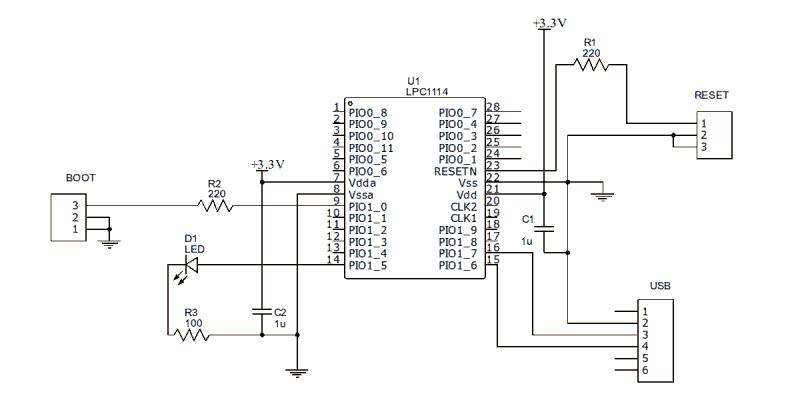

# 装备试验板——每个人都应该为一只手臂编程

> 原文：<https://hackaday.com/2015/10/09/arming-a-breadboard-everyone-should-program-an-arm/>

我总是有点惊讶，我们没有看到更多基于 ARM 的项目。当然，我们确实看到了一些，但数量不是我所期望的，因为低级别的 ARM 芯片便宜、功能强大、功耗低，而且容易获得。与传统的 Arduino 相比，拥有一个运行速度为 40 或 50 MIPS 的 32 位处理器和大量内存是一个游戏改变者(是的，Arduino Due 和 Zero 是基于 ARM 的，所以如果你想的话，你仍然可以继续使用 Arduino)。

一些事情可能会阻止 Arduino、AVR 或 PIC 用户做出这一转变。首先，大多数 ARM 芯片使用 3.3V I/O，而不是传统的 5V 电平(也有例外，如 Kinetis E)。曾经有一段时间，工具链很难建立，尽管这在很大程度上不再是一个问题。但最大的障碍可能是大多数芯片都是表面贴装器件。

当然，今天的建筑商已经非常习惯表面贴装器件，而且你也可以非常便宜地买到评估板。但在某些情况下——例如在教室里——直接安装在普通试验板上的芯片是非常有吸引力的。即使您不介意使用开发板，您也可能希望在项目的最终版本中直接使用 IC，有些人仍然喜欢使用通孔元件。

## 28 针解决方案

LPC1114FN28 处理器解决了大部分(如果不是全部)问题。与大多数其他 ARM 处理器不同，这款处理器采用 28 引脚 DIP 封装，在试验板上工作非常出色。它确实需要 3.3V 电压，但数字输入支持 5V 电压(当然，3.3V 输出通常可以驱动 5V 输入)。该芯片将与 mbed 或其他 ARM 工具一起工作，原型制作完成后，如果您愿意，您可以随时转移到表面贴装器件进行生产。即使你只买一台，你也应该能找到价格低于 6 美元的设备。

我最近想要一些学生用的试验板。我最终制作了一个插入试验板的简单 PCB，但回过头来看，这个简单的电路也可以直接放在试验板上工作。这是你需要的:

*   一个 LPC1114FN28
*   3.3V 电源
*   3.3V 或 5V USB 转串行电缆或适配器
*   一个或两个 220 欧姆的电阻(不是绝对必要的)
*   LED 和合适的电阻器(可选)
*   两个 0.1uF 电容(并非绝对必要)

如果你有一根输出 3.3V 电压的 USB 线，你可以用它直接驱动芯片。否则，您可以使用 LD1117-3.3 或 LM7833。台式电源或者插在试验板上的廉价电源也可以。只要记住，芯片需要在 1.8V 到 3.6V 之间工作。

## 构建硬件

电路非常简单，几乎不需要原理图。这里有一个:

[](https://hackaday.com/wp-content/uploads/2015/10/breadboard.png)

这种方法如此有效的一个原因是该芯片有一个内置的串行引导程序。如果将 PIO0_1 引脚短接至地，然后复位芯片，就可以轻松地将程序上传至器件。您可能只需将两个引脚短接至地即可(它们在内部被上拉)。然而，我喜欢串联一个小电阻(220 欧姆),以防软件出于某种原因驱动该引脚作为输出。

当然，如果您不想安装实际的引脚，原理图中的跳线(启动和复位)和连接器可以只是试验板电线。USB“连接器”假设引脚 2 接地，引脚 3 是 PC 的接收器，引脚 4 是发送器(即 LPC1114 在 16 号上通话，在 15 号上监听)。如果这与您的电缆或 RS232 转换器不匹配，请根据需要进行更换。

你可能还想根据你的 LED 来调整电阻值，但你不是在做手电筒，所以任何能发出可见光的电阻值都可以(或者，如果你不想让 LED 闪烁，就完全忽略它)。如果你是一个真正的极简主义者，你也可以抛弃 220 欧姆的电阻。电容有助于对电源去耦，但试验板已经有很大的电容，如果你有一个干净的电源，你可能也不需要这些。

因此，如果你有一个试验板和一个 USB 转串行适配器，你可以花大约 6 美元来构建这个的裸机版本，如果你必须购买所有东西，可能会花 15 美元来打破银行。当然，如果你想使用另一个 ARM 编程器/调试器，可以用有线方式代替 USB 电缆。但我猜如果你有这样的硬件，你已经解决了你的面包板问题。

这是我的(几乎)基本版本:

不漂亮，但很有效。我用了一个开关来重置，只用了一根电线来连接启动跳线。LED 有一个内部 5V 降压电阻，但在 3.3V 下工作良好(我去掉了其他两个电阻和电容)。要完成下面的软件示例，您需要将另一个 LED 连接到引脚 1，或者您只需提起试验板上的连接并重新调整 LED 的用途。不过要注意:mbed 代码假设您有一个连接到引脚 14 的 LED，如果发现运行时错误，它会闪烁。如果你移动 LED，你可能会有一个错误，不会得到指示。

## 软件

您可以使用任何能够为 LPC1114 生成代码的 ARM 工具链。有很多可供选择，但我将假设您刚刚开始，所以让我们使用 mbed 网站。在之前，我已经介绍过[如何使用 mbed 编程，你可能想看看下面的视频。](http://hackaday.com/2015/08/11/getting-started-with-arm-using-mbed/)

以下是您需要采取的步骤的快速总结:

*   前往[http://developer.mbed.org](http://developer.mbed.org)
*   如有必要，创建一个帐户并登录
*   点击平台并找到 LPC1114FN28(或[直接进入页面](https://developer.mbed.org/platforms/LPC1114FN28/)
*   单击“添加到 mbed 编译器”——如果您看到一个显示“删除”的按钮，则您已经完成了此操作
*   现在转到[项目页面](https://developer.mbed.org/users/wd5gnr/code/HaD1114Demo/)并导入项目
*   编译项目并下载 BIN 文件

一旦你有了 BIN 文件，你需要通过你的串口上传程序。我将使用名为 lpc21isp 的实用程序[来完成这项工作。你通常可以在你的 Linux 资源库中找到它，并且还有一个可用的 Windows 版本](https://github.com/capiman/lpc21isp)。如果你只是讨厌命令行，你可以随时使用 FlashMagic 或恩智浦官方 Windows 下载器。lpc21isp 也有一些 GUI 前端，但是使用命令行足够简单。

您将从 mbed 网站下载的文件将被命名为 HaD1114Demo_LPC1114.bin，除非您对其进行了更改(我假设它位于目录/tmp 中)。您还需要知道您的串行端口的名称(例如，COM1 或/dev/ttyUSB8)。你需要知道的最后一件事大概是 CPU 使用的时钟频率。在我们的例子中，它是 48 兆赫。下面是命令行:

```
lpc21isp -verify -bin /tmp/HaD1114Demo_LPC1114.bin /dev/ttyUSB8 115200 48000
```

您需要使用启动跳线，并在执行该命令行之前或之后立即重置芯片。115200 设置波特率，48000 是必需的，以便软件可以与引导加载程序同步。

一旦下载成功，lpc21isp 将告诉您它正在启动新代码。不要相信它——它还没有做任何事情。您需要断开启动跳线，然后再次重置 CPU。如果你喜欢只做一个闪烁的 LED，开始一个新项目，这是你可以在新项目中使用的样板例子之一。

## 代码内部

代码很简单。就像 Arduino 有许多助手库例程一样，mbed 提供了驱动 CPU 上的设备所需的大部分东西。还有一个为外部设备和示例代码共享库的活跃社区。下面是用于演示的简单代码:

```

#include &quot;mbed.h&quot;
PwmOut myled(dp1);
int main() 
{
 int i,j;
 while(1) 
 {
 for (j=0;j&lt;2;j++)
   for (i=0;i&lt;1000;i+=10)
    {
    float pwm=i/1000.0;
    myled=j?1.0-pwm:pwm;
    wait(0.01);
    }
 }
}

```

mbed 库经常使用浮点数。在示例代码中，PWM 的范围是从 0.0 到 1.0。等待调用使用秒，所以 0.01 是 10 毫秒(顺便说一下，有一个等待调用使用毫秒值)。

j 环路跟踪偶数或奇数通道，因此 PWM 在交替通道中反转。当 j 为零时，PWM 从 0 变为 1.0。当 j 不为零时，步长从 1.0 下降到 0。每一遍需要 100 步(从 0 到 1000，以 10 秒为单位计数)，因此每一遍的总时间约为 100 乘以 10 毫秒，即 1 秒。

## 下一步是什么？

mbed 库是一个起点，您可以在线阅读它的文档。如果你绑定了 Arduino 库，Github 上有[个端口(虽然我没试过)。然而，你可以升级到](https://github.com/scparker/CUSTom-ARDuino-LPC1114)[更大的工具，甚至在你准备好的时候调试](https://hackaday.com/2013/10/15/breadboarding-with-a-arm-microcontroller/)(在 Digikey 的 eewiki 上有[一组很好的例子，或者你可以继续使用 mbed](https://eewiki.net/display/microcontroller/Getting+Started+with+NXP's+LPC11XX+Cortex-M0+ARM+Microcontrollers) [和你自己的 IDE 和调试器](https://developer.mbed.org/handbook/Exporting-to-offline-toolchains))。如果你想要一个快速的原型安排，这个设置将很容易运行[一个非常好的第四，](https://hackaday.com/2015/08/30/go-forth-on-a-breadboard/)也是如此。如果你担心这不是真正的黑客攻击，你总是可以把芯片砍成字面上的尺寸(尽管我们不推荐)。

 [https://www.youtube.com/embed/cKbMyXl3yBA?version=3&rel=1&showsearch=0&showinfo=1&iv_load_policy=1&fs=1&hl=en-US&autohide=2&start=1&wmode=transparent](https://www.youtube.com/embed/cKbMyXl3yBA?version=3&rel=1&showsearch=0&showinfo=1&iv_load_policy=1&fs=1&hl=en-US&autohide=2&start=1&wmode=transparent)

