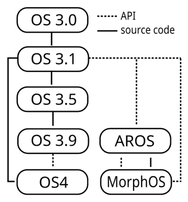

# AROS:像 1993 年一样运行 Amiga 操作系统

> 原文：<https://hackaday.com/2015/10/27/aros-run-an-amiga-os-like-its-1993/>

我们阅读了“Linux Action Show”播客的[Bryan Lunduke]关于古怪的开源操作系统的文章，它让我们在一个类似 Amiga 的操作系统(作为 VM 运行)中玩了一个小时。我们很确定你会遭受同样的命运。但更糟糕的是，这篇文章只是一系列文章中的第一篇。在可预见的未来，你的周末黑客生产力将不复存在。

[【AROS】](http://aros.sourceforge.net/)是 Amiga OS 的开源、API 兼容的重写版本。现在，AROS 不再是一个花里胡哨的人了。不，先生，AROS 项目开始于 1995 年，并在 Amiga OS API 版本 3.1 上解决，它仍然忠实于它的根源。

但这并不意味着你必须放弃 21 世纪的物质享受。给自己弄一个成熟的 [AROS 发行版](http://aros.sourceforge.net/download.php)，像 [icaros 桌面](http://www.icarosdesktop.org/)，你会发现其中包含了一个相当强大的应用生态系统。它基本上是你想从 Amiga 中得到的东西——游戏、音频、视频和图形编辑软件，基于 [WebKit 的浏览器](https://en.wikipedia.org/wiki/Origyn_Web_Browser)，甚至是[超小型文字处理器](http://desler.be/modules/wfchannel/)。

很复古，很性感，也很好玩。只是在角落里积满灰尘的废弃厕所里跑步的门票。(也有报道说运行在运行 Linux 的 Raspberry Pi 上。)还不服气？[旅鼠](http://www.old-games.com/download/600/lemmings)。