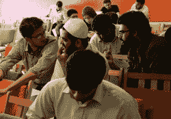
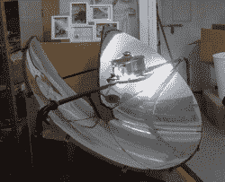
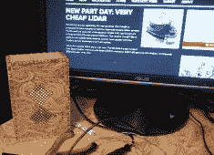
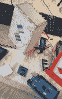
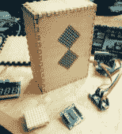
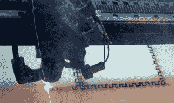
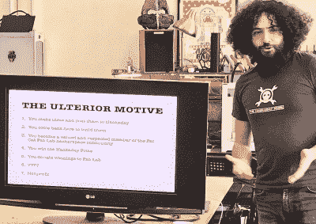
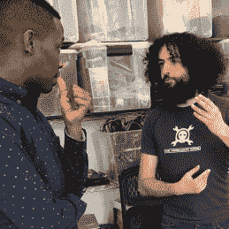
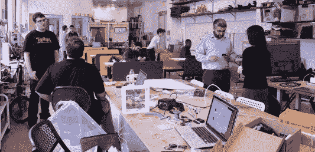
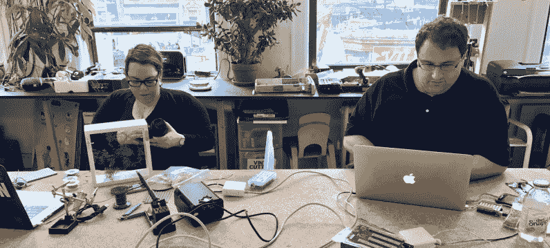

# 在世界创造日环游世界

> 原文：<https://hackaday.com/2017/04/25/around-the-globe-on-world-create-day/>

上周末对科学技术来说是伟大的。当成千上万的人走上街头抗议反智主义时，Hackaday 社区的一些成员坚持己见，打开了烙铁，并实际上为此做了一些事情。这是世界创造日，一个社区努力走到一起，建立一些重要的东西。这些人建造了什么？这么多了不起的东西。

### 巴基斯坦卡拉奇的嵌套 I/O

 在[巴基斯坦卡拉奇的 Nest I/O hacker space](https://hackaday.io/event/20891-hackaday-world-create-day-2017-at-the-nest-io)的人们为世界创造日举办了一场规模相当大的聚会，展出了最好的激光切割、眼睛瞪得大大的战斗机器人。[Nasir Aziz]在他最喜欢的 hackerspace 举办了一次聚会，让人们聚在一起讨论，为 Hackaday 奖做点什么。

会议的亮点是一场来自 EjaadTech 的讨论，这是一家从 Nest I/O 加速器毕业的工业设计公司。世界创造日期间发明的项目包括“购物助手无人机”和微型战斗机器人。一方面是有用的项目，另一方面是很棒的项目，就像我们喜欢的那样。

### 香港的马克尔贝

A solar oven found at MakerBay

MakerBay 是一个位于香港正中央的黑客空间。像大多数黑客空间一样，找到一个地方是个问题，但是 [MakerBay 的人们发现了一些惊人的东西](https://hackaday.io/event/21158-hk-hackaday-world-create-day-meetup-makerbay)。它们被划分为工业区，离火车站只有五分钟的步行路程。

MakerBay 周围有很多项目，包括一个太阳能烤箱，如果在阳光明媚的日子里放在户外，这将是非常危险的。甲板上还有小型帆船的原型，带有一个灵活的船体，用于跟踪和控制漏油。世界创造日的亮点包括[升级的木质建筑](https://www.youtube.com/watch?v=xvnutMKZ0zo)和[自发的钢琴插曲](https://www.youtube.com/watch?v=BM7Ya5_gS7I)。我很惊讶我还没见过更多有钢琴的黑客空间；如果你有一辆卡车和一个存放的地方，它们实际上是免费的。

### 里尔的 BlenderLab

虽然在法国里尔的 BlenderLab hackerspace 举办的世界创造日活动并没有打算用一个项目来改变世界，但他们确实设法设计出了一个非常漂亮的数字沙漏。这个沙漏的主体由激光切割的胶合板制成，显示屏由两个呈 45 度角的 LED 矩阵组成。

        

### 纽约黑客日

 

【扎克·弗里德曼】揭露他的阴谋

虽然世界创造日是一个挑战，让全球各地的黑客聚集在一起，创造一些解决问题的东西，但这并不意味着全球没有更多的官方活动。Hackaday 在纽约市、洛杉矶和旧金山组织了我们自己的活动。纽约的活动非常感谢我们可爱的东海岸社区经理[Shayna]和我们在肥猫 Fab Lab 的主人。

[扎克·弗里德曼]，我们纽约聚会的常客之一，有一个不可告人的动机，让肥猫 Fab Lab 成员向 Hackaday 奖贡献他们的想法:赢得 Hackaday 奖将导致*向 Fab Lab 捐赠奖金*。这是一个辉煌和曲折的阴谋，我们非常推荐。

      

### 告诉我们你的世界创造日

上周末，全球各地还有很多活动在进行，我们想听听你们的世界创造日进展如何。我们将在未来几天报道更多上周末的活动，所以请确保在 Hackaday.io 的世界创造日活动页面上添加您的图片、故事和您启动的项目的链接。活动组织者将因做出这一努力而获得[一些超级棒的奖品](http://hackaday.com/2017/04/17/organizers-of-world-create-day-are-getting-something-special/)。

The [HackadayPrize2017](https://hackaday.io/prize) is Sponsored by:   