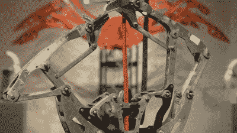

# 艺术和令人毛骨悚然的机制

> 原文：<https://hackaday.com/2016/08/05/art-and-creepy-mechanisms/>

拉脱维亚艺术家[Krists Pudzens]刚刚在瑞典举办了一场展览，并将他令人惊叹的动态雕塑视频发给了我们。(嵌在下面。)我们找到了一篇关于他的另一个展览的艺术理论文章来分享，但是我们有太多的技术问题，所以我们不得不给他回信询问细节。好家伙，他回答了。

在视频中，一对电子动画脸看着你，螃蟹般的爬绳机器人一寸一寸地向上爬，红色的翅膀在背景中扇动。这里有很多出色的机制，除了*不管它意味着什么*，我们只是喜欢看着机器前进。

细节！大多数零件是等离子切割钢或手工切割和归档铝，几乎所有的电机都是旧俄罗斯卡玛斯和 LADA 汽车的雨刷电机。在另一个装置中，红色翅膀(“红色女王的比赛”)被安装在一个公共广场上，用于跟踪人群，当人们更快地走过时，翅膀就会拍得更快。

机器人脸也使用 OpenCV 跟踪你，盯着你看。一个面具是真空成型塑料，另一个是聚酯树脂和凝胶涂层的副本。这是他们自己的视频，另一个是 T2 的发展。

两个爬绳者“不平衡力”，只是以不同的速度向上爬。我们非常好奇攀绳者到达顶峰后会发生什么。[Krists]说画廊工作人员抓起梯子去拿。当他在波兰用 20 米长的绳索展示它们时，它们实际上不得不雇佣专业的攀岩者。生活模仿艺术。

我们在 Hackaday 的一些人对科技艺术情有独钟，无论是 3D 打印的巴洛克式圆柱、金属折弯机的舞蹈、还是 T4 发光的铁磁流体球。黑客和艺术家有很多相同的“想知道如果…会发生什么”的倾向——看到可能性并把它们变成现实。

 [https://www.youtube.com/embed/NuDugftuaBI?version=3&rel=1&showsearch=0&showinfo=1&iv_load_policy=1&fs=1&hl=en-US&autohide=2&wmode=transparent](https://www.youtube.com/embed/NuDugftuaBI?version=3&rel=1&showsearch=0&showinfo=1&iv_load_policy=1&fs=1&hl=en-US&autohide=2&wmode=transparent)

