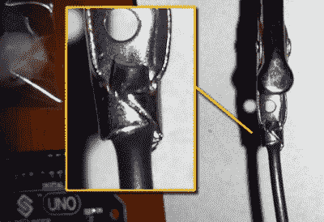

# 问 Hackaday:被鳄鱼夹咬了

> 原文：<https://hackaday.com/2017/02/25/ask-hackaday-bitten-by-the-crocodile-clip/>

我对鳄鱼夹又爱又恨。没有什么比在你的办公桌上快速拼凑几块半生不熟的原型机主板更快的了，但也没有什么比这更快地陷入混乱。我喜欢鳄鱼进来时漂亮的颜色范围，以及简单地夹在 PCB 或任何旧的松散电线上的能力。但是它们会松动，它们会有间歇性的接触，我们甚至不确定它们是否有电流额定值。

当[ [WarriorRocker](http://www.xodustech.com/) ]在询问我们用什么来代替鳄鱼夹时，他附上了一张让我不寒而栗的照片，来自亚马逊上的[对一些剪辑的评论。我在现实生活中见过这个。更糟糕的是，有松散的电线，有时与弹簧夹接触，有时不接触。](https://www.amazon.com/TOTOT-Inches-Test-Alligator-Clips/dp/B016LX8ZBU/ref=sr_1_7?rps=1&ie=UTF8&qid=1487301145&sr=8-7&keywords=alligator+clips&refinements=p_85%3A2470955011)

在大约十二年前的一个小时的调试会议后，这样一条断断续续的鳄鱼让我们许下了一生的誓言。我们所有的 croco-clip 都经过拆卸和人工检查，其中许多都是焊接在一起的。当我买新的时候，我会在把它们和已知的商品混在一起之前检查它们。即使现在想到这一点，我也想拉开他们的小橡胶靴，以确保安全。

但是间歇性并不是问题的唯一来源。你的 crocs 里面的电线有多粗？你确定它足够结实可以承受你通过的水流吗？你确定尖牙和你要夹住的东西有足够的接触吗？当然不是。你会怎么样？

所以我们把[WarriorRocker]的问题传递给你。对于有多少电流通过鳄鱼夹，你有什么经验法则吗？你把它们夹在什么上面，你避免什么？你是如何处理这种纠纷的？当他们从工厂出来的时候，你会相信他们吗？还是你也被咬了？你考虑过哪些替代方案，效果如何？还是有一些超高级鳄鱼夹制造商让我们用痛苦换取金钱？