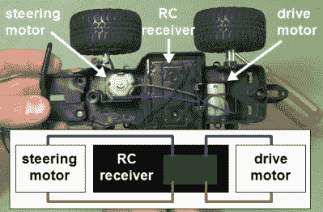
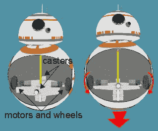
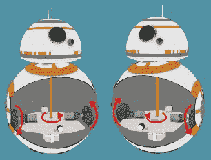
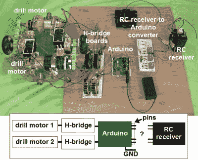
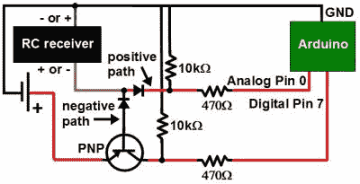
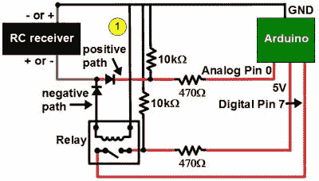
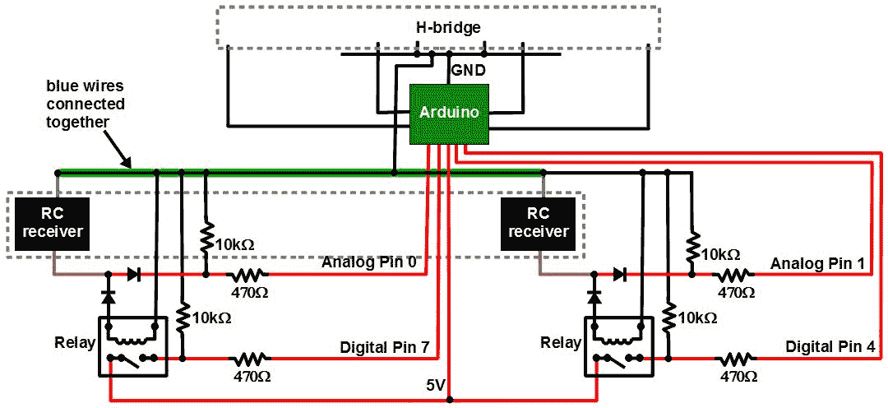
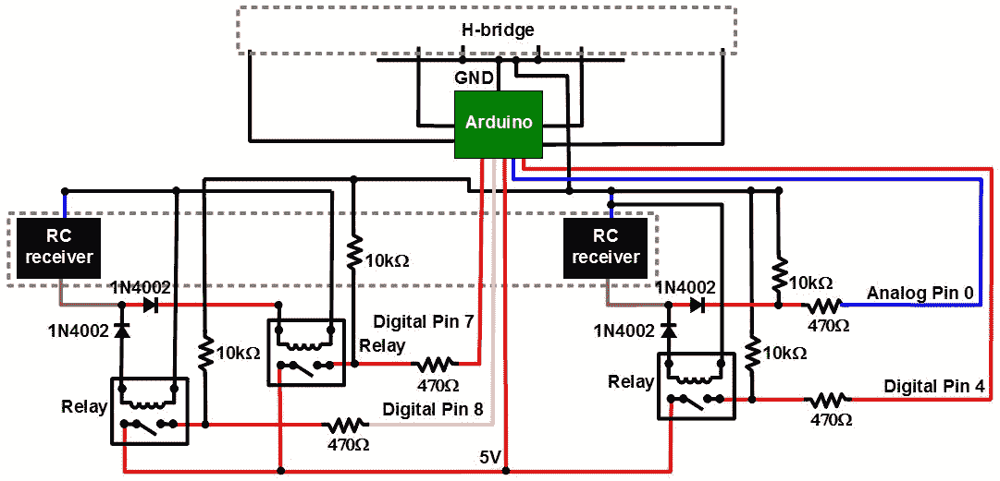

# 问 Hackaday:如何将负电压转换为正电压？

> 原文：<https://hackaday.com/2016/11/14/ask-hackaday-converting-negative-voltages-to-positive/>

我有很好的高压工作背景，对我来说这意味着超过 10，000 伏，但当谈到 RC 控制板和 H 桥所在的较低电压领域时，我有许多差距。在开发我的第一个真正的机器人 BB-8 droid 时，我在设计一个电路板时遇到了困难，这个电路板可以将 RC 接收器电路板的不同极性转换为 Arduino 专用的正电压。

今天的问题是，如何将负电压转换为正电压？

最后，我想出了一个可行的办法，但我相信有一个更优雅的解决方案，也许对那些在低压领域更熟练的人来说是显而易见的。接下来是我想出这个板的旅程。我所拥有的工作，但它仍然蚕食我的大脑，我很乐意看到 Hackaday 社区的技能和经验应用到这个简单而复杂的设计挑战。

## 问题是

RC toy truck and circuit with no common

我有一个遥控接收器，是从一辆玩具卡车上拿下来的。当它在卡车上时，它控制两个 DC 马达:一个用于前后驱动，另一个用于左右转向。这意味着电机被告知根据需要顺时针或逆时针旋转。要使 DC 马达朝一个方向旋转，你只需将两根电线单向连接，要让它朝另一个方向旋转，你就要将两根电线反过来，或者将极性反过来。没有一条输出线在 RC 接收器中是公共的，这是我艰难地发现的，你将在下面看到。

  Hamster type overview  Hamster type turning

我没有用玩具卡车的遥控接收器。我从卡车上提取了它，并用它来控制我的 BB-8 机器人。我的 BB-8 机器人有两个马达，配置成 BB-8 建造者世界中的[所谓的仓鼠驱动](http://hackaday.com/2016/06/24/driving-bb-8-more-than-one-way-to-move-this-bot/)，尽管更广为人知的是坦克驱动或差动驱动(见插图)。相对于机器人向同一个方向转动两个轮子，机器人就会向那个方向移动。反转两个轮子，它就向相反的方向行驶。让轮子向相反的方向转动，它就在原地转动。

The big picture – RC to drill motors

我的 BB-8 中的电机是钻孔电机，由两个 H 桥板控制。Arduino 对 H 桥板进行脉冲宽度调制以控制速度，并控制电机的转向。最后，RC 接收器告诉 Arduino 做什么。但是在 RC 接收器和 Arduino 之间需要一个转换器板，这也是本文的主题。请注意，Arduino 也是必要的，用于在 BB-8 机器人晃动时进行反击，并使声音与运动同步，但这些在这里没有提到。

由于每个电机有两个电机和两个方向，RC 接收器需要控制 Arduino 上的四个引脚，以使两个钻机电机的行为如下:电机 1/顺时针，电机 1/逆时针，电机 2/顺时针，电机 2/逆时针。无论接收器在这些引脚上施加什么电压，都必须相对于 Ardunio 的地。

这就是问题所在。Arduino 期望所有这些引脚上相对于其地的正电压。因此，我需要一种方法来将 RC 接收器的两组电机控制线(可以有正电压或负电压)映射到只需要正电压的 Arduino 引脚。请记住，这些 RC 接收器线在接收器中并不常见。

## 我笨拙的第一次接近

现在，记住，电子学是我的一个普遍兴趣，除了我们在高中物理课上学到的，我是自学的。这意味着我已经“提前阅读”了，但我的大部分知识是由我做过的项目决定的。所以我在知识上有差距。我以前从未把负电压变成正电压。这听起来很简单。不过在网上搜索也没什么帮助。我得到的最接近的答案是论坛上的两个旧帖子，答案是“这很容易做到。我只用一个电阻就能做到。”但是没有进一步的解释，我也没有在任何地方问我自己的问题。

Using a transistor

相反，我想出了我自己的方法，首先只用一组来自 RC 接收器的电线。来自接收器的电线是蓝色和棕色的，可以有任何极性，这取决于接收器被告知以何种方式旋转电机:顺时针或逆时针。这意味着我需要两个二极管来为棕色电线的不同极性创建两个可能的路径:正极或负极。然后，我为一条负极路径添加了一个电池，将它变成正极路径。

接下来，我在电池正极和接收器之间放了一个 PNP 晶体管。没有来自 RC 发射器的信号，晶体管的基极相对于发射极为负，但不足以导通晶体管。这是因为电池的负极连接到接收器的蓝线，因为没有来自发射器的信号，棕色线也与蓝线处于相同的电位，电池负极。

这个想法是，当发射器发送一个信号，使棕色导线相对于蓝色导线为负时，它会变得更负，并打开 PNP 晶体管。一个正信号将从电池通过晶体管传到 Arduino。

最明显的问题是，Arduino 希望看到 3 伏以注册为高输入，这意味着电池必须至少是 3 伏，因此即使没有来自发射器的信号，晶体管也将是-3 伏，在它不应该打开的时候打开它。

## 使用继电器代替

Using a relay

所以我立即想到用继电器来代替。我会使用流经负路径的电流来激励继电器，关闭一个完全独立于 RC 接收器的开关。Arduino 有一个 5V 输出引脚，所以我让开关关闭 5V 引脚和 Arduino 的引脚 7 之间的电路，为引脚 7 提供所需的正电压。

原理图中圆圈内的 1 表示我想要放置电阻的位置，以限制通过继电器线圈的电流。然而，我试着将电阻降低到 4.7 欧姆，但线圈没有足够的电流来关闭开关。在没有电阻的情况下，它工作了，电流为 70mA。继电器的线圈额定为 3V/120mA，所以我离开了它。

使用继电器看起来确实很笨拙，但这是我能想到的唯一解决方案，而且我已经有了继电器库存。

下一步是添加第二个继电器，对来自第二个电机的 RC 接收器的第二组电线执行相同的操作。

## 在接收者中没有共同点

Schematic with common blue RC wires

但这种行为似乎是零星的。请记住，有一个完整的双 H 桥电路也连接到 Arduino 的地。我以前和继电器合作过很多次，RC 接收器来自一个商业制造的功能玩具，所以我没有理由怀疑。另一方面，我从零开始制作 H 桥电路，因为我已经有了大部分器件，而且我对 H 桥和 MOSFETs 还不熟悉。因此，起初我花了整整两周的空闲时间，思考我的问题是 H 桥和钻机电机方面。我相信我们都经历过同样的盲目，认为最可能的罪魁祸首是你参与的部分。

但在某个时候，我断开了 H 桥，只测试了 RC 接收器电路，观察 Arduino 引脚上的电压，同时远程打开所有组合中两个方向的两个“电机”(尽管当时没有连接电机)。我看到的唯一奇怪的行为是当我反方向打开马达时。

请注意，在原理图中，我将来自 RC 接收器的两条蓝色电线连接在一起。在此之前，我一直假设蓝色导线在接收器内部很常见，只有棕色导线相对于蓝色导线从正极切换到负极。从我看到的行为来看，似乎两根线都在切换极性，可能是围绕其他一些内部公共参考。

Finished RC-to-Arduino converter schematic

所以我在其中一组电线的正极路径上增加了第三个继电器。这意味着相应的蓝线不再需要接地，使接收器的两条蓝线保持分离。请注意，我没有为剩余的正向路径添加第四个中继，结果证明这是不必要的。在这一点上，电路工作得很好，并继续这样做。

## 该问

所以我问，有没有更好的方法将 RC 接收器输出转换成 Arduino 可以使用的东西？继电器需要电力，所以如果有一个不需要任何额外电力的解决方案就好了。我的中继解决方案似乎是 20 世纪早期的。或者也许这毕竟是一个好的解决方案，但只是众多解决方案中的一个。请在下面的评论中告诉我们。

## 编辑:

我在评论中被要求提供 RC 接收器电路板的高分辨率照片。嵌入有点太大(不想拖慢手机用户)所以[这里有个链接](http://hackaday.com/wp-content/uploads/2016/11/rc_receiver_board1.jpg)(警告:5MB)。