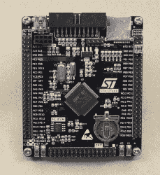

# 问 Hackaday:你如何 DIY 一个最高八度音程发生器？

> 原文：<https://hackaday.com/2018/05/24/ask-hackaday-diy-top-octave-generator/>

黑客日的最大乐趣之一是我们有时会越过小费线的真正古怪的要求。例证:[DC·达森]写了一个 20 世纪 70 年代的坏风琴，需要一个新的最高八度音程发生器，不知道我们是否能帮上忙。他在网上找到了一个复杂但有前途的电路，想知道是否有更简单的。我回答说“我应该可以用一个 Arduino 完成这个任务”，然后很快证明我完全错了。

所以我们把责任推给你，亲爱的 Hackaday 读者。你能以最少的花费和麻烦帮助[DC·达森]修复他的器官吗？我们需要做的就是同时产生 12 个，或者 13 个不同音调的方波。

## 最高八度什么？

管风琴通过在巨大的管子中振动空气来发声，每个音高一个管子。然后出现了[哈蒙德风琴](https://en.wikipedia.org/wiki/Hammond_organ)，从 1935 年到 20 世纪 70 年代中期，它通过在电子拾音器的存在下旋转带有周期性切口的金属圆盘来发出声音。哈蒙德仍然不是一个小机器，但它肯定比管风琴紧凑。到 20 世纪 80 年代，所有这些声音都可以包含在一个专用的集成电路中，结束了巨人的时代。(至少对于大众市场乐器来说:在大空间里听到真正的管风琴仍然是一种享受。)

但在转速脉冲轮和超大规模集成电路时代之间的短暂时间里，有十年的家用风琴是用那个时代现成的神奇技术设计的，即离散逻辑集成电路。特别是，这些设计利用了触发器获取输入频率并[将其除以 2](https://www.electronics-tutorials.ws/counter/count_1.html)的能力，既简单又便宜。将频率除以 2 会将其感知的音高降低一个八度，这意味着，如果您可以准确地为音阶中的 12 个音调中的每一个生成一个音高，您可以使用触发器并向下分频以覆盖整个键盘。

## 参考间距芯片

提供一组精确的 12 个参考音高是最高八度音程发生器(TOG)芯片的工作，这是一个不再生产的部件。但是如果你想修复一个使用它们的 20 世纪 70 年代的器官呢？你也许可以订购昂贵的旧备件，但这有什么意思呢？

几乎[所有的 tog](http://www.armory.com/~rstevew/Public/SoundSynth/TopOctave/topdividers.html)都从一个 2 MHz 晶体振荡器电路获得一个输入频率，并通过将该输入频率除以 239 到 478 的因子来提供 12 或 13 个正确音调的方波。如果我们必须在硅片中实现这一点，我们将构建 12 个 9 位计数器，全部由相同的 2 MHz 主时钟驱动，并在达到正确计数时使它们复位。这应该很容易在 Arduino 的固件中复制，对吗？

## 微控制器非解决方案

钢琴上的最高“C”时钟频率为 4，186.01 Hz，这意味着对于时钟频率为 16 MHz 的 AVR ATmega Arduino，我们必须大约每 1911 个周期切换一次引脚。一次投球应该很容易。这可能意味着您可以在软件中天真地实现这一点，跟踪 12 个计数器变量，并在循环中测试每个变量是否应该被重置。

```

while (1) {
    C7_TOGGLE;
        for (volatile uint8_t i=0; i<12; i++){
        if (counts[i] > tops[i]){
            counts[i]=0;
        }
        ++counts[i];
    }
}

```

但是没有规模。如果你以这种方式实现，计数之间的时间间隔就太长了，你不能足够准确地定义任何一个音高，这在音乐上是有用的。上面的循环运行在 20 千赫左右，这远远不够快，所有的音高都跑调了。

另一种方法是让硬件定时器自由运行，为每个振荡器设置一个定时器变量，并在达到每个振荡器的独立时间时切换它，然后更新 GPIO 引脚。

但是因为分频后的振荡器以不同的频率运行，即使只有两个这样的振荡器，它们也会同相和异相。最终，两个转换会非常接近重叠，以至于遍历循环需要太多时间来服务它们，并且其中一个会延迟重置。12 个振荡器运行，产生的[抖动](https://en.wikipedia.org/wiki/Jitter)是可以听到的，听起来很恐怖。

这些担忧，以及废除触发器分频器的愿望，促使 Tom[电子德鲁伊] Wiltshire 用 12 张图片来制作他的 TOG，每张图片对应音阶的一个音符。然而，为了协调运行，它们需要运行在同一个主时钟上，Tom 报告了他用作主时钟的 PLL 的问题。我对使用 12 张图片有审美上的顾虑，尽管我认为它不会比使用[12 个同步计数器 IC](https://www.electronics-tutorials.ws/counter/count_3.html)来划分八度音阶更糟糕。

大多数微控制器都有板载硬件定时器电路，可以完全满足我们的需求，但 12 个独立的定时器正在推动它。ATmega 驱动的 Arduino 有三个硬件定时器，其中一个被 Arduino 固件绑定。如果你愿意放弃`millis()`，你可以在硬件中实现三个振荡器，并可能在 CPU 上运行第四个。一个完整的八度音程只需要三个 Arduinos。我们可能会有所进展。

## 矫枉过正，但似乎有理

[](https://hackaday.com/wp-content/uploads/2018/05/dscf0712_crop.jpg) 一些更高级的微控制器有 12 个或更多的硬件定时器。我环顾四周，发现高密度的 STM32F407 板有 12 个 16 位定时器，这些板可以从通常的来源以不太多的[买到。我不确定是否所有的方法都是可行的，或者说是可以立刻实施的。尽管如此，全硬件方法具有坚如磐石的计时优势，16 位的音高分辨率是对老式 TOGs 的改进。但是，仅仅为了让 168 MHz 的 CPU 完全闲置而投入更高端的微控制器似乎有些浪费。](https://www.aliexpress.com/item/Free-shipping-STM32F407VET6-development-board-Cortex-M4-STM32-minimum-system-learning-board-ARM-core-board/32618222721.html)

TOG 实际上是 FPGA 的完美应用。您可以相当忠实地实现原始 IC 的计数器分频设计，并且和 FPGA 中的每个子电路都独立运行，真正实现并行运行。实现用于除法的触发器也很容易，只要 FPGA 有 88 个空闲输出引脚，就可以在一块硅片上产生所有需要的间距。那真是太好了。

## 轮到你了

我的直觉是，FPGA 解决方案是最好的，尽管它对大多数器官修复爱好者来说不是 DIY 友好的。每个人都知道 Arduino，但同步三四个听起来很麻烦。高端微控制器解决方案应该可行，但感觉很浪费。

我们遗漏了什么？允许 12 个独立的定时器在一个 AVR Arduino 上运行的聪明的黑客在哪里？只是为了进行心理练习，我们真的很想听一听可行的微控制器解决方案。但也许你有一些秘密的技巧来保持 12 个 555 定时器的协调？(我们一听就信了！)有人想向我们展示 FPGA 解决方案有多简单吗？你将如何实现 TOG？