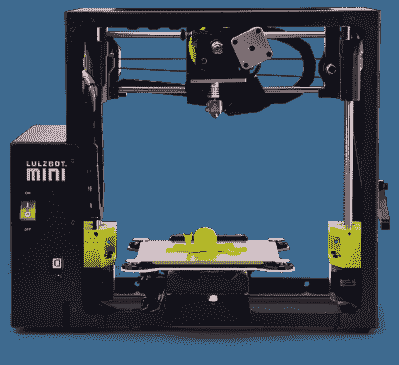

# 问问 Hackaday:拥有一台 3D 打印机值得吗？

> 原文：<https://hackaday.com/2017/02/21/ask-hackaday-is-owning-a-3d-printer-worth-it/>

3D 打印机是开放硬件的最好例子。它们可用于原型制作，为其他工具构建夹具，Lulzbot 已经证明桌面 3D 打印机可用于工业生产。在这里，我们理所当然地认可 3D 打印是一种可行的工具，但这并不意味着我们认为每个家庭都应该有一台 3D 打印机。

回到 Bre 在 Colbert 的时候，制造业是下一个被“颠覆”的东西，3D 打印的价值主张是这样的:每个人都希望家里有一台 3D 打印机，因为你可以打印塑料饰品。看，低聚妙蛙种子。我做了一个霸王龙头骨。/r/3Dprinting 的首页。不用说，当沃尔玛和塔吉特百货存在时，普通消费者不需要花费数百美元来制作他们自己的塑料玩具。

3D 打印机的价值主张是一个开放的问题，但现在有一些证据表明 3D 打印机提供了投资回报。在本周发表的一篇论文中，Joshua Pearce 和密歇根理工大学的一名本科生发现，一台 3D 打印机可以在六个月内收回成本，并可以在五年内获得近 1000%的投资回报。当我调查这个可疑的声明时，请继续阅读。

## 来自每周打印一件东西的数据

这项研究的目的是确定 3D 打印机对消费者来说是否可行。为了评估这一点，该研究使用了 Lulzbot 迷你 3D 打印机，一位名叫[Emily Petersen]的本科生，他在这项实验中假装是一名技术文盲消费者，以及大约一公斤的 PLA 细丝。在几周的时间里，[Emily]从在线对象存储库中下载了 26 个项目，并将打印这些项目的总成本与在线零售商提供的可比项目进行了比较。当将打印这些物体的成本与低成本的商业可用选项进行比较时，3D 打印机在 2.4 年内收回了成本。这种投资回报可以通过每周打印一个对象来看。

这项研究中打印的对象包括工具架、滑雪板捆绑板、尼康镜头盖支架、缝纫机压脚、淋浴头、安全带导向器、GoPro 支架、佳能镜头盖和 iPhone 6 外壳。换句话说，通常在中国生产的小块塑料，被运到洛杉矶，塞进火车，装在卡车里，送到你当地的沃尔玛。

这项研究的一部分是为了确定对于一个不懂技术的消费者来说，3D 打印机是否值得；Cura 的 Lulzbot Mini 和“快速打印”设置非常适合那些几乎不知道自己在做什么的人。

## 3D 打印是塑料的亚马逊总理吗？

有很多方法可以批评这项研究。死星模型的实用性是值得怀疑的，一个“[喷嘴扭矩扳手](http://www.yeggi.com/q/nozzle+torque+wrench/?s=tt)的“高端”商业替代品价格为 419.58 美元——可能是 Snap-on 卡车上的东西，人为夸大了 3D 打印机投资回报率的最佳情况。

然而，这项研究确实使用了 Lulzbot Mini，这是一款价格为 1250 美元的打印机。虽然 Mini 是一台非常棒的打印机，但是[购买一台 i3 克隆版比在一个联合工作车间租用打印机便宜。廉价的 3D 打印机变得越来越好，一对本杰明就能让你买到一台对任何有技术头脑的人来说都绰绰有余的打印机。他们可能不适合普通消费者，但他们会完成工作。无论哪种方式，都可以把前期费用看作“会员费”，之后你打印的东西就是“免费的”(当然除了灯丝费用)。](http://hackaday.com/2016/08/08/in-paris-buying-a-3d-printer-is-cheaper-than-renting-machine-time/)

这就留下了一个问题:3D 打印已经准备好迎接黄金时代了吗？普通消费者有可能用 3D 打印机省钱吗？如果你是技术盲，3D 打印机容易使用吗？

这也是我们想知道的，也在评论中寻找你的答案。