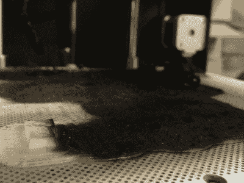
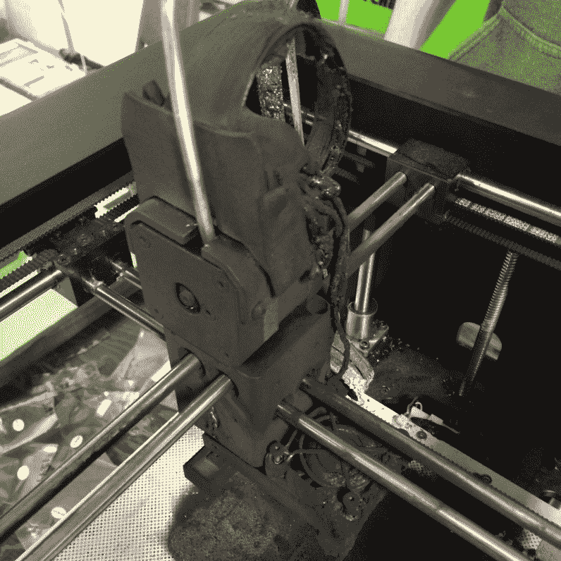
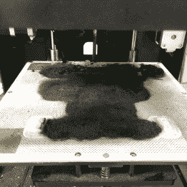
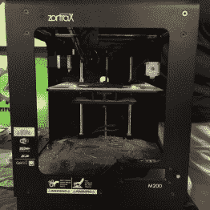

# 问问 Hackaday MRRF 版:3D 打印机会着火吗

> 原文：<https://hackaday.com/2016/03/21/ask-hackaday-mrrf-edition-3d-printers-can-catch-fire/>

[Jay]在皮奥里亚的 River City Labs Hackerspace，IL 清除了他打印机中的卡纸。这是我们大多数拥有 3D 打印机的人都做过的操作。他重新组装喷嘴，一会儿忘记拧紧固定加热器筒的平头螺母。他开始打印，看到第一层向右下，8:30 离开家去上班。当他在 10:30 下班回来时，他没有看到他期望的打印，而是迎接他的是刺鼻的烟雾和烧毁的打印机。

The approximate start time of the fire can be guessed by the height of the print before failure.

据他所知，大约在 30 分钟左右的某个时候，加热器筒从缸体中振动出来。打印机温度下降，并增加了墨盒的功率。由于墨盒现在悬在空中，而读取温度的热敏电阻仍然连接在墨盒上，打印机继续供电。最终，由于没有地方倾倒供给它的能量，弹药筒燃烧起来。这导致了图中的大屠杀。幸运的是，Zortrax 是一款坚固的全金属打印机，所以没有太多的燃料用于灭火，但损坏是完全的，火势很容易蔓延。

这就引出了我们要讨论的话题。

我们能有多信任自己的作品？我们都有自己组装的东西，一旦你在打印机上做了很多工作，你就会希望看到它打印很多东西。我经常带着打印的东西离开家，还有一些其他的家庭项目 24/7 都在进行。是我自大吗？我是否应该对我的家庭作业的信任度低于一个更大的组织所做的工作？还是几率差不多？也就是说，我也信任更大的开源社区。我知道 Marlin 有内置的保护措施来弥补这种失败，这种情况更可能发生在家庭构建中，而不是像 Zortrax 这样严格控制的组装过程中。然而，我希望那些我从未仔细检查过的代码是由一个我不认识的人完成的，以保护我的家免受类似的失败。很难预测分布式开发的严重失败的位置，我很想听听社区对此的想法。

  Well, the matte black smoke finish does look kind of good.  This is why UL reccommends self-extinguishing plastics for power applications. The flames just crawled along. Ouch.  Very sad.  The heater cartridge in question.

硬币的另一面是企业责任。从各方面来看，Zortrax M200 是一款出色的打印机。制作精良，他们的软件很棒，打印出来也很漂亮。即使在目睹了这次失败之后，它仍然是我为小型工程办公室推荐的打印机(特别是如果你是一个必须支持“该死的愚蠢的打印机”的人)。然而，这是一个封闭的来源。如果你把市场上的细丝放进去了，保修就无效了。他们坚持要你把打印机送去维修，即使是像挤压机堵塞这样的日常问题。在这种情况下，我们不能马上指责他们没有预见到这种故障模式，尽管回想起来这是非常明显的。因此，如果你在制造商的坚持下对维修进行了修改或修改，并且因为缺少一个黑客通用的故障安全装置而发生了严重故障，那么谁来负责呢？制造商这样做是对的吗？因为他们想自己完成工作，并控制机器的输入以确保正常运行。或者用户是对的，因为这是他们的机器，从各方面来看[Jay]有足够的能力修理他的机器？

[![A cautionary message from [Jay]](img/ecd79ca767339833991efc59d59c0c76.png)](https://hackaday.com/wp-content/uploads/2016/03/feirl1.jpg) 

来自【Jay】

的警示性结束语这也是开源安全关键代码的一个很好的案例。有人可能已经看到了这种不足，并刚刚修复它。就像围绕加密的争论一样，如果我们不能查看我们信任的代码，并确保我们期望的东西在那里，我们真的拥有它吗？我对我的打印机不会着火有了更多的信任，因为所有的部件都是为了质量而手工挑选的，我读过代码，我对电气连接很着迷。然而，如果我有现金，我现在就会在我的桌子上放一台 Zortrax(还有 MRRF 的几台，它们很不错)，我知道我也会信任它。这是一个微妙的游戏。

最后[Jay]拿出了一台不错的打印机，但幸运的是损害得到了控制。你出门时会让打印机开着吗？你有没有因为自己做的东西而遭遇过真正的或避免的灾难？你有没有关于一个安全疏忽的商用电器的轶事？或者你只是对个人和公司的责任有想法？我们很想听听。