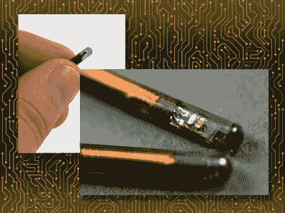

# 问 Hackaday:植入电子设备的未来是什么？

> 原文：<https://hackaday.com/2018/06/07/ask-hackaday-what-is-the-future-of-implanted-electronics/>

生物黑客是新的前沿。短短几年内，数百万人将在拇指和食指之间的皮肤下植入 RFID 芯片。已经有成千上万的瑞典人在自己身上植入芯片，让他们的日常生活变得更轻松。通过一个微小的电子植入物，瑞典铁路乘客[可以支付他们的火车票](https://www.youtube.com/watch?v=5N-mqiMuS-I)，不言而喻，打开 RFID 锁是多么方便，而不必掏出你的钱包。

也就是说，将 RFID 芯片嵌入皮下已经有几十年的历史了；我这只十三岁的猫从小就有芯片。尽管已经存在了非常非常长的时间，现代的电子人还是很少见。事实上，只有成千上万的人在火车上使用芯片是一个有新闻价值的事件。没有多少人会觉得挥一挥手就能打开锁的便利值得他们去弄个芯片。

为什么最受欢迎的生物黑客例子没有流行起来？为什么没有更多的人植入芯片？是因为没有人愿意被打上野兽的印记吗？生物黑客缺乏的原因更微妙吗？这就是我们在这里要发现的，所以我们问你:植入电子设备的未来是什么？

在过去的十年里，我们已经看到了数百个使用 RFID 和 NFC 标签的建筑。我们已经看到人们用这些标签来发动汽车和开门。我们已经看到了放置在生物兼容玻璃中的 NFC 标签，也看到了由 ATtinys 和一卷磁线构成的 RFID 标签。黑客们似乎遍布短程、无电池的电子跟踪标签，这还不包括数量庞大的地铁卡、非接触式支付系统，也不包括如今几乎每部手机都能读取这些卡的事实。

RFID Implants are simple, cheap, and battery-free

虽然在皮肤下嵌入 RFID 标签给我们带来了非接触式支付、魔锁和随时随地被跟踪的能力，但我们真的没有看到嵌入式标签的许多应用。事实上，可穿戴 RFID 标签最有趣的应用可能就是[把 led 放在指甲上](https://twitter.com/jyujinX/status/986599030691164162)。是的，每只指甲只需 3 美元，你也可以在经过非接触式读卡器几英寸范围内时点烟。

公众对可穿戴 RFID 标签缺乏兴趣的部分原因可能只是系统本身的缺点；如果你想在星巴克为你的饮料买单，这是一个 RFID 标签。如果你想上地铁，那是另一个 RFID 标签。如果你想打开办公室的门，这是第三个 RFID 标签。除了随身携带一个标签编程器——完全否定了将钥匙藏在皮下的便利——我们还不具备植入一个 RFID 来控制一切的技术。

当然，还有其他技术可用于植入式电子机器人，但在你身上植入 RFID 或 NFC 标签是目前最受欢迎的。然而，人们并没有真的这么做，所以我们把这个开放给花生画廊。如何才能让植入式电子产品广泛流行？你能买一个吗？如果你手里有一个芯片，你用它做什么？随着时间的推移，它发生了怎样的变化？*你怎么看* *？*