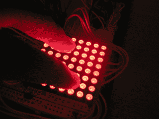
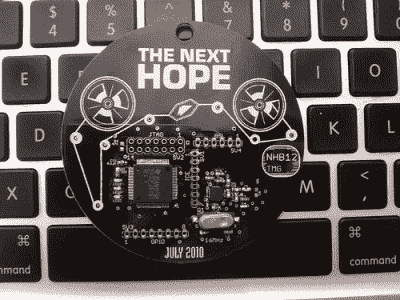

# 问问 hack aday:LED 光传感器到底怎么了？

> 原文：<https://hackaday.com/2016/06/17/ask-hackaday-whatever-happened-to-led-light-sensors/>

如果你像我们一样是一个长期的黑客读者，你肯定会记得大约十年前的一系列项目，这些项目都(错误地)将 LED 用作光传感器。这个想法并不新鲜，但不知何故，它流传开来，并渗透到我们的集体意识中。大约在同一时间，一种内存占用非常小的加密算法也出现在黑客项目中:TEA(微型加密算法)。

[这个由[Marcin Bojanczyk]、[Chris Danis]和[Brian Rogan]完成的老项目](https://courses.cit.cornell.edu/ee476/FinalProjects/s2006/bcr6/final_report/index.html)将 LED 作为光传感器的迷因和 TEA 结合起来，制作了一个在可见光范围内工作的门禁钥匙链。而且他们几乎不用任何东西——几个 led 和 2Kb 多一点的代码。挺甜蜜的。

这就给我们带来了一个问题:它们(LED 传感器和茶)现在在哪里？

 LED-as-light-sensor 简直酷毙了。[早在 2006 年，我们当然喜欢这个想法](http://hackaday.com/2006/02/21/low-cost-sensing-and-communication-with-an-led/)。但是[【福里斯特·米姆斯】几十年前就已经使用这种现象](https://hackaday.com/2015/10/13/citizenscience/)。当你试图从尽可能少的东西中挤出尽可能多的东西时，或者当预算是一个主要问题，而你又负担不起额外的光电二极管时，这当然是有意义的。

但是我们自己使用发光二极管作为光传感器的经验是，不同的发光二极管之间的结果差异很大。例如，适用于透明红色发光二极管的代码可能不适用于红色塑料发光二极管。这就是它们灭绝的原因吗？
 同样，[茶家族的密码](https://en.wikipedia.org/wiki/XTEA)也在这个时候出现在一堆项目中，从 2010 年希望会议的[徽章](http://travisgoodspeed.blogspot.de/2010/06/hacking-next-hope-badge.html)到广泛使用的 [RFM12B 无线电库](https://github.com/LowPowerLab/RFM12B)。XXTEA 上有几个攻击，但它们只影响加密算法的精简版本，并依赖于大量拦截的数据——比我们多年来在家庭自动化网络中看到的还要多。

在过去五年左右的时间里，出现了更多的物联网，这意味着使用标准的互联网风格的加密方法(AES 等)，这些方法在不受内存限制的计算机上广泛使用。XXTEA 也是这样吗？

无论如何，我们得到了一个项目的提示，这个项目将我们最喜欢的(旧的)想法结合在一起，所以我们想我们应该分享一下。感谢[蓝烟]沿着记忆之路走下去。你们中有人让火焰继续燃烧吗？你用过感应 led 或者 XXTEA 吗？那些项目还在进行吗，或者你有没有任何计划好的未来项目，这些技巧还在你的袖子里？请在下面的评论中告诉我们。