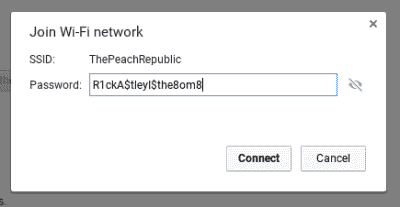

# 询问家庭自动化的安全问题

> 原文：<https://hackaday.com/2016/08/18/asking-the-security-question-of-home-automation/>

说到技术，“安全性”是众所周知的死马，我们都喜欢击败它。这当然不是不公平的——我们生活在一个以“安全至上”的思维模式构建的技术社会。总是有这样或那样的理由:公司需要快速失败，一旦产品证明可行，他们将处理安全问题；如果系统受到保护或加密，最终用户将很难设置和使用系统；政府/执法部门不希望犯罪分子躲在高度安全的系统后面。

这是一场我不想陷入其中的争论。对于这个讨论，让我们都同意这个对话的起点:任何管理有价值的东西的系统都需要某种类型的安全性，问题变成了多少安全性才有意义？顾名思义，当今的技术是家庭自动化。当你设法把你的恒温器连接到你的门锁、灯、窗帘、冰箱和厕所时，什么类型的安全需要成为计划的一部分？

休息之后，请和我一起了解一些家庭自动化安全问题。本文是我们系列的第三篇——第一篇问的是什么是家庭自动化 ，第二篇讨论的是我们面临的 [*软件难题*](http://hackaday.com/2016/08/02/home-automation-is-hung-up-on-software/) 。

这些都受到了黑客日奖自动化挑战赛的启发。在周一早上[之前记录你自己的自动化项目，以便进入](https://hackaday.io/project/add?light&tag=2016HackadayPrize)。20 个项目将分别赢得 1000 美元，成为决赛选手，有机会获得 15 万美元的大奖。我们还将向留下评论的人赠送 Hackaday T 恤，这些评论有助于推动这一讨论，所以请在下面让我们知道您的想法。

### 我是钥匙大师。你是看门人吗？

大多数人在谈论科技时都会想到来自更广阔世界的安全。有人会打开你的车库门，关掉你的炉子，或者观看你的婴儿的视频，这有风险吗？我觉得这是一个已经解决的问题:每个家庭都应该为他们的局域网配备一个安全的路由器——这同样适用于家庭自动化。它应该是一个有围墙的花园。

如果你同意我的想法，这就变成了一个标准问题。WiFi 设备可以在世界各地的不同硬件上工作，提供可靠的连接和强大的安全性。但正如我们在上一篇文章的许多评论中听到的那样，WiFi 对于家庭自动化来说并不真正理想，所以其他协议如蓝牙和 Z-Wave 已经被采用。

软件定义无线电变得既经济又简单——你可能会认为我们可以找到一种规格，在你的围墙花园和互联网路由器之间添加一个家庭自动化路由器，利用 SDR 与所有设备通话。但是谁来做这项工作(IEEE 上次被提名为 drop ),什么会推动行业内的采用呢？有人知道 WiFi 是如何成为*和*的吗？不知道的竞争对手发生了什么？

### 你的灯泡需要加密吗？

没有什么比一个简单的灯泡更能突显这个话题有多棘手了。几个月来，埃利奥特·威廉姆斯和我一直在断断续续地讨论家庭自动化的安全问题，并回到同一个问题上。如果您的系统受到保护，免受更广泛的互联网的攻击，您是否需要对每台设备进行加密？

 首先关闭，WiFi 和 Z-Wave 已经有加密内置到规范中。如果你用的是 Flux smart 灯泡，没有你使用的复杂的 WPA2 密码，你的邻居就不会嗅探你的数据包。但是那个灯泡真的需要加密吗？如果你的灯泡开着 433Mhz，只听集线器的开关命令，那会怎样？这需要多安全？

我认为，关键的自动化任务永远不应该能够远程启动。例如，你应该能够远程关闭你的炉子，但不能打开它。你应该能够设置你的炉子到一个合理的温度或者远程休假模式，但是不能关掉它。让你的房子冬天保持华氏 50 度，夏天保持华氏 85 度是可以的，但是你不应该把它关掉，否则水管会结冰，宠物也会死亡。有人把车停在路边开或关你的灯，我们需要多少保护？

### 最薄弱的环节

我希望从您那里听到的最后一个问题是一个最薄弱的环节。如果我们建造围墙花园来保护我们的设备免受大坏互联网的攻击，我们会为我们的整个系统打开一个本地攻击媒介吗？你能坐在路边，欺骗我的灯泡，并由于局域网上的家庭自动化设备的信任，使它成为我的服务器上的敏感文件吗？

我们想听听你的意见。当我们在每一个街区和大街上建立家庭自动化时，我们的合理安全目标是什么？我在上面错过了什么，我们如何计划不可预见的事情？

The [HackadayPrize2016](https://hackaday.io/prize) is Sponsored by:   