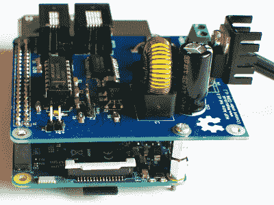

# Astro Cat: Raspberry Pi 望远镜控制器

> 原文：<https://hackaday.com/2017/12/05/astro-cat-raspberry-pi-telescope-controller/>

当有人处理一个工程问题时，有两种可能的途径:他们可以快速而肮脏地拼凑出一个满足他们需求的解决方案(可以说是经典的“黑客”)，或者他们可以更进一步，开发一个文档化的解决方案，帮助整个社区。我们在 Hackaday 这里讨论了这一切，但我们肯定对后一种方法情有独钟，即使有些人可能觉得它属于“不是黑客”的可怕领域。

 当【加里·普雷斯顿】想要控制自己的望远镜和天体摄影硬件时，他大张旗鼓地走了第二条路。在他的博客上的几篇文章中， [[Gary]向我们展示了他的开源 Raspberry Pi 附加板的创建过程，它控制着一系列传感器和光学设备](https://www.mups.co.uk/project/software/astrocat/)。不要称它为帽子，虽然它看起来像，但[Gary]非常明确地表示，它不符合树莓派基金会发布的[帽子规格。](https://www.raspberrypi.org/blog/introducing-raspberry-pi-hats/)

即使你对窥视上面的无限虚空不太感兴趣，加里所做的极其详细的报道包含了大量多学科的信息，你可能会发现这些信息很有用。从展示如何修改 Pi 的引导配置以启用真正的硬件 UART(默认情况下，Pi 3 将其与蓝牙捆绑在一起)和用 ST3232 对其进行电平转换，到对他在 PCB 布局中所犯错误的分析，有很多东西要学习。

Astro CAT 是一个完全开源的项目，[硬件端在 CERN 开放硬件许可证 v1.2](https://bitbucket.org/BWGaryP/mup-astro-cat-hardware/) 下发布， [INDI 驱动](http://indilib.org)组件在 GPL v3 下可用。

如果这看起来让你第一次尝试树莓派天文摄影有点畏惧，不用担心。[我们已经涵盖了无论](https://hackaday.com/2017/04/20/budget-astrophotography-with-a-raspberry-pi/)[你的预算或经验水平如何](https://hackaday.com/2017/11/09/weatherproof-pi-looks-up-so-you-dont-have-to/)都可以让你启动并运行的构建。