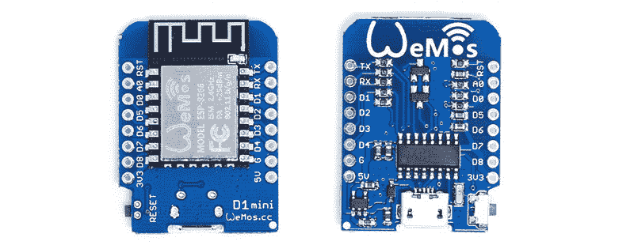
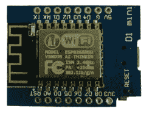
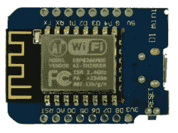
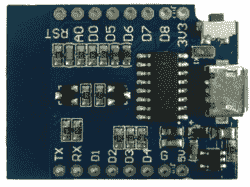
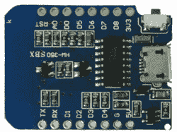

# 对克隆体的攻击:两种常见的 ESP8266 迷你 D1 板述评

> 原文：<https://hackaday.com/2017/05/15/attack-on-the-clones-a-review-of-two-common-esp8266-mini-d1-boards/>

基于 ESP8266 的开发板迅速发展。最受欢迎的一款 [WEMOS 迷你 D1](http://www.wemos.cc/product/d1-mini.html) 经常被模仿并在没有任何品牌的情况下出售。随着这些主板继续向世界各地的发烧友和零售商发货，我们认为进行一个小实验可能会很有趣。

有一些 ESP8266 开发板可用，最受欢迎的似乎是 node MCU“Amica”板。当然，还有其他几十种选择，包括 WiFiMCU、 [Sparkfun 的 ESP8266 Thing](https://www.sparkfun.com/products/13231) 和 [Adafruit 的 HUZZAH ESP8266](http://www.adafruit.com/product/2471) 。既然如此，为什么这次审查仅限于迷你 D1 板？因为迷你 D1 是最便宜的。或者曾经是，直到它被克隆。

我们看了看这些“克隆”主板，以找出它们之间的差异，了解它们是否如预期那样工作，也许最重要的是，这些克隆主板是否可靠地发货。结果如何？看看下面。

像 NodeMCU 一样，迷你 D1 也无处不在，并且已经被克隆者所采用。D1 小一些，也稍微便宜一些。如果您不想附加引脚接头，请单独提供。它实际上与[这个电机控制器](http://www.dx.com/p/l9110-2-channel-motor-driver-module-red-green-2-5-12v-216851)、[这种电池](http://www.dx.com/p/h31-011-spare-parts-3-7v-400mah-battery-for-jjrc-h31-blue-silver-448777)和这个[充电电路](http://www.dx.com/p/tp4056-4-2w-1-2a-5v-lithium-battery-charging-discharging-protection-module-w-micro-usb-blue-397213)的尺寸相同，用于一些非常小的群体准备机器人。当你需要[许多 MQTT 节点](http://hackaday.com/2016/05/17/minimal-mqtt-networked-nodes/)或者[升级一辆 RC 汽车](http://hackaday.com/2016/03/14/broken-rc-car-goes-online/)时，它也会大放异彩。简而言之，它很小，很便宜，而且仍然是一个很棒的板，我们期待有趣的项目使用一段时间。

### **方法**

我们在淘宝上订购了 28 个迷你 D1 复制品，分成两种最常见的设计。淘宝是一个大得惊人的中国在线市场，主要面向本地市场。[概不退换](http://hackaday.com/2017/03/28/source-parts-on-taobao-an-insiders-guide/)。

我们尝试了两家不同的进口公司，他们管理淘宝的订单。零件被拆分，这样每个公司必须管理多个供应商，零件被运到一个邻国进行测试。这种类型的进口公司在一些亚洲国家很常见，通常会收取 20%的附加费来管理你的订单。

### **比较**

从电学角度来看，所审查的克隆与原始 WEMOS 板完全相同。所有元件都是一样的，焊接工作也很好。一些电路板使用带有 [EIA-96 标记](http://www.hobby-hour.com/electronics/eia96-smd-resistors.php)的 SMT 电阻，其他电路板使用更熟悉的 3 位数代码 :

The basis for comparison, the Wemos Mini D1

Board One, Top View

Board Two, Top View

Board One, Bottom View

Board 2, Bottom View

然而，电路板布局有一些非常细微的差异。板 1 有方形角而不是圆形角，某些地方的走线稍厚，有一些布线差异，整体焊盘更好，USB 迷你连接器上的焊接安装点更少，所有引脚都有大而清晰的标签，复位开关没有裸露焊盘。

电路板 2 的走线更薄，所有过孔周围的焊盘更薄，USB 迷你连接器固定良好，复位开关的焊盘裸露在外。所有引脚的标签都是极小的字体。由于焊盘较薄，焊接难度稍大，需要注意的是，在 480°C 温度下焊接时(有时我们都很匆忙), PCB 会有一些表面热损伤，但在电路板 1 上没有观察到这种情况。

### 结果

总之，两块电路板基本相同，电路板 1 在可焊性方面可能稍有优势，电路板 2 则更便于使用复位开关和更牢固的 USB 端口。

回头看看实际的 WEMOS 迷你 D1 板，它有一个正确保护的 USB 端口，以及所有相关过孔周围的漂亮焊盘。随着时间的推移，似乎有努力修改和改进董事会。即使是批量生产，克隆产品也便宜不了多少。我们会说，实际的 WEMOS 板可能是最物有所值的。

这给我们带来了另一个问题:在他们的网站上，WEMOS 提供了一个工具来使用 ESP8266 chipID 验证产品是否是真的。不幸的是，它目前似乎不起作用。

所有的模仿板在 Linux 和 Windows 中都正确地注册为串行设备，并且在 NodeMCU 和 Arduino 固件上都能正常工作。所有重置开关都工作正常。这实际上有点令人惊讶——根据以前类似零件的订单，预计故障率约为 5%。我们可能只是运气好。

### **总结**

克隆的 WEMOS 迷你 D1 板做它们应该做的事情。虽然构建质量还可以接受，但还是有一些小缺陷。从制造商处订购克隆板并不比原板便宜多少，大约每块板 1 美元，而且订购过程并不简单。

我们还从淘宝订购了 40 块 node MCU‘Amica’板。总的来说，这是相同的体验，除了两个板在到达时已经死了。一个无法恢复，另一个有缺陷的复位开关被迅速替换。

围绕这些主板的最糟糕的经历就是订购它们。一切都到来了——最终。有些部分在一周内，有些在一个月内。没有订单追踪。两家公司都没有人知道这些包裹在哪里。一个人连续一周每天都告诉我们，他们“明天”就会到达。基本上，你预先付款，然后希望东西在你的截止日期前到达。尽管如此，对于没有截止日期的批量订单，这些缺点还是可以容忍的。

对于我们的大多数读者来说，我们无法推荐这种体验，尤其是在一个有 [Adafruit](http://www.adafruit.com) 、 [Sparkfun](http://www.sparkfun.com) 和 [Hackaday Store](http://store.hackaday.com) 的世界里。如果你住在 mainland China 或附近，淘宝通常名副其实。

你用过类似的板子效果好吗？还是被火烧掉了？请在评论中告诉我们你的故事。