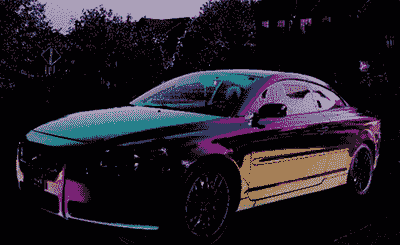

# 用偏振照相机增强人类视觉

> 原文：<https://hackaday.com/2015/12/15/augmenting-human-vision-with-polarimetric-cameras/>

光只是一种波，光的波长决定了它的颜色，决定了它是否能像微波一样烹饪食物，或者是否能像 x 光一样透视皮肤。波的另一个特性人类没有经历太多:偏振，或者光波是否上下、左右或两者之间。

[David Prutchi]的 Hackaday Prize 项目和许多项目一样——一个简单、新颖的想法，实施起来容易且相对便宜。这是一台偏振照相机，旨在观察人类看不到的东西。通过在偏振光下看世界，DOLPi 可以看到地雷、癌组织和空气污染，只需要一个树莓 Pi 和几个 Python 脚本。他在今年的 [Hackaday 超级会议](http://hackaday.io/superconference)上发表了关于偏振相机和 DOLPi 项目的演讲。欣赏完视频后，请在休息后加入我们，了解更多详情。

 [https://www.youtube.com/embed/zb0ayifhuZw?version=3&rel=1&showsearch=0&showinfo=1&iv_load_policy=1&fs=1&hl=en-US&autohide=2&wmode=transparent](https://www.youtube.com/embed/zb0ayifhuZw?version=3&rel=1&showsearch=0&showinfo=1&iv_load_policy=1&fs=1&hl=en-US&autohide=2&wmode=transparent) 

虽然相机和人眼可以看到不同波长或颜色的光，但它们不容易检测到偏振。[大卫]确实提醒了我们，由于一种叫做[海丁格刷](https://en.wikipedia.org/wiki/Haidinger%27s_brush)的现象，人眼能够检测偏振。然而，他确实要求每个人说出两片偏光膜的区别。没有人接受他的挑战。

而传统相机和人眼不容易看到偏振，蜜蜂利用偏振来找花，乌贼利用偏振来找猎物。偏振相机的用途包括寻找地雷、水下观察、检测癌组织和观察空气中的污染物。这是一个迷人的使用范围，从简单的手机摄像头，伺服系统，和几张偏振膜，DOLPi 使它成为现实。

A car, as seen with polarized light mapped to colors

DOLPi 的硬件部分实际上非常简单——它实际上只是一个树莓 Pi、相机模块，以及一个电光偏振调制器(有点贵)，或者一个伺服和纸盘，上面贴有不同角度的偏振膜(非常便宜)。

在软件方面，[David]有一个 Raspberry Pi 用相机模块拍一张照片，改变偏振滤光器，再拍一张照片，最终将所有这些图像组合成一个假彩色图像，不同的颜色映射到不同的光偏振。

这是一个相对简单的项目——任何人都可以建造一台偏振相机，并运行一些软件。但是它有潜力产生巨大的影响，有很多伟大的人道主义用途，可以看到肉眼看不到的东西。