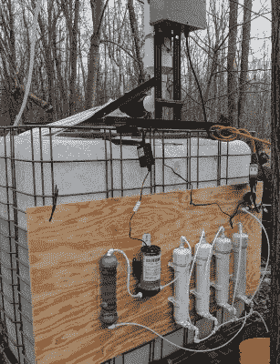

# 自动化糖浆系统是甜蜜的疯狂

> 原文：<https://hackaday.com/2018/03/03/automated-syrup-system-is-sweet-sweet-madness/>

在 Hackaday，我们是电视节目“*它是如何制作的”*的忠实粉丝。不难想象，作为一个正在阅读这个网站的人，你可能已经看过了。虽然看到创造日常产品的幕后过程总是很有趣，但展览最吸引人的一个方面是看到*制作东西有多难。说真的，当你看到生产这些产品需要多少技术和手工劳动时，这足以让你想知道公司是如何在这些产品上盈利的。*

 这正是我们在浏览这篇关于[如何制作枫糖浆](https://imgur.com/a/j4vpI)的绝对令人难以置信的概述时得到的感觉。如果这不是你曾经想过会在 Hackaday 上看到的句子，你并不孤单。但这不是一个挂在水龙头上的生锈的旧桶，这是一个高科技的自动化系统，能够从整片树林中吸取数百加仑的树液。我们再也不会像以前一样看着商店里的一瓶糖浆了。

这一切都始于数百个钻入树中的小龙头，它们与一个软管网络相连。管道布置如此复杂，以至于在某些区域需要高压支撑线来支撑软管及其甜味内含物的重量。主软管通向 Arduino 驱动的收集站，该收集站在整个系统中保持 100 kPa (29 inHg)的真空。

树液被暂时保存在一个 250 加仑的容器中，但此时它仍然只是:树液。需要提炼成适合放在你煎饼上的东西。该过程的第一步是利用反渗透过滤系统将水从汁液中抽出，并增加其糖浓度。[HDC3]表示，过滤系统是用易贝的分数和家装商店的零件建造的，它看起来肯定是厨房水槽下的东西的一部分。该系统能够将树汁中的糖浓度从流出树汁时的 2%左右提高到 8%。但是离可以使用还很远。

有趣的是，这个过程的最后几个步骤几乎和它们来的时候一样老套。半浓缩的树液被放在一个长而低的金属锅里，在木火上加热以驱除更多的水分。这一过程一直持续到汁液中大约含有 60%的糖，这时汁液被过滤并转移到房子里，在炉子上完成煮沸。

总的来说，糖浆要煮八个小时，使其含糖量达到 66%。即使[HDC3]对系统进行了改进，他透露，所有这些艰苦的工作只能产生略多于半加仑的最终糖浆。说到奉献。

这可能并不奇怪，这是 Hackaday 第一次报道生产枫糖浆的故事。然而，我们已经看到[数量的自动化啤酒酿造系统](https://hackaday.com/2013/12/13/arduino-controlled-beer-brewing-machine/)似乎已经被[以类似的热情](https://hackaday.com/2012/04/19/automated-beer-brewing/)解决了。关于普通黑客的饮食可能会有一个结论，但这有点超出了我们的范围。

[通过 [/r/DIY](https://www.reddit.com/r/DIY/comments/815jd8/our_diy_maple_syrup_system/)