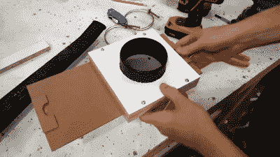

# 全店自动吸尘

> 原文：<https://hackaday.com/2018/01/05/automatic-dust-collection-for-the-whole-shop/>

如果你有一个木工区，或者即使你只是有一些真正产生灰尘的东西，如砂带机或台锯，有一个很好的机会你讨厌锯屑。它会弄脏你的衣服，堵塞所有的机械设备，如果处理不当，这个有趣的小奖励会爆炸。值得庆幸的是，新工具往往自带集尘袋(在过去，除非你咳出木质纤维，否则你就不是真正的男人)，但如果你有半打工具和半打不同的集尘袋，你必须清空它们，这可能会很烦人。

尤其是如果你像布拉德·赖特一样认真对待木工。在他的 YouTube 频道[DIY Builds]上，他快速浏览了一个全店灰尘收集系统的构建，其中有一些非常简洁的功能。不是每个人都需要如此复杂的系统，但他在构建过程中展示的技巧和诀窍非常棒，肯定可以适用于不那么宏大的设置。

One of the scratch-built gates.

[Brad]在这个画廊中讲述了更多的细节，揭示了建筑的核心是一个港口货运灰尘收集系统，他将其改造成了一个旋风分离器。大块落入 55 加仑的桶中，剩下的通过外墙的百叶窗式通风口被吹出商店。一个复杂的 4 英寸 PVC 管系统被用来连接每台机器的集尘口。甚至个人手桑德斯也通过一个三路歧管进入行动。他的台锯没有防尘口，所以他用一块胶合板包住马达，自己做了一个。

这个建筑最有趣的一个方面是临时建造的防爆门。这些基本上是阀门，它们打开和关闭 PVC 的不同部分，在那里它们与单独的站匹配。当在任何给定的时间只有一个站在使用时，这防止了灰尘收集系统通过试图一次从所有的站拉出而浪费吸力。[Brad]甚至在防爆门上安装了开关，当门打开时，开关会打开集尘系统，当门关闭时，开关会关闭。

这不是我们第一次[报道人们为了清除店里的灰尘会走多远。](https://hackaday.com/2014/03/23/diy-cnc-dust-collection-really-sucks/)[旋风除尘器是一种特别受欢迎的建筑](https://hackaday.com/2014/09/14/diy-cnc-dust-collection/)，使用从[金属板](https://hackaday.com/2014/02/24/cyclone-dust-collector-requires-no-bags-or-filters/)到 [3D 打印零件](https://hackaday.com/2014/04/10/3d-printed-cyclone-dust-separator/)的一切东西。

 [https://www.youtube.com/embed/eVlJP4naUfM?version=3&rel=1&showsearch=0&showinfo=1&iv_load_policy=1&fs=1&hl=en-US&autohide=2&wmode=transparent](https://www.youtube.com/embed/eVlJP4naUfM?version=3&rel=1&showsearch=0&showinfo=1&iv_load_policy=1&fs=1&hl=en-US&autohide=2&wmode=transparent)

