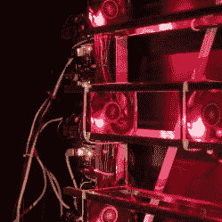

# 来自 42 台风扇和 7 台激光器的自主音乐声景

> 原文：<https://hackaday.com/2016/06/24/autonomous-musical-soundscapes-from-42-fans-and-7-lasers/>

[dmitry]来信让我们了解一个新项目,它将激光和风扇结合起来，将光束的调制转化为自主的声音景观。这款产品名为“divider ”,是一套大型壁挂式导轨，一端安装了七个红色激光器，另一端安装了七个匹配的光传感器。中断激光路径的是 42 个无刷风扇。四个 Arduino Megas 控制该单元。

 照射到光传感器上的激光束本身没有什么作用，但当旋转的风扇叶片打断每束激光束时，它会调制固体光束，并将远端传感器的读数转化为可以播放为声音的变化电信号。光被风扇叶片调制以产生声音是风扇合成器背后的工作原理，我们之前讨论过的[是一种警报器](http://hackaday.com/2016/01/21/drawn-in-by-the-sirens-song/)(或者你可以直接去那篇文章的[风扇合成器演示视频](https://www.youtube.com/watch?v=17V9zvka47s)听听这样一个系统可能产生什么样的声音。)

这个项目不仅通过增加激光器和风扇的数量，而且通过将它们连接成一个自治系统，进一步发展了风扇合成器的整个概念。激光被反复不断地中断，但从不同时中断。请在下面的视频中听并观看它的实际应用。

[https://player.vimeo.com/video/171790362](https://player.vimeo.com/video/171790362)

项目页面上没有太多深入的技术信息，但有许多非常好的照片。我们尤其喜欢整个组件的高度可视化，激光开关以及与不同风扇的互动。

任何变化的电信号都可以作为声音播放，如果像[自动播放音乐硬件](http://hackaday.com/2016/04/27/autonomous-electro-musical-devices/)这样的项目可以教会我们一件事，那就是如果你有一个看起来奇怪或混乱的电信号，把一个扬声器接到它上面，因为它可能听起来很酷！