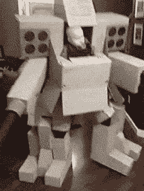

# 婴儿武器是不能乱用的

> 原文：<https://hackaday.com/2015/12/23/baby-armaments-are-not-to-be-messed-with/>

[theKylenator]花了大约一个月的时间为他的儿子制作了这套[华丽的万圣节服装](https://www.youtube.com/watch?v=ILNUKulJnCk)。我们意识到快到假期了，但这实在太棒了，不能不分享，尽管对我们的标准万圣节黑客来说有点晚了。

它完全由纸板制成，这表明你真的可以做出一些既不昂贵也不过分复杂的令人惊叹的东西。

虽然婴儿似乎对拥有一套能够造成大规模破坏的衣服漠不关心，但拍摄视频的妻子听起来也印象深刻:“这很酷，宝贝。”

[凯尔]另一方面是享受他的生活。听听他做的机甲战士音效就知道了。

 [https://www.youtube.com/embed/ILNUKulJnCk?version=3&rel=1&showsearch=0&showinfo=1&iv_load_policy=1&fs=1&hl=en-US&autohide=2&wmode=transparent](https://www.youtube.com/embed/ILNUKulJnCk?version=3&rel=1&showsearch=0&showinfo=1&iv_load_policy=1&fs=1&hl=en-US&autohide=2&wmode=transparent)

我们可以发誓我们以前见过一些类似的，但我们似乎找不到它。还有谁记得父母为自己制作的一些很棒的服装吗？呃，他们的孩子？我们很喜欢几年前的这套[学究气的 Roomba 服装](http://hackaday.com/2012/11/15/roomba-and-virtual-walls-make-up-this-theme-family-halloween-costume/)。

基思，谢谢你的提示！]