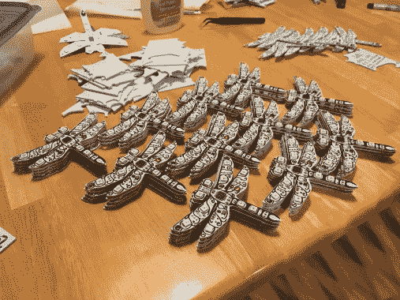

# 钻石时代的徽章来到 DEF CON

> 原文：<https://hackaday.com/2017/07/14/badge-from-diamond-age-comes-to-def-con/>

我们是(尼尔·斯蒂芬森的)作品的超级粉丝，通常希望将他的一些设想应用到现实世界中出现的设备上。但是这个不需要拉伸或者眯着眼睛。[凯瑞·沙夫格拉斯]根据基础科幻小说《T2》中的《钻石时代》制作了一个有效的鼓手徽章。

徽章叫 Sympetrum，是蜻蜓的一个属。在解释徽章是什么和做什么时，[Kerry]指导你先去读这本书，我们完全同意。这不是推荐阅读；如果你是一个极客，你需要阅读这本书。

蜻蜓徽章来自书中相当怪异的一部分，但要点是杆逻辑(由微观碳纳米管制成的机器)是如此普遍，以至于任何时候你都被实际上是机器的螨虫所覆盖。在一次聚会上，一个角色注意到每个人都戴着蜻蜓别针，它们开始随着音乐跳动并彼此同步。它们实际上是穿着者体内螨虫正在做什么的指示器——使人与其他人同步。

这个徽章是一个工作娱乐，大概没有数十亿的螨虫控制人(但谁知道，它是*DEF CON)。徽章的中心是一个驱动 10 个 APA102 模块的 STM32。交互性是基于红外信号的。独自一人时，徽章会循环播放随机的彩色动画。但每个徽章也通过红外投射时钟同步和元数据，所以把它们放在同一个房间里，它们会趋于同步。*

    

简单，美丽，是一个伟大的极客背景故事。Badgelife 的这个例子证明了硬件徽章不需要打包功能，或者有巨大的 BOM 成本。如果做得好，你只需要一点硬件和强烈的灵感就可以做很多事情。这也使得手工组装变得更加容易，正如你在上面的图片中所看到的。感谢[[Kerry](https://twitter.com/Borgel)让我们先睹为快，迫不及待地想在展会上见到他们。

* * *

我们将在 DEF CON 25 上寻找这个和所有其他#Badgelife 产品。周日早上加入我们的黑客聚会，我们再次在 DEF CON 吃早餐