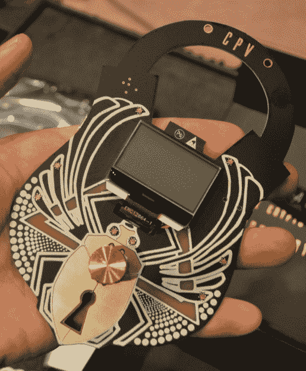

# 贝格利弗:从 1 到 100

> 原文：<https://hackaday.com/2018/03/05/badgelife-from-1-to-100/>

归咎于印刷电路板成本的下降，硬件设计工具的增加，GCC 现在在微控制器上工作的事实，无论“制造商运动”是什么，或者许多其他因素中的任何一个。现在有一个硬件演示。不是戳位、写代码、除以零来在计算机上创建令人印象深刻的多媒体演示，而是有一小群非常有创造力的人在构建他们自己的物理硬件，只是为了好玩。他们正在拓展硬件设计的界限，展示制造技术，并在这样做的同时获得(少量)利润。这就是 badgelife，致力于创建定制电子会议徽章的小型亚文化。

在 Hackaday，我们一直在深入研究硬件演示的严酷性，上周，我们有幸与 badgelife 社区的一些大玩家作为嘉宾举行了一次会议。当然，也有讨论在有限的预算和不够的时间内设计、制造和运输数百件硬件的考验和磨难的会谈。如果你想知道电子设计和制造有多难，你可以看看下面的演讲。

 [https://www.youtube.com/embed/PUvh5-_HJJg?version=3&rel=1&showsearch=0&showinfo=1&iv_load_policy=1&fs=1&hl=en-US&autohide=2&wmode=transparent](https://www.youtube.com/embed/PUvh5-_HJJg?version=3&rel=1&showsearch=0&showinfo=1&iv_load_policy=1&fs=1&hl=en-US&autohide=2&wmode=transparent)

上周我们硬件开发者大会的第一位嘉宾是[Kerry Scharfglass]。理论上，他是一名电气工程师，有时会编写一些代码，并为从医疗设备到物联网门锁的一切事物提供咨询。也许更有趣的是，他去年通过建造人们想要的整洁的硬件来支付他的 Defcon 之旅。

去年夏天，我们看了一下【凯瑞】的徽章，称之为*钻石时代*徽章，鼓手徽章，一个交响乐团，但它最出名的是蜻蜓徽章。在这个蜻蜓形状的 PCB 中间是一个 STM32，周围放置了十个 APA102 RGB LEDs。车身周围布满了红外发光二极管，当几个徽章相互指向对方时，RGB 淡入淡出就会同步。这是对尼尔·斯蒂芬森的致敬，也是对一种很酷的电子产品的致敬。

虽然我们去年夏天知道了蜻蜓徽章的故事，但我们并不知道这个徽章是怎么来的。跟随其他流行徽章的潮流，[凯瑞]决定自己应该制作一个徽章。愿望清单上的功能包括许多 blinky、无线通信、可持续整个会议的可充电电池、密码拼图、酒精传感器、手机应用程序以及与其他徽章互动的方式。常识慢慢进入了[凯瑞]的制造计划，他将这些要求削减到一个可实现的目标:只是一些带 AA 电池的闪光灯。

 几个原型之后，【凯瑞】把原理图做下来，慢慢过渡到基于蜻蜓的徽章。这个徽章上有一些巧妙的制造技巧:AA 和 AAA 电池座都有孔，APA102 LEDs 上的时钟和数据线有可焊接跳线。如果一个 LED 出现故障，你可以把它拆下来，装上一个焊接桥。你不可能在会场上修改徽章。

这个蜻蜓徽章成功了吗？非常喜欢。Defcon 上有 25，000 名黑客，有足够多的人想要扔出一些现金，得到一些甜蜜的，甜蜜的闪闪发光的东西。这个徽章支付了[Kerry]的 Defcon 之旅，还剩下一点来支付今年徽章的几个原型。

 [https://www.youtube.com/embed/fDB-15LNyKg?version=3&rel=1&showsearch=0&showinfo=1&iv_load_policy=1&fs=1&hl=en-US&autohide=2&wmode=transparent](https://www.youtube.com/embed/fDB-15LNyKg?version=3&rel=1&showsearch=0&showinfo=1&iv_load_policy=1&fs=1&hl=en-US&autohide=2&wmode=transparent)

制作徽章不仅仅是某个随机的人做的事情。可能最成功的徽章是那些由 Defcon 上的村庄放在一起的。汽车黑客徽章总是很壮观(并且总是插在你的车上)，去年的 DC 暗网徽章很漂亮，加密和隐私村徽章是供应链物流的惊人展示。

 【惠特尼·梅里尔】是《加密与隐私村》背后的智囊之一。几年前，她注意到 Defcon 上到处都是独立的徽章，于是她和[supersat]以及其他几位同胞一起，决定从头开始创建自己的徽章。他们这样做已经有几年了，到目前为止，他们已经学到了很多东西。

去年的加密和隐私村徽章是一个惊人的挂锁，旋转编码器被甲虫弄得眼花缭乱。电子设备基于 ESP-32，有背光显示器，cap 触摸传感器和耳机插孔，可以在整个周末收听 Defcon 广播。走到这一步并不容易；它包括接收装有电池的 Beats 耳机盒子(谢谢，中国)，跟踪进入长滩港的船只，专业组装，半专业返工，以及铝箔压花盒子。

这些谈话不容错过。任何人都可以制造一个东西，但是制造几十个或者几百个完全是另外一回事。有物流，有制造，不管怎样，你需要把这些徽章拿到拉斯维加斯去。顺便说一句，最便宜的方法是买一个棺材，付钱给殡仪馆，享受尸体的特殊航空运费。