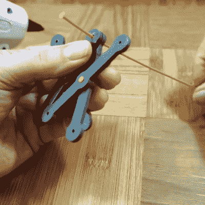

# Barb 用细丝铆钉制造机械手指

> 原文：<https://hackaday.com/2016/06/11/barb-makes-mechanical-pokey-finger-with-filament-rivets/>

我们在 Hackaday.io 上闲逛，无意中发现了[Barb]的视频系列，名为(很自然地)“ [Barb 制造东西](https://hackaday.io/project/8882-barb-makes-things)”。她的视频情节很简单——Barb 将一台延时相机对准她的办公桌，然后制作东西。很棒的东西。

两个特别巧妙的项目引起了我们的注意:一个机械尖头物和她用来制作它的有用的 3D 打印细丝铆钉。(下面都嵌入了。)手指很整洁，因为剪刀状的延伸机构直接来自 Wile E. Coyote 的实验室。

但真正的赢家是将它维系在一起的铆钉。[Barb]取一根细丝，用像热胶枪一样的热东西，熔化并挤压末端成蘑菇状铆钉头。将细丝穿过你的部分，另一端呈蘑菇状，就可以了。看了视频后，这是如此明显，我们不得不分享。(事实上，很多便宜的塑料玩具就是用这种技术组装的。)它很快，可拆卸，似乎是一个非常低摩擦的枢轴，这是印刷的销入孔往往不会的。好主意！

我们只需说“去看看她的 YouTube 频道”，我们认为这将解决大多数其他问题。有一个很棒的竹签弹珠，一个自动六吉他音乐机，还有…你还在这里？去看看她的频道。

 [https://www.youtube.com/embed/uliIK_bLQqQ?version=3&rel=1&showsearch=0&showinfo=1&iv_load_policy=1&fs=1&hl=en-US&autohide=2&wmode=transparent](https://www.youtube.com/embed/uliIK_bLQqQ?version=3&rel=1&showsearch=0&showinfo=1&iv_load_policy=1&fs=1&hl=en-US&autohide=2&wmode=transparent) 
 [https://www.youtube.com/embed/ReyMdd8uFIU?version=3&rel=1&showsearch=0&showinfo=1&iv_load_policy=1&fs=1&hl=en-US&autohide=2&wmode=transparent](https://www.youtube.com/embed/ReyMdd8uFIU?version=3&rel=1&showsearch=0&showinfo=1&iv_load_policy=1&fs=1&hl=en-US&autohide=2&wmode=transparent)

