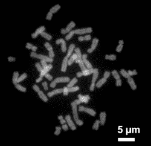
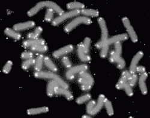
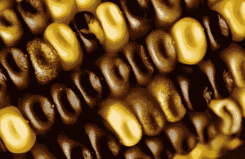
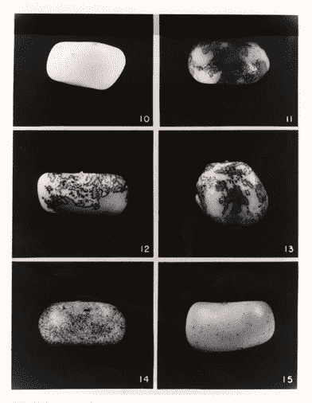

# 芭芭拉·麦克林托克:反对基因谷物

> 原文：<https://hackaday.com/2017/12/28/barbara-mcclintock-against-the-genetic-grain/>

芭芭拉·麦克林托克生活的大部分是科学家用显微镜长时间工作以寻求解决秘密的故事。她在职业生涯的大部分时间里试图解决的一个谜是，一个有机体中的所有细胞如何能够包含相同的 DNA，但却分裂产生具有不同功能的细胞；基本上细胞是如何分化的。为此，她独自获得了诺贝尔奖，这也是一个不小的成就。

## 成为科学家

Human chromosomes, long strands of DNA by Steffen Dietzel CC BY-SA 3.0

麦克林托克 1902 年 6 月 16 日出生于美国康涅狄格州哈特福德。从三岁到开始上学，她和姑姑一起住在纽约的布鲁克林，而她的父亲努力赚钱开始行医。她是一个孤僻、思想独立的孩子，她后来称这种特质为“独处的能力”。

1919 年，她开始在康奈尔大学农学院学习，并于 1921 年选修了第一门遗传学课程。一年后，由于她对遗传学表现出的兴趣，她被邀请参加康奈尔大学的研究生遗传学课程。正是在这里，她开始对细胞遗传学的新领域感兴趣，特别是玉米。细胞遗传学研究染色体与细胞行为的关系，特别是在细胞分裂过程中。染色体是每个细胞细胞核内的 DNA 长链，照片中显示的是它们浓缩或卷曲的时候。

还在康奈尔大学时，她开发了许多可视化和表征玉米的方法，这些方法最终出现在教科书中。她也是第一个描述十条玉米染色体的形态，基本上是它们的形式和结构关系的人，这让她发现了更多关于染色体的东西。她的一位同事观察到，康奈尔大学在 1929 年至 1935 年间在该领域取得的 17 项重大进展中，有 10 项是她的。这只是一位备受尊敬的科学家非凡事业的第一步。

## 旅行科学家

麦克林托克重视完全按照自己的意愿进行研究的自由，不受干扰或外界指导。到 1931 年，她的声誉如此之好，以至于她通过一系列奖学金获得了自由，在此期间她可以旅行并在不同的地方从事研究。

Telomeres in white on human chromosomes

她在奖学金期间的工作意义重大。例如，在 1931 年和 1932 年的夏天，她被介绍使用 X 射线作为一种增加突变率的方法。这项工作使她发现了端粒，即染色体末端的重复序列，它保护末端并防止相邻染色体相互连接。你可能听说过端粒[，因为它们与衰老](https://en.wikipedia.org/wiki/Telomerase)有关。

1936 年，她在密苏里大学找到了一份助理教授的工作。在此期间，她再次做了重要的工作，例如发现了断裂-融合-桥(BFB)循环，这是染色体不稳定性的一个来源，在今天的癌症研究中仍然很重要。然而，她觉得自己被排除在员工会议和晋升机会之外，还有其他一些问题促使她在 1941 年决定离开。

## 做出了值得诺贝尔奖的发现

接下来，她在冷泉港实验室找到了一份全职研究工作，这是一家位于纽约的私人非营利研究机构。她的工作是按照自己的节奏研究科学，对她来说，这意味着长时间努力研究她感兴趣的问题。这正是她想要的自由，她在那里度过了她职业生涯的大部分时间。

关注麦克林托克的行动很有趣，为此，我们强烈推荐纳撒尼尔·c·康弗的《纠结的领域*】这本书。大致来说，这个过程包括在小心控制下种植一季玉米，然后在实验室分析玉米，然后对结果进行理论化，为下一季作物制定计划，然后种植。*

Maize kernels with different colors by Carl Davies, [CSIRO](https://en.wikipedia.org/wiki/CSIRO) CC BY 3.0

与大多数人熟悉的玉米上的均匀黄色颗粒不同，一些玉米的颗粒有不同的颜色，甚至有斑点或斑块。麦克林托克的大部分分析和理论涉及检查果仁表皮的颜色模式和组成表皮的细胞的相应染色体，并试图推断是什么导致了特定的模式。具体来说，她会观察染色体上某些位点的变化，大致就是我们现在认为的基因位置。她会给它们起名字，比如“解离素”的 Ds 位点和“激活素”的 Ac 位点。

虽然大部分工作都是单独进行的，但她会联系冷泉港的某些人，分享新的发现。伊夫林·维特金回忆起 1948 年 3 月或 4 月初的一个特殊事件，当时麦克林托克把她叫了进来。“她兴奋得简直忘乎所以，几乎语无伦次，她说得太快了。她得出的结论是，这东西在四处移动。”

不清楚这个“东西”是 Ac 还是 Ds，但是从她 1948 年 4 月 18 日的笔记来看，Ac 已经从一个远离 Ds 的地方转移到了一个靠近 Ds 的地方。这是转座的发现，一些基因在染色体上移动。正是这一发现使她获得了 1983 年的诺贝尔奖。

## 细胞如何分化

Maize kernels. All have Ds. 10 has no Ac, 11-13 have one Ac, 14 has two, and 15 has three.

但是换位并不是她想要的。她想弄清楚是什么让细胞分化。她的驱动理论是，玉米粒上的颜色完全是由涉及染色体的行为驱动的，她将她所寻求的称为“控制元素”。

她收集了大量的数据，记录了涉及染色体上不同位点的复杂事件序列，并试图解释发生了什么。这些序列变得如此复杂，以至于许多人很难理解她的解释。

她给同事们写了长长的、详细的信，讲述她的进步，然而，她发表的文章和在 1950 年至 1953 年的研讨会上的讲话引起了不同的反应或沉默。对此提出了许多理由。

她在 1950 年发表在《美国国家科学院院刊》上的文章中给出了自己的理论，但隐瞒了数据。她以报道的彻底性而闻名，也许正是这种奉献精神阻止了她在觉得自己还没准备好的时候透露太多。她在 1951 年冷泉港研讨会上的讲话也缺乏数据，得到了不同的回应。也可能她的意图主要是刺激类似的研究。

混合反应的另一种可能性是，许多研究已经从苍蝇和玉米转移到细菌和病毒。另一个是从单独的染色体到一个基因一个酶的方法的转变，在这种方法中，编码酶的基因和生物体的发育依赖于由基因控制的化学反应系统。

1953 年，她在《遗传学》杂志上发表了一篇文章，其中她提供了更多的数据，但对于一些理论，还附有诸如“支持这一假设的证据已经获得(麦克林托克未发表)”的陈述考虑到她得到的反应，从那以后她很少发表关于控制元素的文章，尽管当在其他生物中发现类似的活动时，她在这方面的工作不时被提及。

## 拉丁美洲玉米

1957 年，她被要求帮助培训一名年轻的科学家在拉丁美洲对玉米进行细胞研究。为此，她去了秘鲁的利马。这开始了一段时间的工作，她在染色体水平上研究玉米的进化，主要是通过检查不同地区生长的玉米染色体末端的突起。这与她的细胞分化工作非常吻合，因为她觉得这些旋钮是基因行为的调节器。

## 一个时代的终结

Giving her Nobel Lecture

1967 年，麦克林托克从卡内基研究所退休，她在冷泉港工作期间，该机构雇用了她。然而，她成为了一名杰出的服务成员，这使得她能够作为荣誉退休科学家继续在冷泉港的活动。

1983 年，她因发现转位现象而被授予诺贝尔生理学或医学奖。

不可能用一篇文章概括芭芭拉·麦克林托克的一生和成就。我们遗漏了许多发现、奖项和对知名机构的任命。尽管她从未结过婚，但她确实有很多朋友和同事，并定期与他们交流。1992 年 9 月 2 日，90 岁的她自然死亡。