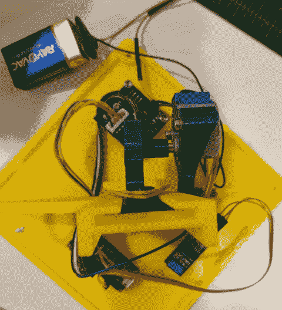

# 打败这个马里奥积木，就像它欠你钱一样

> 原文：<https://hackaday.com/2018/04/25/beat-this-mario-block-like-it-owes-you-money/>

人们试图从视频游戏中复制他们最喜欢的物品和小工具并不是什么新鲜事，随着桌面 3D 打印价格的降低，我们看到了比以往更多的此类项目。冒着用过于宽泛的笔触描绘的风险，这些项目中的大多数似乎都围绕着武器；无论是神秘的剑还是拼凑的等离子步枪，似乎大多数游戏玩家都希望在现实世界中拥有和在数字世界中一样的装备。

 但是【乔纳森·惠伦】走的是一条不同的路。当被赋予显现实物的能力时，他决定[重现马里奥系列](https://www.thingiverse.com/thing:2858020)中标志性的“问题方块”。但他并不满足于只是把一个黄色的大立方体无所事事地放在桌子上，他决定让它变得实用。虽然你可能不应该用你的头去撞它，但是如果你给它一个好的撞击，它会把金币发射到空中。不幸的是，你必须自己提供金币，至少在我们搞清楚整个炼金术之前。

打印块本身足够简单。这只是一个 145 毫米的黄色立方体，侧面有凹痕，可以接受白色印刷的问号，并粘在里面。一件足够整洁的装饰品，也许，但不完全是一个黑客。

真正的魔力在内心。Arduino Nano 和一个振动传感器用于检测何时情况开始变得糟糕，然后启动步进电机。通过一个巧妙的印刷齿条和齿轮的安排，橡皮筋被拉回，然后释放。当装满 1 美元的金币时，你需要做的就是推搡立方体，使一枚硬币从顶部射出。

如果这个项目让你对娱乐界的 3D 打印道具感兴趣，不要担心，[我们已经帮你搞定了。](http://hackaday.com/2018/04/02/bringing-fiction-to-life-with-3d-printing/)

 [https://www.youtube.com/embed/gtSkSsmljP0?version=3&rel=1&showsearch=0&showinfo=1&iv_load_policy=1&fs=1&hl=en-US&autohide=2&wmode=transparent](https://www.youtube.com/embed/gtSkSsmljP0?version=3&rel=1&showsearch=0&showinfo=1&iv_load_policy=1&fs=1&hl=en-US&autohide=2&wmode=transparent)

