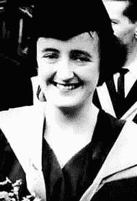
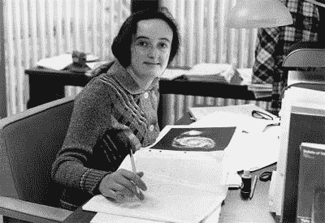
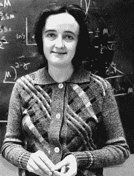

# 比阿特丽斯·汀斯利和星系的演化

> 原文：<https://hackaday.com/2018/04/17/beatrice-tinsley-and-the-evolution-of-galaxies/>

现在看来这几乎是荒谬的，但是宇宙学家曾经假设一个给定类型的星系都是一样的，不会改变。因为这个假设，星系被用作红移或基于光的尺度来测量宇宙中的距离。但是如果一些星系本质上比其他星系更红呢？在 Beatrice Tinsley 出现之前，很少或没有人考虑过它们的起源、组成或进化。

比阿特丽斯认为星系是不断变化的星体。她相信他们成长、进化、死亡是因为他们是由恒星组成的，这就是他们的恒星群体所做的。把所有的星系放在一起，并用它们作为标准烛光是一种过于简单化的做法。比阿特丽斯创建了第一个星系的计算机模型来证明她的观点，并由此建立了星系演化领域。

如果你从未听说过比阿特丽斯，不要难过。正当她的事业真正开始腾飞时，她在 40 岁生日后不久患上了癌症并去世了。虽然她的生命短暂，但她对宇宙学的影响却是深远的。

Beatrice earns her PhD in 1966\. Via [Science Learn NZ](https://www.sciencelearn.org.nz/interactive_timeline/3-beatrice-hill-tinsley-cosmologist)

### 文艺复兴时期的女人

比阿特丽斯·穆里尔·希尔出生于 1941 年，当时二战正在她的父亲驻扎的英格兰切斯特及其周边地区肆虐。她在一次空袭中早产，没想到会活下来。战争结束后，她的父亲成为了一名圣公会牧师，并举家迁往新西兰。

年轻的比阿特丽斯尽力取悦她的父母，但对他们的宗教信仰越来越不满。在学校，她擅长数学、语言、写作和音乐，并为新西兰国家青年管弦乐队演奏小提琴。比阿特丽斯可以成为她想要的任何人，包括职业小提琴手。但是在 14 岁时，她把目光投向了星星。

比阿特丽斯 16 岁高中毕业，1961 年在坎特伯雷大学获得理学硕士学位。同年，她嫁给了物理系的同学布莱恩·汀斯利。除了学习之外，两人几乎没有什么共同之处，但比阿特丽斯想做人们对她的期望。布赖恩接受了达拉斯大学的一个研究职位，比阿特丽斯得到保证，她可以用奖学金在那里攻读博士学位，她同意和他一起去。然而，当申请的时候，她被告知他们不接受已婚女性。

Beatrice 在达拉斯没有机会，所以她申请了奥斯汀大学，进入他们的非全日制博士课程。每周，她往返 400 英里，在宇宙学光明未来的承诺和她婚姻的黯淡之间摇摆。

Beatrice at Yale in 1978\. Via [The Encyclopedia of New Zealand](https://teara.govt.nz/en/photograph/44359/beatrice-tinsley)

### 星系的演化

比阿特丽斯在不到两年的时间里获得了博士学位，这大约是通常所需时间的三分之一。她获得了极高的分数，她的教授称她的论文题为*星系的演化及其对宇宙学的意义，*“非凡而深刻”。许多天文学界人士称之为颠覆性的。

对比阿特丽斯来说，显而易见的是，由于星系在时空开始时并不存在，它们必须成长和变化，因此不能像静止的物体一样使用。在她的论文中，她提出星系的变化需要很长时间。为了确定一个星系的年龄(进而确定宇宙的年龄)，人们必须注意诸如星系的质量、恒星诞生率和内部化学元素等因素。

毕业后，Beatrice 利用她在 UT Austin 的任期进一步探索星系的演化。她用 FORTRAN 语言编写了一个星系从诞生到 120 亿年演化的模拟程序，以展示其外观如何随着其恒星的演化而变化。Beatrice 的结论基于最近关于太阳进化的理论，这些理论表明太阳将耗尽其燃料，进化，并最终死亡。她认为，对太阳有益的东西一定对类似的中等大小的恒星有益，包括那些构成被用作衡量标准的星系的恒星。

Beatrice at the blackboard. Via [Wikipedia](https://en.wikipedia.org/wiki/Beatrice_Tinsley)

### 碧翠丝的进化

1974 年，比阿特丽斯因其在星系演化领域的开创性工作获得了安妮·约姆普·坎农奖。她与布赖恩离婚，并彻底离开德克萨斯州去追求自己的事业。在圣克鲁斯利克天文台呆了一年后，她成为了耶鲁大学的天文学助理教授。四年后，她成了正教授。

同年，正当她的事业真正起步时，比阿特丽斯被诊断出患有黑色素瘤。在接下来的三年里，她一边抗击癌症，一边发表论文，一生中发表了 100 多篇论文。Beatrice 患了脑瘤，导致她部分瘫痪，所以她自学用左手打印，以便继续工作。1981 年，致力于宇宙学的比阿特丽斯在病床上写下了她的最后一篇论文。