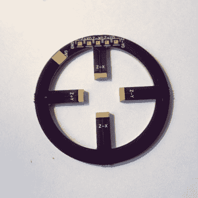
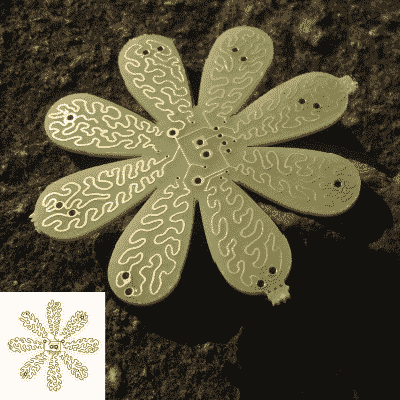
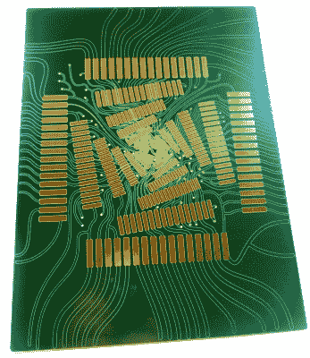
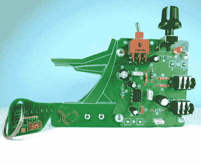

# 美丽而奇异的木板

> 原文：<https://hackaday.com/2016/01/28/beautiful-and-bizarre-boards/>



An odd board (piezo coupler), fabbed by OSHPark.

最近我对有趣的 PCB 形状很好奇。在过去，我总是使用简单的多边形，也许是圆角使设计更美观。右边的板子是我对异形板子可能性的介绍。它被设计成与压电蜂鸣器(用作致动器)耦合。我一直计划在 FPC 制造它(柔性印刷电路)，但由于制造成本如此之低，我把它送到了 OSHPark，看看他们会怎么做。OSHPark 没有关于内部路由的硬性规范，但根据我的经验，他们可以尝试任何事情(他们的质量总是很好)。所示 PCB 上管脚的宽度为 5mm。我认为这是一个风险，FR4 可能会损坏，但它回来了！

这让我意识到，我的电路板看起来可能比现在更令人兴奋，我们高度优化的现代 PCB 制造工艺为实验提供了很大的空间。本文将讨论创建非传统 PCB 时可用的一些选项。



The flower solar lantern design and final board.

左边的板子是一个简单的太阳能灯。led 位于摆动轨道的末端，驱动器 IC 位于中间。我设计它是为了尝试和推动这一过程，看看 PCB 是否可以做得不那么无菌，更像一件工艺品。通向发光二极管的线路没有被遮盖，这样它们就可以和 ENIG 一起呈现出金色。我认为制作的板看起来还可以，但在下一次修改中，我会保留更多的遮罩，这将使痕迹更加突出。令人欣慰的是，我现在对 OSHPark 可以应对的怪异棋盘形状有了更好的了解(并将努力推进这一进程)。

包括 KiCad 在内的大多数布局工具在设计时都没有考虑到制造复杂的边缘或组件。虽然上面耦合器的边缘是在 KiCad 中创建的，但这是一个不愉快的过程。所以对于太阳能灯，我选择了外部工具。

首先，我在 Inkscape 中设计了花形边缘切割。在 KiCad 的最新版本中，导入边缘切削相当容易。首先在 Inkscape 中创建您的边缘，确保设计是一个简单的线条画，并将其保存为 DXF 文件。然后只需在 KiCad 中选择“文件->导入->DXF”，将 DXF 导入到边缘层。

在 KiCad 中创建蜿蜒的轨迹更加困难，事实上这是不可能的。KiCad 没有非直线走线的概念，也没有受限的焊盘几何形状。

KiCad 整合了一个名为“位图 2 组件”的工具，虽然许多人使用它在他们的板上添加徽标效果很好，但它在处理矢量图像数据时并不理想，并且功能有限。为了解决这个问题，我们期待 svg2mod。该工具允许您使用简单的命令行工具将 svg 转换为 KiCad 封装。在 Linux 上，您可以按如下方式使用它:

```
./svg2mod.py -i ~/design.svg -o ~/design.mod -p 0.1
```

由于 KiCad 只使用直线，原始 svg 中的曲线将被分解成直线段。“-p”参数决定一条曲线被分成多少段，可能需要一些实验。svg2mod 处理分层的 svg 文件。您可以在 svg 中为铜、掩模和丝绸创建单独的层，从而生成复杂的元件外形。对于上面的 PCB，我用这个来移除所有摆动轨迹的遮罩。Eagle 用户可能想看看似乎提供类似功能的 [svg2poly](https://github.com/cmonr/Eagle-ULPs) 。

这是我第一次尝试创造更美观的电路板，但 Saar at [Boldport](http://www.boldport.com/) 多年来一直在制造好看的 PCB。



One of Boldports amazing boards designed for [Haute circuits](http://boldport.com/hautecircuits).

他的一些设计(如右图所示)。很难被认为是 FR4 板。Marie Claire 委托这款和其他类似的电路板拍摄名为 [Haute circuits](http://www.boldport.com/blog/2015/11/25/haute-circuits) 的照片，该照片使用这些电路板作为奢侈珠宝的背景。

Boldport 的设计总是独特而美丽。典型的是，永远找不到一条直线。在传统的布局封装中产生这样的设计几乎是不可能的。

因此，萨尔大胆地从零开始设计自己的排版软件。该工具名为 [PCBMode](http://pcbmode.com/) ，免费开源。它非常适合 Saar 独特的工作流程，需要一点时间来适应，但值得一试。

PCBMode 原理图不是有自己的接口，而是用一系列 JSON 文件表示。这些然后被处理成一个 SVG，可以在 Inkscape 中编辑，以产生一个美观的设计。然后，svg 最终被处理，以创建可用于制造的 gerbers。



Another one of Saars [amazing designs](http://boldport.com/nutclough). Not a straight trace to be seen.

PCBMode 生产出漂亮的电路板，但需要投入大量时间来适应。如果你喜欢 PCBMode 漂亮的电路板，你可能想看看萨尔的[漂亮套件](https://boldport.cratejoy.com/)，他将从 3 月份开始提供订阅。全部采用 PCBMode 精心设计。

还有一个我们应该提及的历史悠久的传统，尽管带有现代色彩。在计算机化排版工具出现之前，手工排版当然是相当普遍的。

这些带有极不规则(通常无掩模)轨迹的旧电路板仍然具有一定的视觉吸引力。对于在家蚀刻的黑客来说，这当然很容易复制。但是，您也可以使用商业 fab 和工具将 SVG 直接转换为 gerbers 来实现类似的美感。

为此目的，Cenon 工作得很好..你必须为每个层和边分别创建和转换 SVG。您还会遇到创建自己的钻孔文件的问题。在我到目前为止所研究的过程中，svg2mod 和 KiCad 最适合我，它允许您在 Inkscape 中轻松创建复杂的多层矢量组件足迹，以导入到 KiCad 中，并与更传统的电路元素相结合。创建和导入轮廓和边缘的过程效果很好，即使这是一个有点笨拙的过程。

我很想听听你最喜欢的创新 PCB 布局，以及你在设计新颖 PCB 过程中发现的任何辅助工具。请在下面评论！