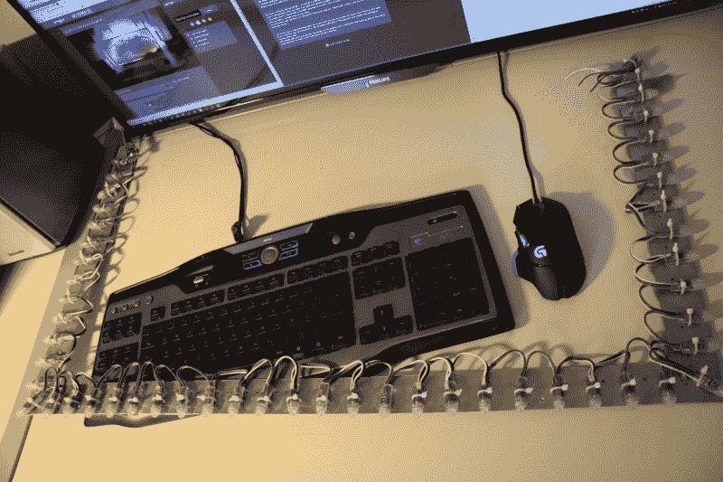

# 漂亮的 DIY 流光溢彩展示

> 原文：<https://hackaday.com/2016/12/03/beautiful-diy-ambilight-display/>

一个合适的战斗站——或者更通俗地说，电脑桌——有时可以使用一点技术天赋来展示你的技能。[fightforlife2]分享了他们的 [DIY 流光溢彩监视器背光](https://www.reddit.com/r/DIY/comments/5ez0yb/cheap_diy_ambilight_tutorial_for_a_windows_pc/)，它通过不同的颜色模拟屏幕上显示的内容。

[fightforlife2]的设置使用了 50 个 RGB LEDs，每个 LED 都有支持 FastLED 库的独立控制器，由 Arduino Nano 克隆进行调节——尽管任何一个都可以。显示器的电源要求有点棘手，最终要求 5V 时 3 安培；外部电源可以做到这一点，但[fightforlife2]也建议使用计算机电源的 5V 线的漫不经心的解决方案——增加了当你关闭 PC 时关闭流光溢彩显示器的便利性！

将 LED 连接到 Arduino 很简单，然后添加 FastLED 库，并在您的 PC 上安装和配置 AmbiBox。对于游戏来说，该软件只能在无边框的游戏窗口上运行，但这将对你的处理器征收 5-10%的税。预先警告！——在第一周左右玩游戏时，这种模糊会让人分心。

如果你想把这个很酷的想法带到你的其他追求中，你可以——比如说——在你的钢琴周围设置一个类似的展示。

[通过 [/r/DIY](https://www.reddit.com/r/DIY/)