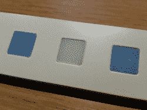

# 漂亮的线性 RGB 时钟

> 原文：<https://hackaday.com/2017/02/18/beautiful-linear-rgb-clock/>

是的，另一个时钟项目。但是在这里，[简]建造了一些在现代艺术博物馆比在黑客洞穴的黑暗角落更自在的东西。看时间一点都不难，很准，很好看。是一个[线性 RGB LED 挂钟](https://hackaday.io/project/18878-linear-rgb-led-clock)。

 你不必学习[电阻色码](http://hackaday.com/2016/10/03/who-could-resist-a-color-coded-clock/)或[奇怪的二进制编码](http://hackaday.com/2017/01/12/x-marks-the-clock/)来判断时间。这里没有[炫目的图形](http://hackaday.com/2016/02/12/glitching-square-wave-clock-is-designed-to-confuse/)，也没有[改良的经典时计](https://hackaday.com/2016/05/30/gutting-and-rebuilding-a-classic-watch/)。这个项目是最小的，干净的，优雅的。十二个发光二极管显示小时，六个和九个发光二极管显示十进制的分钟。(横幅图像中是 3:12。)

技术细节很简单:WS2812 LEDs，一个 Arduino，三个按钮和一个 RTC。你可以自己想出来。但是，去看看日志，看看如何构建一个漂亮的漫射树脂和一个非常干净的壁挂解决方案。正是这些细节将这个建筑与挂在我们办公室墙上的东西区分开来。干得好，[简]。