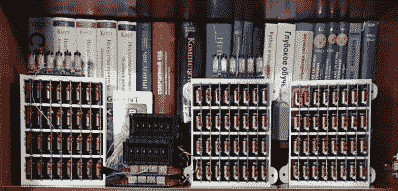

# 因为建造一台中继计算机还不够难

> 原文：<https://hackaday.com/2018/04/06/because-building-a-relay-computer-isnt-hard-enough/>

对于今年的 Hackaday 奖，我们正在做一些特别的事情。我们正在介绍获奖项目的成果。把它们当做荣誉徽章。如果你的 Hackaday 奖项目有多个部分组成一个统一的、令人敬畏的整体，你将获得 Voltron 成就。如果你制造了一件出乎意料地震撼每个人心灵的乐器，你就获得了天后普拉瓦拉古纳成就。少数入选者将获得泡菜里克成就。这是什么？这是一个令人瞠目结舌的建筑，让你在工程完美的总体中摇头。

这里有一个项目，钉这一成就。这是一台自制的计算机，由继电器制成，运行一套定制的指令集。它建立在 Brainf*ck 的基础上。这是迄今为止，你见过的最荒谬、最神奇的自制电脑。

Several modules on a shelf, for scale.

第一，硬件。这个 CPU 是由大约 800 个苏联簧片继电器，RES64，RES55 和 RES-43 继电器组成的，如果你想要一些零件号的话。这些继电器安装在与底板相连的逻辑卡上。每个背板由 32 个这样的卡组成，需要两个背板来构建一个 16 位全加器。16 位指令指针和 16 位地址指针各安装在半个背板上。

再往上一层，这台计算机的指令集是基于 Brainf*ck 的，并做了一些补充。'+'指令增加了当前值，'>'指令仍然增加了当前的内存地址，但有一些新的指令使这个 CPU 不是一个无休止的痛苦世界。现在有了“将当前数据值写入寄存器”命令和逻辑 XOR 指令。

基于继电器的计算机以前做过吗？是的，脑残也是。这种组合很少见，我们从未见过表现如此出色的组合。下面，你可以看到一个视频，这台计算机以每秒 500 次运算(或频率计数器 500 赫兹)计数。这对于我们见过的任何其他中继计算机来说都是不可想象的，这都要归功于那些非常小的苏联电子管。如果你想要一个令人瞠目结舌的 Hackaday 奖项目，那就来吧。

 [https://www.youtube.com/embed/JhsZYBufTJ4?version=3&rel=1&showsearch=0&showinfo=1&iv_load_policy=1&fs=1&hl=en-US&autohide=2&wmode=transparent](https://www.youtube.com/embed/JhsZYBufTJ4?version=3&rel=1&showsearch=0&showinfo=1&iv_load_policy=1&fs=1&hl=en-US&autohide=2&wmode=transparent)

The [HackadayPrize2018](https://hackaday.io/prize) is Sponsored by:     