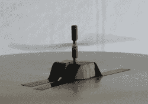
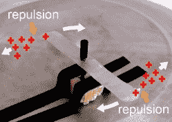
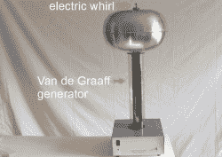
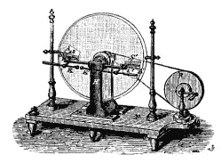
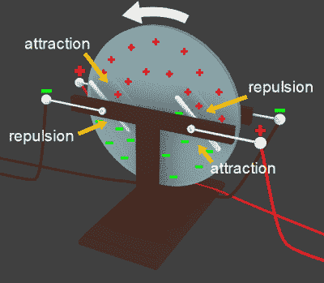
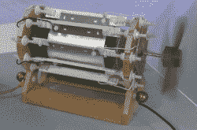
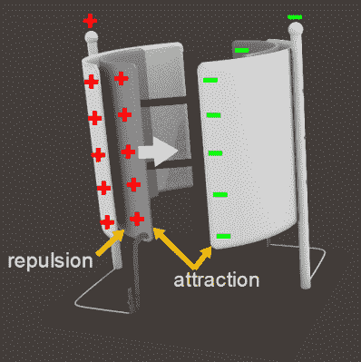
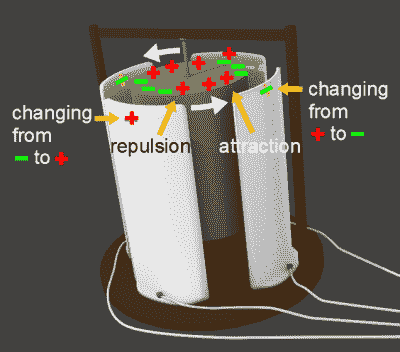

# 本·富兰克林的弱运动和其他被遗忘的运动

> 原文：<https://hackaday.com/2017/10/03/ben-franklins-weak-motor-and-other-forgotten-locomotion/>

如今我们看到的大多数电动机都是电磁型的，这是有充分理由的:它们功率很大。但是有一种马达是在电磁马达之前发明的，并且有许多变体。那些是靠高压运行的电机，电荷的吸引和排斥，俗称[静电电机](https://en.wikipedia.org/wiki/Electrostatic_motor)。

本·富兰克林制造并测试了一台这样的高压电机，他的电学实验经常与在雷暴中放风筝有关。这不是很强大，但足够好，他可以想象使用它作为烤肉店黑客。食物是强大的动力。

接下来是各种类型电机的发展历程，从最早的离子推进电机到大多数人从未听说过的感应电机，甚至像你这样的 HV 黑客也不例外。

## 富兰克林电动轮

Franklin’s electric wheel

1748 年，本杰明·富兰克林发明了他所谓的电动轮。这通常被称为第一台静电马达，有时也被称为第一台电动马达，这取决于你的定义。转子由一个木质轮毂组成，轮毂周围连接有 30 根玻璃杆。这些栅栏是从窗户玻璃上切割下来的。黄铜套管连接到每个棒的末端。为了容易转动，转子有一个中心轴，底部有一个铁点，顶部有一根结实的线，线穿过一个孔以保持垂直。

电源由两个带相反电荷的莱顿瓶组成，最初的名字是用某种瓶子制成的圆柱形电容器。在富兰克林的时代，罐子和电介质都是玻璃的。一根电线从内部电容器板向上延伸，这根电线被放置在套管将经过的地方附近。当顶针经过时，在顶针和导线之间会产生火花，使顶针带上与内极板相同的极性。由于带相同的电荷，顶针会被电线排斥，带动轮子转动。当顶针碰到对面莱顿瓶的金属丝时，由于电荷相反，它会被吸引到莱顿瓶的金属丝上。当它通过时，两者之间会产生火花，使顶针充电到与电线相同的极性，并使其被排斥，使轮子转动更多。

轮子的初始方向是通过用手推它来设定的。在一封信(第 29 页)中，富兰克林写道，它以每分钟 12 到 15 转的速度旋转，承载着一百西班牙元的重量。他还写道:

> 如果在直立的轴上发现一只大家禽，它会被带到火前，以适合烧烤的动作。

## 电涡流

Electric whirl in action

How the electric whirl works

Electric whirl on Van de Graaff generator

这台发动机比富兰克林的要老一点，可以追溯到 1745 年。它是由苏格兰本笃会修士安德鲁·戈登制作的。它有很多名字，但最初的名字是电动旋转。基本的想法是在尖点的电场会比在光滑点的强。这种强电场使点附近的空气电离，根据极性，甚至可能向空气中发射电子。这种电离的空气被称为日冕。在这两种情况下，尖点周围的电离空气与构成尖点的物质具有相同的极性。由于同性电荷相互排斥，电离空气排斥尖头。你肯定听说过牛顿第三定律，它基本上是说，对于每一个作用力，都有一个大小相等方向相反的反作用力。所以空气在一个方向被排斥，尖点通过在另一个方向被排斥来反应。把这个点安排在一个可以绕轴自由运动的臂上，这个臂就会绕着那个轴旋转。移动的电离空气通常被称为离子风，因此也经常被称为离子风转子，或离子风旋转器或针轮。

通常有两个点，分别在各自的臂上，指向相反的方向，以使系统更加稳定。当然可以有更多。图中的这一个位于范德格拉夫发电机的圆顶上，相对于地面来说是高电压。电涡流器通过支撑轴与圆顶电接触。电场的另一端是周围的空气，范德格拉夫发电机的底部和房间。

## 波根多夫/电晕电机

Holtz influence machine

在 19 世纪 60 年代，许多人都在试验影响力机器，这种机器使用静电感应，当时被称为*影响力*来产生高压。一个这样的实验者是[威廉霍尔茨](https://en.wikipedia.org/wiki/Wilhelm_Holtz)。1867 年，他灵光一现，将一台类似机器的输出连接到自己的一台机器上，发现它可以像马达一样运转。因此在 1869 年， [J.C. Poggendorff](https://en.wikipedia.org/wiki/Johann_Christian_Poggendorff) 制造了霍尔茨机器的简化版本，只有它作为马达运行所需的东西。

Poggendorff motor

波根多夫的马达由一个玻璃圆盘组成，圆盘的两边都有梳子朝向它。梳子上有锋利的尖端，这些尖端排列在圆盘附近，但不接触圆盘。可以转动梳齿，使得它们相对于圆盘严格呈径向。在这种情况下，磁盘不是自启动的，一旦用手旋转，它将继续朝那个方向旋转。然而，梳也可以转向偏离径向的角度。在这种情况下，磁盘将自启动，并且是单向的。

富兰克林的轮子和波根多夫的马达之间的一个区别是，富兰克林的轮子使用火花将电荷放在顶针上，而波根多夫的轮子通过电离空气或电晕将电荷喷射到圆盘上。这个电晕与我们在谈论电涡流时提到的相同，并且是以相同的方式形成的——尖锐的点导致了使空气电离的强电场。

与富兰克林的“圆盘面积”相似，接近梳子时会带上与梳子相反的极性，因此会被梳子吸引。远离梳子的区域带相同极性的电荷，因此被排斥。

 [https://www.youtube.com/embed/Pzjvrh96QTs?version=3&rel=1&showsearch=0&showinfo=1&iv_load_policy=1&fs=1&hl=en-US&autohide=2&wmode=transparent](https://www.youtube.com/embed/Pzjvrh96QTs?version=3&rel=1&showsearch=0&showinfo=1&iv_load_policy=1&fs=1&hl=en-US&autohide=2&wmode=transparent)

Corona motor

Poggendorff 的电机也比富兰克林的电动轮有一些优势。梳子总是喷射到磁盘上，不断产生旋转，而富兰克林的，只有当顶针经过莱顿瓶时才会发生。此外，总是有相同数量的圆盘表面面积面向梳齿，从而产生恒定的扭矩。

由于电晕是转移电荷的机制，这些类型的电机通常被称为[电晕电机](https://hackaday.com/2015/11/22/who-is-john-galt-finally-answered/)。并且在它们中的许多中，圆盘被圆柱体代替。然后梳子要么变成细金属丝的尖端，要么变成长而锋利的刀片，就像这里显示的由大气电力驱动的那种。

## 电容式电机

Capacitor motor

下一种类型的马达是卡尔·齐珀诺斯基在 1889 年发明的，但一个更容易说明的版本是 N.G .范·赫费尔在 1904 年发明的。在它里面，转子和定子都是由两个部分圆柱体或弯曲的板组成的。转子盘的直径稍小，以便安装在定子盘内。

定子板带相反的电荷，转子板通过滑动接触从它们相邻的定子板接收电荷，就像它们旋转离开那些板一样。这样，它们就会与相邻的定子板相斥，并到达一个位置，然后被下一个定子板吸引。

所有这些电机之间的最大区别是电荷移动的方式，通过富兰克林的火花，通过电晕，或通过滑动接触。然而，由于这里使用滑动触点，这些电机可以在较低的电压下运行。这些也可以在交流电上运行。

## 感应电机

Induction motor

感应电机的工作原理可能是最有趣的。转子不与任何电源电连接，由绝缘材料制成。周围的定子板由交流电供电，因此转子周围有一个旋转电场。该电场引起转子表面分子的极化。从定子的角度来看，这表现为净电荷。

关键在于，当定子板的磁场改变极性时，附近转子的极化需要时间来做出响应。这在运动的磁场和极化的分子之间产生了一个滞后。这种滞后是导致转子跟随磁场的原因。

这里展示的插图是罗卡多·阿诺在 1892-1893 年制作的^([1](#footnote1))。

## 所有的马达都到哪里去了？

正如我们所说，电磁马达的功率要大得多。但是静电马达确实在微小尺寸的 MEMS 马达中得到应用。当然，如果你考虑到喜欢复活这些旧机械奇迹的静电修补者，他们并没有真正去任何地方。我涉猎过电漩涡和电晕电机，并从中国订购了 30 个顶针，细心的读者应该能猜到。你在家里的实验室里摆弄过哪些静电马达？

#### 资源:

静电电机:其历史、类型和工作原理作者 Oleg D. Jefimenko