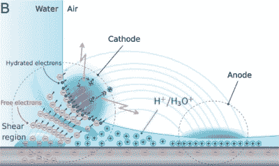

# 测试新型等离子体

> 原文：<https://hackaday.com/2018/04/03/ben-krasnow-tests-novel-plasma/>

当[Ben Krasnow]看到一个有趣的现象时，他会以一个真正的科学家的心态去追求它，尽管他也有技能和工作室，这并没有什么坏处。这一次他的[用高速水射流](https://www.youtube.com/watch?v=_vTq8oGpqwM)冲击熔融石英和其他材料，产生了炽热的等离子体。

纯水射流从直径为 0.004 英寸或 100 微米的蓝宝石孔中喷出，流速约为每秒 2 毫升，速度为每秒 240 米。它以 90°与电介质材料碰撞，在碰撞点周围产生环形等离子体。

How a waterjet plasma works

对这种现象的研究很少，但是【本】发现[的一篇研究论文](https://authors.library.caltech.edu/83266/4/PNAS-2017-Gharib-12657-62.pdf)提出等离子体是由于摩擦电效应充电的结果。这与当你摩擦你的头发时气球充电的效果相同，只是这里有水分子穿过透明的电介质，如熔融石英。这种效应导致碰撞下游的阳极带正电，而最高剪切力点附近的水变得导电，并将负电荷传导到最小曲率点，产生阴极。小半径阴极上的电场就像一个带有高电压的短路点，电离空气并形成等离子体。如果这种形式的电离听起来很熟悉，那是因为我们已经谈论过它[发生在飞行升降机](https://hackaday.com/2016/07/13/expanding-horizons-with-the-ion-propelled-lifter/)的尖锐电线和圆形箔裙之间。

[本]用油代替水，为摩擦起电理论找到了支持。这没有产生任何等离子体，这是意料之中的，因为与水不同，石油是一种非极性分子。然而，虽然研究人员只尝试了几种电介质材料，但[Ben]在他尝试的每种透明电介质上都取得了成功，包括熔融石英、铌酸锂、玻璃、聚碳酸酯和丙烯酸，其中一些材料彼此之间的摩擦电差异很大。所以这里有更多的理论空间。但请查看他的完整视频，展示他生产喷水器的设备以及他的演示和解释。

[本]对有趣现象的永不满足的好奇心在 Hackaday 上是众所周知的。看看他的实验:制作光致变色玻璃和钢铁热处理。

 [https://www.youtube.com/embed/_vTq8oGpqwM?version=3&rel=1&showsearch=0&showinfo=1&iv_load_policy=1&fs=1&hl=en-US&autohide=2&wmode=transparent](https://www.youtube.com/embed/_vTq8oGpqwM?version=3&rel=1&showsearch=0&showinfo=1&iv_load_policy=1&fs=1&hl=en-US&autohide=2&wmode=transparent)

