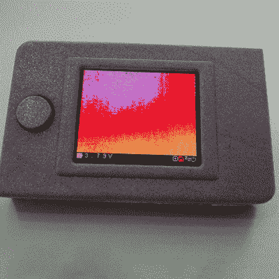

# 最佳参赛产品:袖珍热感相机

> 原文：<https://hackaday.com/2017/06/28/best-product-entry-pocket-thermal-camera/>

Hackaday 奖最佳产品竞赛的参赛作品之一是[【x-labz】的袖珍热像仪](https://hackaday.io/project/20039-pocket-thermal-camera)。它不仅仅是一个原型，它是一个被设想出来的设计，可以被世界上的许多人使用。[最佳产品](https://hackaday.io/prize/bestproduct)参赛作品将于 7 月 24 日截止，奖金高达 30，000 美元，让我们来看看将项目提升到产品状态的一些事情。

 由于热成像传感器的最新进展，一种让你拥有*捕食者*视觉的工具几乎是现代工作台上的必需品。袖珍热成像仪会在冬天发现你家里的通风，会告诉你如何烹饪牛排，找出你最新的电子项目中哪个部分短路了，会告诉你你的 3D 打印机上的加热床有多糟糕。

[x-labz]的热成像相机基于 FLIR 轻子图像传感器，这是一种 80×60 像素的热成像传感器，足以满足大多数用途。这款相机焊接在一个 PCB 夹层上，其中包含 Atmel SAMD21 微控制器、全彩色有机发光二极管显示器、SD 卡和电池管理系统。

到目前为止，我们提到的内容对于 Hackaday 奖的其他参赛作品来说并没有什么特别之处。然而，为最佳产品竞赛制造东西是不同的:必须对这种设备的可制造性、适合度和光洁度进行大量思考。到目前为止，对于[x-labz]的相机来说，一切看起来都很好。有一个 3D 打印的外壳，看起来它可以很容易地转换成可注射成型的外壳，至少用户界面[的一些部分令人难以置信地满意](https://twitter.com/xLabzNet/status/877832544573632512)。我们期待看到完整的材料清单和商业计划(今年的新要求)。这是许多硬件设计师缺乏经验的领域；能够研究来自最佳产品条目的例子将是一个受欢迎的资源。

构建一个项目和构建一个产品之间有着天壤之别，Hackaday 奖的[最佳产品部分的整体目标是奖励那些作为有抱负的企业家付出额外努力的人，并向我们展示这是如何做到的。为最佳产品留出 5 万美元的现金奖励；正如我们之前提到的那样，获胜者将获得 30，000 美元，但除了从 Hackaday 的硬件爱好者和早期采用者社区获得一些应得的名声之外，进入该类别决赛的 20 个参赛作品中的每一个也将获得 1000 美元。](https://hackaday.io/prize/bestproduct)

The [HackadayPrize2017](https://hackaday.io/prize) is Sponsored by:   