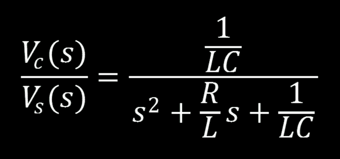

# 超越控制:控制系统的数学

> 原文：<https://hackaday.com/2015/12/24/beyond-control-maths-of-a-control-system/>

控制系统就在我们身边，了解它们将使你在硬件设计方面做得更好。在上一篇文章[超越控制:控制系统的基础知识](http://hackaday.com/2015/12/02/beyond-control-the-basics-of-control-systems/)中，我们用一个例子概括了什么是控制系统:“水和时间之间的一切都是控制系统”。我们还观察了自然界中的控制系统，我描述了自己灌满一杯水而不会产生灾难性结果的敏锐能力。那次讨论涉及框图的基本概念(没有数学)，我们稍微扩展了一下，看看我们的圆盘式卫星电视天线的例子会是什么样子(仍然没有数学)。

我在这篇文章中承诺了一些大的丑陋的数学，我们将很快到达，永远不要害怕。首先，让我们看看一些基本元件:电阻、电感和电容是如何在时域中定义的。不要让这些前几个定义让你感到厌烦。不管你对微积分的感觉如何，你不一定需要完全理解每个方程。更重要的是方程本身如何组合求解电路。同样重要的是，我会尽一切可能来摆脱做困难的数学。因此，请坚持阅读这篇文章，你将会学到为自己减轻痛苦的诀窍！

在我们开始之前，快速回顾一下传递函数可能是有益的。控制系统用于定义机电行为。例如:我们的圆盘式卫星电视天线(来自前一篇文章)在某个时候需要从一个位置移动到另一个位置，作为控制工程师，我们的工作就是确定这个动作将如何发生。我不是在谈论为大的情绪机器人旋转设置情绪，更像是:在移动盘子时不要损坏设备或任何可能在附近的人。出于多种原因，需要极其小心地以非常精确的方式移动盘子。控制系统是该运动的数学定义。通常定义的数学是讨厌的微分方程，(记住我在避免任何可以避免的数学，对吗？)因此，传递函数将使用代数来定义系统，将系统的输出与输入相关联，而不是使用微分方程来定义系统。

我们不打算磨出任何困难的东西，但如果你仍然担心微积分，你应该[把【威尔·斯韦特曼】的*微积分并不难*系列添加到你的阅读清单](https://hackaday.com/2015/12/22/calculus-is-not-hard-the-derivative/)中。

现在让我们熟悉一些无源瞬变，好吗？

# 用数学方法定义无源元件

电阻是一种可以用来改变电压和/或电流的元件，它有多种用途，在设计和构建电路时很快就会变得显而易见和熟悉。虽然这不是电阻的全面定义，但它确实允许我们与外界交流我们在电路中使用的“不同颜色条纹的小东西”是什么。

如果我们想向有数学背景的人解释这一点，那么我们需要改变这个定义，以便对他们有用。对于电阻来说，这不是问题，靠近麦克风，用低沉的声音说出“欧姆定律”，同时进行眼神交流(*表示抢劫*孩子们称之为抢劫)，放下麦克风，走出去。

如果你忘了，欧姆定律说:

那就是电压等于电流和电阻的乘积。

定义储能元件并不那么简单。瞬变需要一点花哨的步法和谨慎的退出策略，以避免在活着离开房间时踩到自己的舌头。

让我们看看如何在时域中根据电压和电流来解析定义每个元素:

## 电阻器

  Resistor Symbol  Resistor Voltage  Resistor Current

我已经包括了一个电阻的符号，不管你住在池塘的哪一边，它都应该适合你。我们对电阻的计算是欧姆定律的精髓:V=IR 或电压等于电流和电阻的乘积。公平地说，尽管你使用它的头 600 次看起来并不壮观，但在某个时刻，你开始用欧姆定律来发挥创造力，它比你鞋子里的 20 美元更方便。为了我们的目的，我们可以把一个电阻代表的值想象成一个常数，如果你不精通微积分的话:常数=像星期天早晨一样简单。

## 感应器

  Inductor Symbol  Inductor Voltage  Inductor Current

对于没有一点微积分知识的人来说，这不太容易解释。在很大程度上，如果你对这些方程的反应是“对，那是香蕉。我不喜欢，也不会容忍。”那我们就没事了。在我们控制讨论的这一点上，我们不需要通过任何微积分工作。相信我，我不想解释，就像你不想让我解释一样。包含微积分方程的目的是提醒我们这些没有做过导数(左边有 2 个***【d】***)或积分(右边有一个大而笨的**】∫**，数字放在错误的两端)的人，我们是多么不记得它的机制。

## **电容器**

  Capacitor Symbol  Capacitor Voltage  Capacitor Current

明眼人会发现电容和电感等式的相似之处。

# 时域分析

你可以看到，如果电路中有几个电容(C)和电感(L ),需要进行解析定义，事情会变得多么复杂。为了说明这一点，让我们来看看一条基本的 RLC 系列赛道(我假设你能对 R 代表什么做出大胆的判断)。

上面所示的串联 RLC 电路可以用我们之前讨论过的时域定义来建模。每个元件的电压方程都在方程的右边。当你把所有的比特放在一起，它基本上是一个令人生畏的欧姆定律，正如你在下面看到的。

如果你因为这个等式而出了一身冷汗，深呼吸，退后一步，让我们来谈谈这个。我说过这是一个很大的欧姆定律方程，记得吗？看看等式左边的项和右边的第一项，用手盖住其余的项，现在忽略这两项中的***【t】***，我们有什么？你答对了， ***V=IR*** 以下术语是各元件电压的定义。将每个元件的电压相加，得到电路中任何时间的总电压*(又名:电压与时间的函数)。等式的电容项中使用的符号τ也是时间常数。我们现在不会讨论如何找到τ，但是我刚刚告诉你们，这个方程是时间的函数，我不想你们在τ上叫我出来。*

 *为了计算这个方程，让我们通过对整个方程求导来去掉积分，留给我们一个二阶微分方程。我知道你没有被警告过微分方程，但是在你看到 taddle 的评论之前先等一下，它会像创可贴一样快。

微分方程(DFQ)可以在时域中求解，但看看我们创造的那个怪物，这一定是个笑话，对吗？还要记住，我们还没有用组件值替换 RLC 变量，这有可能变得可怕。将 ***L*** 替换为 **20E-6** 不会使算术有任何不同，但它会使它看起来更吓人，最重要的是:当我必须记住纸上的数字而不是符号时，就会出错。结论:让我们从另一个方向进攻。

# s 域=代数而不是微分方程

从我们决定避开的微分方程中可以看出，这很复杂。为了简化，我们可以在 s 域中处理这些讨厌的时域方程。如果您将 **s 域**视为**复频域，那么理解这个概念可能会更容易。**这让我们可以用代数来解复杂的微积分方程。但这怎么可能呢？如果我们可以用代数的方法解决问题，为什么微积分会是一个东西？这是一个很好的问题:因为拉普拉斯。拉普拉斯变换是我们从时域到 s 域的方法。不出所料，当我们在 s 域中折腾完之后，我们使用拉普拉斯逆变换返回到时间域。

导数的 s 域等价物是复变量 ***s*** 。记住这种替换，当我们从一个领域进入另一个领域时，事情就会变得有意义。

## 拉普拉斯变换

拉普拉斯变换的一般形式可以在上面看到，如果你愿意的话，它可以像描述的那样使用。我们在本文中不需要它，但当我们从 s 域转到时域时，它会在后续文章中再次出现。所以这是它所有的荣耀，供你日后参考，但现在，我们应该继续前进。

# 被动 S 域等价物

s 域将允许我们用代数代替微积分。这不是靠魔法就能做到的，而是通过仔细重新定义我们的数学陈述、表达式和方程。时域中的电阻等效于 s 域中的阻抗( ***Z*** )，因此我们在 s 域中的欧姆定律方程为:

下面是每个元件的 s 域等效阻抗。如果你愿意，你可以自己去推导，这篇文章对我来说已经足够好了，不需要更多的证明。

## 电阻 s 域阻抗

## 电感 s 域阻抗

## 电容 s 域阻抗

# 控制系统，是吗？

同时，回到正题:我打赌你认为我甚至忘记了我们在这里做什么？你说得对，我完全陷入了电路元件的多领域定义，但不要碰那个刻度盘，因为我要在这里用鞋拔一些控制装置。让我们看看这与控制系统有什么关系。

让我们用原来的 RLC 电路找出电容电压与电源电压之间的传递函数。

我们将逐步介绍每种方法的流程，即 DFQ 和转换。

## 网格分析微分方程

从电阻开始，沿环路顺时针旋转，我们得到:

利用电流和电荷之间的关系:

我们可以把方程中的每一个 ***i*** 都代入出来。这导致了二阶 DFQ:

我们当然记得，电容器的电荷等于电容器两端的电压与其电容的乘积:

我们用这个关系来代替电荷 ***q*** :

退一步来观察我们构建的美丽的微分方程，这是我们现在分享的一个激动人心的时刻。擦干眼泪，让我们通过拉普拉斯变换从时域转移到 s 域。通过用复变量 ***s*** 代替导数，并分解电容两端的电压( ***Vc(s)*** )，我们有一个更清晰的等式:

最后，我们可以求解控制系统输出与输入之比的方程，得出传递函数:

## 网格分析转换方法

如果在创建环路方程之前，我们用 s 域等效阻抗重新绘制电路，则电路如下:

现在，我们以每次查看原理图时相同的方式写出环路方程:

求解电流过压:

将欧姆定律的阻抗等效用于我们的电容器电压:

我们可以求解电流，并用结果替换“电流与电压”等式中的电流:

我们可以求解控制系统输出与输入之比的方程，得出传递函数:

# 为什么我们两次得出同一个方程？

我真的希望这是修辞，因为这是如此令人兴奋的事情发生了！我的意思是我们完全避免了解一个二阶微分方程！我们只用代数就直接突破了防守，做了几次交叉，一次在后传后面，像老板一样直接扣篮！我不打棒球，但是那对我来说听起来像是一场容易的胜利。

# 最终传递函数

我们知道传递函数是控制系统的数学表示，因此我们可以将传递函数放入控制系统的框图中:

# 这一切意味着什么？

这是一个技术性很强的事实，我不会忘记，所以也许我可以通过尝试完整地介绍这一点来阐明这一点:我们可以设计一个 RLC 电路，作为交流信号的陷波滤波器，也称为带阻滤波器。这对于各种应用都很有用，例如阻挡讨厌的 60Hz 噪声。一种方法是将电路输出跨接在电感和电容上，如下所示:

这对于仅阻塞部分输入信号很有用。然而，我们并不是以削波信号的形式进行阻塞，这将阻塞任何超过特定值的电压。我们阻挡了由一系列频率定义的信号部分，在这种情况下，它就是“阻带”。我们可以通过选择在所需阻带中心产生谐振的电感和电容值来定义这一不良频率范围。我认为我们现在应该放弃任何进一步的数学，因为我已经吃饱了，我认为你正在拾起我在这一点上放下的东西。

# 结论

我们讲述了如何从简单的 RLC 电路创建传递函数。我们在多个领域定义了被动元素。我们用这些定义找到了一个简单的 RLC 电路传递函数。在下一期*超越控制*中，我计划讨论我们如何从传递函数中找到时间响应，以及它的一些特征是什么样的。我们还将研究极点和零点，以确定系统如何响应各种输入，然后我将解释什么是极点和零点，干杯！*