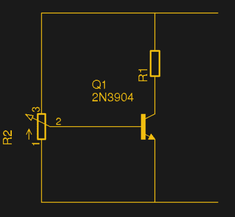
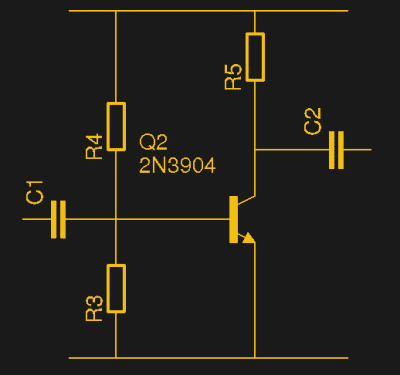
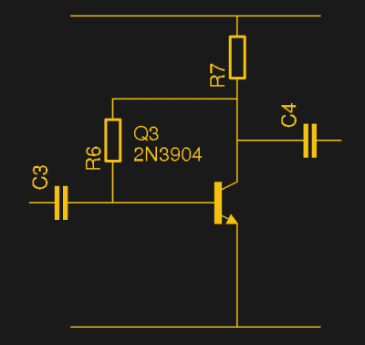

# 偏置晶体管:共发射极放大器

> 原文：<https://hackaday.com/2018/05/04/biasing-that-transistor-part-1-the-common-emitter-amplifier/>

如果你翻开长期以来最受欢迎的电子教科书*电子艺术*，翻到晶体管部分，你会看到一幅小漫画。晶体管显示为一个房间，其中“晶体管人”站在观察显示基极电流的刻度盘，同时调节限制集电极电流的电位计。如果你再施加一点基极电流，他就会把集电极推高一点。如果你把基极电流倒回去，他就会把它降回去。这是解释晶体管基本工作原理的一种简单而有效的方式，但它没有触及晶体管工作原理的一些细微差别。

当然，基极-发射极结是一个二极管，它不是位于集电极和发射极之间的简单电位计。对该器件这些方面的“更好”描述充斥着电子工程专业一年级学生的大脑，直到他们一辈子都不想再听到 h-paramater 或 Ebers-Moll 晶体管功能模型。幸运的是，在没有深入了解晶体管工作原理的情况下，也可以使用晶体管，但在选择器件周围的元件之前，还是有必要了解一下晶体管人。

## 最简单的偏置示例

The potentiometer can be used to explore transistor biasing

想象一个简单的晶体管电路，其中包含一个 NPN 晶体管，其发射极接地，集电极通过一个电阻连接到正电源，地与电源之间有一个电位计，可以将任何电压提供给基极。因为发射极接地，即使有时通过电阻，这种晶体管配置被称为*共发射极*放大器。在这个电路中，如果从接地端的电位计开始，那么晶体管将被关断，没有电流流过。

在 NPN 晶体管中，基极和集电极之间的连接是 PN 结，所以正如你所料，它与二极管中的 PN 结具有相同的特性。当硅二极管两端的电压达到约 0.6 V 时，它开始导通；当电位计基极-集电极结两端的电压达到 0.6 V 时，它也开始导通。一个小电流流入基极，由于这是一个晶体管，我们谈论的结果是一个更大的电流流经集电极。我们又回到了*霍罗威茨&希尔*漫画中的小人，基极电流和集电极电流之间的关系被称为晶体管的*增益*。您会在数据手册中看到它的引用，例如，对于 1 mA 的基极电流，增益为 100 的晶体管会在集电极通过 100 mA 的电流。

当基极电压刚刚超过 0.6 V 时，集电极中会流过一点电流，但不会太多，因为晶体管几乎不导通。随着电位计向上移动，基极电压将增加，基极电流也相应增加，集电极电流也随之增加。在某个区域，基极电流和集电极电流之间的关系接近线性，但最终会达到一个点，在这个点上，无论基极电流增加多少，集电极电流都会停止增加。此时，晶体管被认为是饱和的，或者完全导通，通过一个被 R1 限制的电流。

## 制造更实用的放大器

现在，想象一下我们用作交流放大器的简单 DC 电路。我们保留电位计，但也向基极施加交流电源，即正弦波。随着我们的正弦波上升和下降，基极电压也上升和下降，因此其电流也上升和下降。如果基极保持在 0.6 V 的刚导通点，则晶体管将仅在周期的上半部分导通，如果保持在晶体管的饱和点附近，则晶体管将仅通过周期的下半部分。在这两种情况下，集电极都缺少半个周期。因此，为了放大正弦波的整个周期，我们必须用电位计固定基极，使晶体管在正弦波产生的基极电流的整个范围内处于接近线性的区域。以这种方式保持晶体管的基极电压被称为*偏置* it，当连接到电源且没有正弦波等输入信号时，具有这种类型偏置的晶体管将通过其集电极传递恒定的恒定电流。

The classic simple transistor AC amplifier.

经典的晶体管放大器电路在电源和地之间有一对串联电阻，形成一个分压器，给基极偏置。发射极接地，另一个电阻位于集电极和电源之间。一个小的输入信号被提供给基极，一个放大和反相的信号出现在集电极。该电路有许多变化和改进，包括发射极电阻和旁路电容来修改高频响应，但这个最简单的电路应该足以理解其工作原理。

那么，如何得出各种电阻的值呢？对于专心致志的数学家来说，有一套公式[可以很容易地在网上找到](https://en.wikipedia.org/wiki/Bipolar_transistor_biasing)，最好不要在这里剪切粘贴，假装我和许多其他工程师甚至从大学开始就给了他们第二次机会。对于大多数根据基本原理进行设计的人来说，有无数的电路分析软件，其中许多都可以追溯到古老的 SPICE。我遇到过通过穿孔卡片学习 SPICE 的工程师，我是通过 VAX 小型计算机的终端学习 SPICE 的，如果你是通过桌面图形用户界面来学习 SPICE 的，你应该感到幸运。我选择的模拟器，仅举一例，是 [QUCS](http://qucs.sourceforge.net/) 。

一如既往，有一个“官方”的答案，和一个“非官方”的答案。每次连接 2N3904 时，我都要接触 QUCS 吗？当然不是。就像所有通过长期实践而熟悉某样东西的人一样，我认为自己比香料更聪明。所以我做了一些猜测，然后对结果电路进行试验，如果不太正确，就在这里或那里做一些调整。例如，当晶体管饱和时，我会使用欧姆定律选择一个集电极电阻来提供所需的最大电流，然后通过使偏置电阻的总值超过集电极电阻的 10 倍来猜测偏置电阻，上偏置电阻与下偏置电阻的比值约为 2:1。您可以根据自己的仿真、实验或经验，在评论中大做文章，指出其中的漏洞，但这实际上是鼓励所有读者在自己的电路中尝试偏置。

## 自偏置，更简单的选择

Simple but effective, the self-biasing amplifier. Try 330k for R6, and 1k for R7.

如果分压器对你来说太复杂，还有另一个选择。所谓的自偏置电路用从集电极到基极的单个高阻值电阻(R6)代替了分压器。

该电路的工作原理是，选择基极电阻来提供开启晶体管所需的电流，使其保持在前面提到的近似线性区域。因此，基极电阻通常具有较高的值，通常在几百千欧姆的范围内。在锗晶体管时代，你甚至会看到没有偏置电阻的电路，它们依赖于锗器件的更高漏电流，如果你阅读了我们最近关于[Clive Sinclair]的文章，你可能会在其中一幅图中看到一个例子。如前所述，如果您不想模拟它，可以根据提供所需集电极电流所需的基极电流来计算基极电阻值，但这也是一个简单的电路，可以猜测电阻值。对于小信号自偏置音频放大器来说，1kω集电极电阻和 330kω基极电阻从未让我失望过，如果我不是一个习惯动物，我什么也不是。

大约一个月前，我写了一篇文章，哀叹在 Arduino 或 Raspberry Pi 上长大的一代人缺乏晶体管偏置等电子基础。他们很幸运地从青少年时期就掌握了有用的技能，如 GNU/Linux 操作系统的内部原理或 SPI 接口的复杂性，但这一水平的模拟电子技术还没有达到他们的要求。这在一定程度上是解决这个问题的一种尝试，也是对单晶体管放大器的一种致敬。我绝不声称已经提供了关于这个主题的全面介绍，但是这为将来有机会再回来打开了方便之门。同时，如果你们中的任何人从未拿起 2N3904 进行实验，而不是跟随别人的电路，我希望你得到一些鼓励。祝你好运！