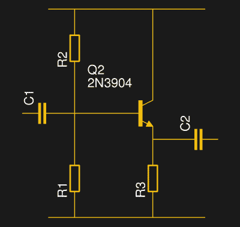

# 偏置晶体管:射极跟随器

> 原文：<https://hackaday.com/2018/05/25/biasing-that-transistor-the-emitter-follower/>

[我们在思考关于分立半导体电路基础的教育相对匮乏的问题](https://hackaday.com/2018/04/06/wont-somebody-please-think-of-the-transistors/)，所以我们认为我们应该做点什么。到目前为止，我们已经通过[共发射极放大器](https://hackaday.com/2018/05/04/biasing-that-transistor-part-1-the-common-emitter-amplifier/)了解了晶体管偏置的基本原理，然后介绍了一种不太常见的配置，[共基极放大器](https://hackaday.com/2018/05/11/biasing-that-transistor-the-common-base-amplifier/)。还有第三种晶体管放大器配置，正如你可能会想到的有三个端子的器件:所谓的*共集电极*放大器。你可能也知道这种配置为*射极跟随器*。它被称为“跟随器”，因为它跟踪输入电压，提供更高的电流能力和显著更低的输出阻抗。

The emitter follower circuit

正如共发射极放大器和共基极放大器各自将相应的晶体管端子连接到固定电位，并将另外两个端子用作放大器输入和输出一样，共集电极电路也是如此。基极构成输入，其偏置电路与共发射极放大器相同，但电路的其余部分有所不同，集电极连接到正供电轨，发射极构成输出，发射极电路中有一个接地负载电阻。

与其他两种配置一样，偏置被设置为使得晶体管导通并通过恒定电流，该恒定电流将晶体管保持在其小的基极电流变化和较大的集电极电流变化之间的几乎线性关系的区域中。随着输入信号和基极电流的变化，由晶体管增益决定的集电极电流也相应变化，从而在发射极电阻上产生输出电压。与共发射极放大器不同，该电压随输入电压同步上升或下降，因此射极跟随器不是反相放大器。

眼尖的读者会注意到，由于晶体管的基极-发射极结也是一个二极管，所以无论电流在其中流动，它都会保持大致相同的电压。对于硅晶体管，这约为 0.6 V，因此发射极的输出电压将始终比基极的输入电压低 0.6 V。因此，射极跟随器的电压增益将始终略小于 1，因此，如果忽略它具有显著的电流增益，您可能会认为它作为放大器用处不大。射极跟随器的输出阻抗远低于共射极放大器，因此可以驱动要求更高的负载。出于这个原因，你会经常发现它被用作缓冲级，在[的输出中可以找到一个方便的例子，这是我们今年早些时候研究过的一款早期运算放大器](https://hackaday.com/2018/02/20/deconstructing-a-simple-op-amp/)。

我们现在已经了解了晶体管放大器的三种基本配置，以及双极性晶体管偏置的基本原理。在 Hackaday 上讨论这个话题可能看起来很奇怪，因为可以肯定的是，你们中的许多人已经对它很熟悉了，但是有时值得记住的是，并不是每个人都足够幸运地精通这些基础知识。这个系列的动力来自一位朋友，他哀叹说，虽然他的学生掌握了他这一代人在他们这个年龄没有掌握的先进的微控制器知识，但他们没有机会学习这些基础知识。

关于这个主题还有最后一点，同样的原理也适用于其它三端有源器件，因此我们将快速了解一下 fet 和电子管。