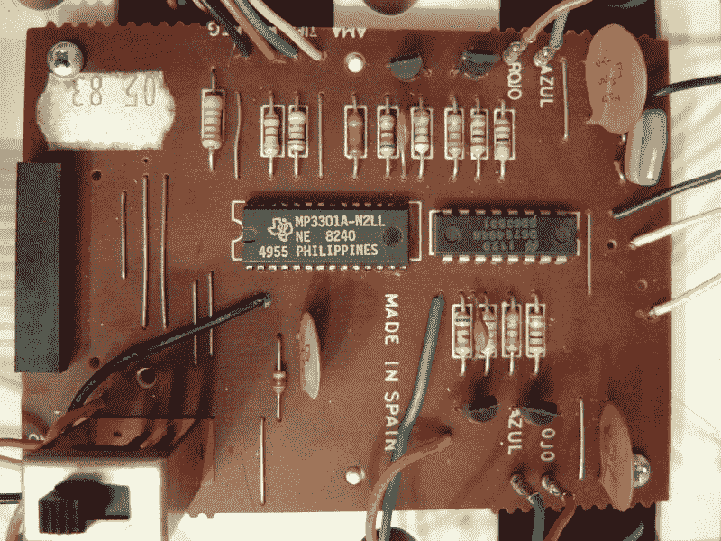

# 大 Trak 得到了一个新大脑

> 原文：<https://hackaday.com/2018/01/18/big-trak-gets-a-new-brain/>

如果你是 20 世纪 80 年代的孩子，你可能已经足够幸运地获得了一个大 Trak——一个可以使用薄膜键盘编程做 16 种不同动作的机器人玩具。[霍华德]有一个，但不想生活在 16 步程序中，他用 Arduino 给它进行了大脑移植，并将其上传到[retro mancave]的视频博客上，你可以在下面看到。

如果你想复制这个壮举，而且你妈妈已经打扫过你的房间，把它变成了一个工艺品商店，你可以在易贝上买一个，或者甚至有一个新的复制品，尽管它不便宜。你需要的代码在 [GitHub](https://github.com/HowardLJTaylor/VintageBigTrackArduino) 上。

CPU 并不是唯一的升级，因为更新的 Big Trak 有有机发光二极管显示器。[Howard]计划添加 WiFi 或蓝牙，并将键盘连接到板载 Arduino。[霍华德]展示了内部，以今天的标准来看有很大的空间。当然，我们想看看原来的 PCB，但它无处可寻。幸运的是，我们在维基百科上找到了单面 PCB 的图像，所以如果你和我们一样，你可以在下面的视频下面看到它。

我们看不到线路图，但从 Arduino 代码中，你可以找出声纳、有机发光二极管显示器和原始电机的新电机驱动器之间的连接。

奇怪的是，这并不是第一个登上 Hackaday 页面的大 Trak。当然，我们也不缺[被黑的玩具机器人](https://hackaday.com/2012/02/28/15-toy-becomes-fully-programmable-robot/)。

 [https://www.youtube.com/embed/D-guBA1_T_Y?version=3&rel=1&showsearch=0&showinfo=1&iv_load_policy=1&fs=1&hl=en-US&autohide=2&wmode=transparent](https://www.youtube.com/embed/D-guBA1_T_Y?version=3&rel=1&showsearch=0&showinfo=1&iv_load_policy=1&fs=1&hl=en-US&autohide=2&wmode=transparent)

 Bigtrak PCB 图像-【Sergio Calleja】CC BY-SA 2.0