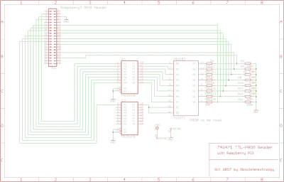
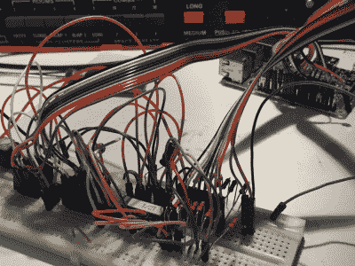

# 来自过去的爆炸与空间站舞会阅读器

> 原文：<https://hackaday.com/2017/11/09/blast-from-the-past-with-space-station-prom-reader/>

大熊座空间站 SST282 是数字混响的恐龙。好吧，也许 1978 年还不算古老*还不算*，但它已经到了人们不得不担心组件故障的可能性的地步。至少[Obsoletetechnology]在[为其内存内容](https://obsoletetechnology.wordpress.com/projects/ursa-major-sst282-prom-data-dump/)创建备份时是这么想的。

从 [Hackaday 之前的一些文章](https://hackaday.com/2016/10/14/li-ion-tech-staring-into-the-abyss-with-note-7-failure/)中可以看出，一个零件不一定是旧的才会失效。然而，当涉及到较老的部件达到其寿命时，没有什么是过于偏执的。尤其是涉及到有价值的记忆的时候。PROM 存储器的每一位都被其位置网格上的保险丝锁定，以存储永久数据。为了能够读取并收集相应的数据，创建了一个 Raspberry Pi 3 PROM 读取器。

SST282 片上使用 3 个 TTL 级 74xx 系列肖特基 PROM 存储器，用于保存 RAM 查找表。在这些失败的情况下，所有后续信息都将丢失，因为没有在线的幸存内存转储。幸运的是，我们只对收集它们的内容感兴趣，所以 PROM 阅读器的原理图是相当初级的。芯片的地址和数据总线连接到 Pi 的 GPIO 头，唯一需要注意的是 74LS541 TTL 电平转换器，它将 Pi 的 3.3V 输出转换为 PROM 的 5V TTL 电平。

整个过程由一对 Python 脚本控制，这些脚本用 Pi 配置端口，然后重复遍历 PROM 的完整地址范围，并将每个存储单元的数据值存储到一个文件中。

[Obsoletetechnology]慷慨地为他们的 Python 脚本提供了[下载](https://www.dropbox.com/s/fkwoivdtksjaxpp/PromReader.zip?dl=0)，以及找到的相应数据转储。如果你仍然有一个这样的坏男孩，考虑尝试一下这个技巧，这样你就可以放心地玩那些老式的音效了。