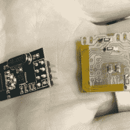
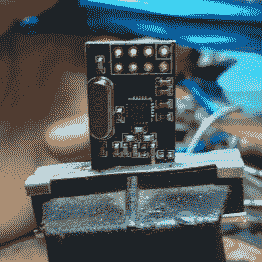
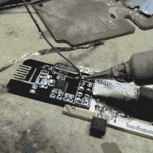

# 斑点网格阵列技术安装板对板

> 原文：<https://hackaday.com/2016/08/16/blob-grid-array-technique-mounts-board-to-board/>

[霍华德·马修斯]米尔斯自己的印刷电路板，男人，他讨厌钻通孔。隔离走线后手动更改雕刻和钻孔之间的位？这是什么？石器时代？[Howard]决定重新思考他的 DIY PCB 制造流程，并得出一个重要结论:[这些钻孔中只有一小部分是真正必要的](http://howiem.com/wordpress/index.php/2016/08/05/quick-hacker-tip-diy-pseudo-bga/)。

我们的许多廉价且受人喜爱的元件，如 NRF24L01+和 ESP-01 无线模块，都带有不必要的笨重引脚接头。为了不需要钻孔，[Howard]认为，他需要做的就是省去引脚接头，并使用 BGA (blob grid array，斑点网格阵列)将这些模块板对板安装。

要安装 NRF24L01+模块，[Howard]首先从模块上取下引脚接头并清洁焊盘。然后，他将八个相应的焊盘镶嵌在他铣过的 PCB 上，并添加两个*索引斑点*。关节周围的 Kapton 胶带有助于隔离。然后，模块的电镀孔首先焊接到这些索引斑点，然后用焊料填充其他孔以进行连接。

  Nope, not drilling this  Removed pin headers  Board-to-board mounting

结果相当巧妙，因为板对板安装节省了大量空间，尽管去除引脚接头的步骤破坏了这一技巧的生产率方面。带有城堡形安装孔的模块仍然稍微贵一些，并且并不总是可用，所以这可能是一个需要记住的好技术。得到一些更好的关于 DIY PCB 制造的专业建议？把它们放在评论的正下方吧！