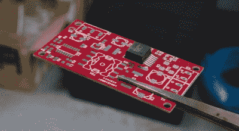

# 喷灯 SMD 回流

> 原文：<https://hackaday.com/2016/09/01/blowtorch-smd-reflow/>

【white quark】一直在试验一种用于 SMD 回流的[喷灯。刚刚移动了 8000 公里的[白夸克]在没有任何常用回流工具的情况下被卡住了。然而，他们手边确实有一个喷灯，并尝试了一下。](https://lab.whitequark.org/notes/2016-04-28/smd-reflow-with-a-blowtorch/)

当[whitequark]在 Twitter 上提到尝试时，我们认为结果主要是烧焦的 PCB、烟雾弥漫的房间，以及可能去当地医院。但是[白夸克]比我们更敏感，通过仔细监测温度和测量距离能够得到相当不错的结果。

[白夸克]已经做了两次[进一步的](https://lab.whitequark.org/notes/2016-08-27/smd-reflow-with-a-blowtorch-try-2/)T2 尝试，并且已经有了不同的结果。总的来说，我不确定自己是否有兴趣尝试这种技术，但这表明在紧要关头，黑客总能找到创造性的方法来完成任务。