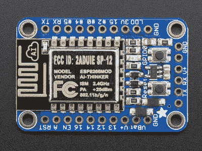

# 高兴得不得了

> 原文：<https://hackaday.com/2016/12/02/blynk-with-joy/>

上次，我谈到了我的存储情况和我的廉价本性如何使我用手机应用程序和 ESP8266 构建了一个 RC 操纵杆控制器。让这变得简单的关键是使用名为 Blynk 的 GUI 生成器为 Android 或 Apple 手机制作用户界面。Blynk 可以与 ESP8266 通信，使项目相对简单。

## ESP8266 和 Arduino IDE

ESP8266 Blynk 代码非常简单。您确实需要设置 Arduino IDE 来为 ESP8266 构建。这可能因板而异，但[这里是我使用的板的说明](https://learn.adafruit.com/adafruit-huzzah-esp8266-breakout/using-arduino-ide)(来自 Adafruit 见下文)。

[](https://hackaday.com/wp-content/uploads/2016/11/adaesp.jpg)

根据您使用的 ESP8266 设备的类型，您可能需要 3.3 V 串行电缆或其他方式将固件安装到设备中。对于我的 Adafruit 设备，它有一个 5 V 兼容的串行连接，因此可以插入一个标准的 USB 转串行加密狗。我的设备上还有两个开关。要进入引导模式，你必须按下按钮，按住它，然后按下复位按钮。一旦你松开复位按钮，你就可以松开另一个按钮。红色 LED 半发光，然后设备等待下载。

除此之外，Arduino IDE 的一切都和平常一样。你必须知道什么样的[对象在 ESP8266](https://github.com/esp8266/Arduino/blob/master/doc/libraries.md) 上可用，而不是普通的 Arduino。也有一些微妙的区别。例如，EEPROM 对象有一些额外的方法，因为 ESP8266 模拟 EEPROM(稍后会详细介绍)。

## 虚拟引脚和处理

如果你刚刚开始，你可以用一个按钮做一个简单的用户界面，然后把它连接到板上的一个 LED 上。这就是布林科的“你好，世界”节目。但是对于操纵杆，还有一些其他的考虑。

您可以使用虚拟引脚，而不是将小部件连接到物理引脚。然后，您的程序可以轻松地读写这些虚拟引脚。这个上下文中的“pin”可以是一位、一个数字，甚至是一个字符串。

要处理虚拟 pin 写入(例如，按钮按下或滑块改变值)，可以使用 BLYNK_WRITE 宏编写一个函数。例如:

```
// Flip S1
BLYNK_WRITE(V5)
{
if (!param.asInt()) return;
s1flip=!s1flip;
updates1();
updateEE();
}
```

当相关的虚拟 pin (V5)改变时，框架将调用这个代码。提醒一句:按下一个按钮会得到两个电话；一份给媒体，一份给媒体。如果您只想对其中一个进行操作，那么您需要测试这个值。这就是为什么第一行测试参数值为零并返回，从而忽略按钮释放。

除了 asInt()之外，还可以将参数转换为其他类型，包括 float (asFLoat)、double (asDouble)和 string (asStr)。

BLYNK_READ 宏允许您提供将与框架一起运行的代码，以读取虚拟 pin(即，将数据从嵌入式系统发送回电话)。还可以调用 Blynk.virtualWrite 来立即更新虚拟 pin 的值。

## 代码

你可以在 [GitHub](https://github.com/wd5gnr/ESP8266Joy) 上找到代码。这很简单:两个伺服对象控制脉冲输出。它们的持续时间由 Blynk 的虚拟引脚设置。因为操纵杆被设置为直接输出微秒数，所以没有太多问题。

为了让事情变得更有趣，我安排了可以翻转 X 和 Y 轴的按钮，并且还可以反射任意一个轴(也就是说，反转轴，所以不是读取 1000-2000，而是读取 2000-1000)。每一个都只是一个调用 BLYNK_WRITE 函数的按钮。有一行代码使按钮只在按下和释放按钮的两个事件中的一个上操作。

当然，一旦你可以配置操纵杆(包括一个 recenter 选项)，每次重启都要丢失配置是很痛苦的。因此，我决定允许将配置写入 EEPROM。那是许多麻烦的开始。

## EEPROM 问题

ESP8266 没有真正的 EEPROM。但是 Arduino 软件用 flash 模拟它。当你想使用 EEPROM 时，你必须通知库你将使用多少内存。它将内存从闪存读入缓冲区。从那时起，所有 EEPROM 更改都发生在缓冲器中。完成后，调用 end 或 commit，库将确定您是否进行了更改。如果你这样做了，整个闪存页面将被擦除和重写。如果您调用 commit，您可以进行更多的更改(然后需要编写这些更改)。如果你叫 end，你就完了。

就其本身而言，这不成问题。然而，观察示波器上的输出，我注意到当我改变配置时，有时——只有有时——伺服输出会停止。ESP8266 仍在运行，因为点亮 led 的按钮仍在工作。我终于意识到，任何要求 EEPROM 提交的按钮都可能会挂起伺服输出。这不是所有的时间，甚至大部分时间，但它往往足以令人讨厌。

我尝试了很多东西。没有什么能完全修复它。我最终决定有一个“保存”按钮，这样至少你知道当你按下它的时候你可能会崩溃。在网上搜索，这是一个普遍的问题。由于简单的代码工作，看起来好像 EEPROM 代码禁用伺服对象使用的任何定时器中断或不复位伺服定时器。

最后，它基本上是有效的，但是任何时候你按下保存按钮，都有伺服输出会停止的风险，直到看门狗定时器启动并重置设备。

## 网络欺诈

当然，ESP8266 有我的本地 WiFi SSID 和密码插入其中。你可以设置一个像许多现代设备一样的设备，如果它不能连接[，它将作为自己的接入点，这样你就可以配置它](https://github.com/tzapu/WiFiManager)。你也可以把它设置成一个 AP 并连接到它，假设你能找到到 Blynk 服务器的互联网路由。

问题是，我把这款设备带到办公室炫耀，并意识到虽然我的手机可以连接到公司网络，但 ESP8266 并没有为它设置。我没有足够的东西来重新编程这个设备，但我想到了一个解决方案:我把手机上的热点配置成模拟家里的 WiFi。使用相同的 SSID 和密码，连接操纵杆。诚然，Blynk 应用程序向远程服务器发送数据有点迂回，远程服务器将数据发送回手机，然后手机将数据路由到操纵杆，但它确实有效。

## 最终分析

总的来说，使用 Blynk 非常简单，而且效果很好。EEPROM 故障似乎不是一个 Blynk 问题，所以我不能责怪它。虽然有一些粗糙的边缘。例如，LED 按钮是颠倒的，但我没有找到简单的方法来颠倒按钮的操作。也就是说，按钮被打开以发送熄灭 led 的高电平信号。

使用他们的服务器会带来一些延迟，但并不像我担心的那样。如果你担心安全问题，你可以运行你自己的服务器，虽然我没有试过。不过，你仍然需要为应用程序注入“能量”。我不知道我对此有什么感觉。我明白，一个人必须谋生，操纵杆项目毕竟符合自由的限制。

另一件超级棒的事情是能够将 Blynk 用户界面放在浏览器中。Blynk 支持 JavaScript，但据我所知，它只是一个远程平台，而不是 GUI 的主机。我知道这可能会削减他们的收入模式，但它肯定会很方便。

说到这里，你可以将 Blynk 嵌入到许多设备中，从 Arduinos 到 MBed 板，再到 Raspberry PIs。可以通过以太网、WiFi、蓝牙、USB 连接，也可以添加自己的连接方式。

这个项目甚至没有触及到可以与 Blynk 一起使用的小部件的表面。你可以发送电子邮件，从流媒体服务器(如网络摄像头)播放视频，或者发布到 Twitter。有仪表和滑块和许多其他东西，我不需要操纵杆。

如果你不喜欢 Blynk，还有其他选择，虽然没有一个让我觉得完全。例如，快速浏览一下[谷歌 Play 商店](https://play.google.com/store/search?q=arduino&c=apps)就会发现很多类似的应用。如果你开始剔除那些不能在所有不同平台上运行或者不能在苹果手机上运行的，你会得到一个更短的列表。如果你有使用不同应用的经验——好的或坏的——请在评论中发表。

当然，你可以随时构建自己的手机应用程序，并通过标准网络进行通信。这实际上没有听起来那么难，但也不像使用 Blynk 这样的工具那么容易。自定义代码可以优化你最担心的事情，会完全按照你的意思去做。另一方面，支持许多不同的平台，在谷歌和苹果手机上工作，等等，这将是一项繁重的工作。但是，对于您的应用程序来说，这可能没有对函数的控制重要。这是你的电话。