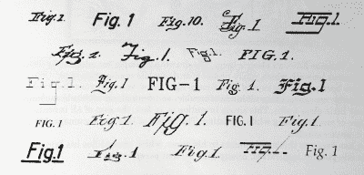
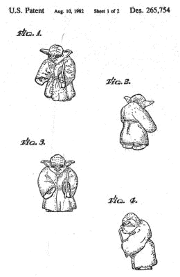

# 书评:专利的艺术

> 原文：<https://hackaday.com/2017/07/05/book-review-the-art-of-the-patent/>

在为我们的文章提供合适的插图时，我们黑客抄写员使用了各种来源，这些来源提供以许可为特色的图像。在通常的免费图片库中，有一个特别丰富的来源，即世界各国授予专利的庞大档案中包含的线条画。这些插图是专利本身的一部分，用来描述所要求保护的专利的工作原理。我们使用它们，是因为尽管它们所描述的项目受到它们所属的专利的法律保护，不能被复制，但它们作为专利的一部分本身是在公共领域的。因此，我们可以很容易地找到过去几百年左右各种技术创新的详细手绘图片，作为我们的读者，您会不时从中受益。

The beauty in hand-rendered fonts from patent artwork, collected within the book.

如果你花一点时间通过搜索引擎如谷歌专利浏览旧专利，你会很快沉迷于这些过去发明的美丽图片。虽然他们的目的是传达一项发明的工作原理，但匿名艺术家经常倾注他们所有的技能来渲染它们，而不仅仅是绘画。在那些布满灰尘的政府档案中潜伏着杰作，只等着被发现。

似乎我们在 Hackaday 并不是唯一对这些图像感兴趣的人，因为一位美国专利代理人[Kevin Prince]在他的书《专利的艺术》中写了一篇对这种媒介的迷人探索。

 

玩具人偶、【小卢卡斯】等人、[美国外观设计专利 D265754](https://patents.google.com/patent/USD265754S/en) 。他首先将专利图纸视为一种艺术形式，而非技术制图练习。这本书通过对几个无处不在的发明进行文字描述，并让读者猜测它们可能是什么，考察了为什么在专利中需要图纸。立即可识别的图像然后呈现在背面，并提供了一个强大的例子，图像的力量，而不是一段文字。然后，我们通过一项不包括著名发明的专利经历了同样的过程，展示了图像如何能够传达无法单独用语言描述的复杂机械。

最后，我们介绍了外观设计专利，它保护的是事物的外观，而不是其工作原理。然而，一些著名的和立即识别的例子被用来说明。这些代表了市场上最受保护的商业设计财产，并且不遗余力地在他们的专利中呈现它们的最小细节。

下一章探索了专利制图员的艺术形式的工具，通过点画和阴影来表现纹理、运动、透明度和颜色。向我们展示了用于表示材料和表面的标准纹理，以及用于传达复杂机构操作的不同技术，如分解图和剖视图。我们开始看到，天才的艺术家可以颠覆严格适用的专利绘画规则，以传达真正的艺术表达，而不是毫无生气的图表。

[![Musical instrument support, [Edward L. Van Halen], US patent US4656917A.](img/3161fa482f7d9efadae735887d4a4efc.png)](https://hackaday.com/wp-content/uploads/2017/06/eddie-van-halen-patent.jpg) 

乐器支架【爱德华·l·范·海伦】[美国专利 US4656917A](https://patents.google.com/patent/US4656917A/en) 。尽管专利艺术的规则在过去几十年里几乎没有变化，但应用这些规则的艺术风格已经与更传统的艺术作品同步发展。这些既是社会史的目录，也是设计史的目录。有一章专门讨论这一现象，并列举了一些引人注目的例子。一个穿着端庄的 19 世纪最后十年的洋娃娃与一个非常迷人的 20 世纪 60 年代的洋娃娃形成对比，一个非常传统的原声乐器上绘制的同一时期的吉他部分与一个 20 世纪 80 年代的电吉他配件一起展示。那项 80 年代专利的受让人是一位[ [爱德华·l·范·海伦](https://en.wikipedia.org/wiki/Eddie_Van_Halen) ]，这项发明方便了他著名的双手演奏技术，专利艺术与他的肖像一起完成。

在专利档案中有一份历史记录，记录了那些创造了我们现代世界的重大发明。从[艾利·惠特尼]1794 年的轧棉机到 2007 年的苹果 iPod Mini，下一章将带我们穿越一条通过发明媒介描绘的美国历史的时间线。我们看到了(塞缪尔·莫尔斯)的电报机，(伊莉莎·奥蒂斯)的电梯，(理查德·加特林)的手摇机枪，(爱迪生)的留声机，以及(巴勒斯)的机械计算机器的复杂细节。这些 19 世纪的发明构成了我们现代社会赖以建立的技术基石的一部分，这本书继续展示了 20 世纪的一些标志性图像。大富翁棋盘上有完整的钱、财产卡和游戏计数器，然后是乐高积木和[华特·迪士尼]的动画桌。随后，20 世纪中后期世界大事的决定性技术出现了,[恩利克·费密]1955 年的核反应堆专利。

[![Buoyant bulletproof combat uniform, [Nelson J. Waterbury], US Patent US3398406A.](img/2167e1e6c441eddee1f26f9c767e1adb.png)](https://hackaday.com/wp-content/uploads/2017/06/combat-suit.jpg) 

浮力防弹作训服【纳尔逊·j·沃特伯里】，[美国专利 US3398406A](https://patents.google.com/patent/US3398406A/en) 。这本书将专利艺术的研究带到了今天，然后审视了新千年的专利，涉及电子或生物技术的前沿领域。谷歌搜索表单、生物和医疗器械以及半导体设备等在线界面的设计专利出现了。我们看到 CAD 绘图和照片取代了前几十年的手绘艺术，但尽管风格可能已经发生了变化，我们还是看到了图像本身如何经常回到它们的前辈。复杂的框图和图表以及重要的文本注释会出现，作者注意到这些有时会违反专利局的规定。

这本书的最后一章只是一个画廊，展示了作者最喜欢的专利图片，是几个世纪以来发明的辉煌横截面，细节丰富。我们看到工业机械、服装、发动机、钟表和家用设备。并不是所有展示的发明都是人们熟悉的，但其中有蚀刻素描玩具和[拉迪斯洛·比罗]的圆珠笔。虽然其他章节提供了大量关于专利的迷人信息和背景，但对我们来说，这一章比其他任何章节都更能概括专利档案的引人入胜的本质。几乎在所有领域的每个角落都可以找到细节和兴趣相同的图像，所以对作者来说，从一大堆图像中筛选出适合可用空间的图像肯定是一个几乎不可能的过程。

由凯文·普林斯(Kevin Prince)创作的专利艺术(Art Of The Patent)于 2011 年由 Kickstarter 资助，现在可以通过你的知名在线书商购买。如果你对专利、发明或技术历史感兴趣，那么我们建议你为自己找一本，因为你不太可能对它失望。