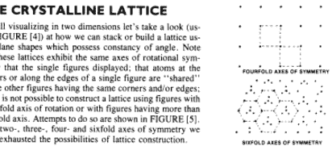
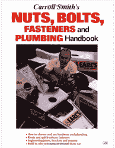

# 你应该读的书:卡罗尔·史密斯的《工程师致胜》

> 原文：<https://hackaday.com/2016/09/02/books-you-should-read-engineer-to-win-by-carroll-smith/>

当今工程教育的一个问题是缺乏实验教学。当然，你可能有一两个项目，但这不是项目的重点，因为很难标准化测试。典型地，该领域的各个部分由在该领域有专长的教授或研究生在高度集中的理论课程中讲授。因为课程是针对单个主题领域的，所以完全有可能很好地理解同一个难题的两个部分，但永远不会意识到它们是组合在一起的。只有当一名新工程师进入现实世界时，他们才开始在看似不同的知识领域之间建立联系。

这就是为什么卡罗尔·史密斯的书《工程师制胜》如此之好。在一个小小的失败可能意味着朋友死亡的领域，他作为一名执业工程师度过了一生。所以当他开始写一本书时，他写了一本书，讲述了在他的领域中正确概念化和解决机械工程问题所需的一切。

不过，有一个警告:这本书不适合胆小的人。如果你想学好困难的东西，那么这本书是给你的。卡罗尔跳过令人欣慰的类比，准确地给出信息。它可能有点晦涩，但他假设读者是来学习的，最重要的是，理解。这需要努力。

 例如，你无法真正理解为什么轧制的螺栓比用[螺旋机](https://en.wikipedia.org/wiki/Automatic_lathe#Screw_machine)切割的螺栓更坚固，除非你明白金属在晶体层面上是如何工作的。这同样适用于金属疲劳、脆性断裂、延展性失效以及金属可能遭受的所有疾病。工程师和技术员的区别就在于这种深刻的理解。否则，学到的方程只是工具箱中的一部分，而不是艺术家调色板上的颜料。

这就是为什么这本书的前半部分主要是冶金方面的内容。这本书从金属晶体结构的简单抽象开始。不像我在大学里上的材料课，它在整个过程中对信息的呈现保持了一种实用的倾向。例如，在进入金属是如何制造及其历史的(简短)题外话之前，它继续讨论所有这些对于承受应力和失效的金属实际上意味着什么。

However, if racecar plumbing and fasteners are kinda your thing, “Carroll Smith’s Nuts, Bolts, Fasteners and Plumbing Handbook” is also a fantastic read.

这本书的前半部分涉及有色金属及其正确使用。接下来是我读过的关于金属疲劳、紧固件和金属结合的一些最好的解释。当一个关节的故障导致烤面包机的一个机械装置失灵时，这是一回事，但当它在赛车中失灵时，人们就会受伤。卡罗尔非常严格地规定了什么是工程中可原谅的疏忽，什么不是。

一旦这本书完成了传达金属和紧固件的工作理解，它似乎分裂成不同的赛车相关主题的运气。在我第一次读这本书的时候，我抵制住了这种奇怪的转变。例如，我真的不想读八十年代的赛车管道，或者卡罗尔喜欢什么样的弹簧和翼型。然而，当我以更专注的方式重读这些章节时，我意识到它们中的许多都是在教授前几章所学知识的实际应用。这种金属是如何制成优质弹簧的？为什么一种管道比另一种好？

重要的是，本书结尾的轶事让读者理解了工程专业的重要性。工程师真正的职责是什么？他教导说，不要认为别人对你技能的信任是理所当然的。他教导要相信他人的技能。这本书教导工程师要谦虚。他展示了一个人在一生认真学习他们的手艺后会成为什么样的人。

*感谢读者【介】，感谢[向我推荐](http://hackaday.com/2016/04/11/continuing-the-dialog-its-time-the-software-people-and-mechanical-people-sat-down-and-had-a-talk/#comment-2986490)这本书。此外，从我所做的一点研究来看，旧的 [motorworks 版](https://www.amazon.com/dp/0879381868)通常被认为比该书的新印刷版本具有更好的图表复制质量。*