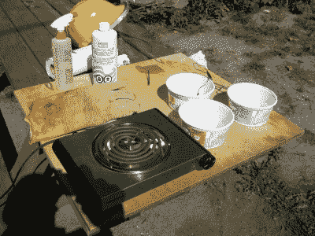

# 你应该读的书:放大仪器

> 原文：<https://hackaday.com/2016/07/21/books-you-should-read-instruments-of-amplification/>

嘶…想做一个罐装二极管吗？一个网球三极管？半导体晶体管怎么样？或者你只是喜欢坐在后面，跟着一个有趣的故事，同时收集大量的背景知识、技巧和各种想法？在我的案例中，我想制作一个氧化亚铜半导体二极管，这让我想到了 H.P. Friedrichs 的精彩著作 *[放大仪器](http://www.hpfriedrichs.com/mybooks/ioa/bks-ioa.htm)。*它包含了如此庞大的放大器知识集合，由于其叙事风格和频繁的动手实验，读起来令人愉悦。

  My well worn copy of Instruments of Amplifications  DIY point-contact semiconductor transistor

弗里德里希斯首先写了另一本非常受欢迎的书，名为*水晶之声*，是关于制造水晶收音机的，他还想写第二本。对于那些不熟悉[水晶收音机](http://hackaday.com/2016/04/07/getting-serious-about-crystal-radios/)的人来说，制造仅由输入无线电波驱动的收音机很有趣；没有电池。但这也意味着成交量很低。

这本书的读者建议，一个很好的后续将是一个关于放大器电路，以放大晶体收音机的音量。然而，这样的书已经很多了。弗里德里希斯意识到，最好的后续工作是研究如何从零开始制造放大元件，即“放大仪器”。这将是独一无二的，并且体现了水晶收音机从零开始的精神。*这本书，放大的仪器*诞生了。

### 实验

Microphonic relays, via [H.P. Friedrichs Homepage](http://www.hpfriedrichs.com/mybooks/ioa/bks-ioa-gallery1.htm)

这本书包括了适量的历史，给出了放大器是什么以及它们如何首次出现在电气世界的背景。电报员想要将信号发送到越来越远的距离，解决方案是使用电报继电器中的电子和机械的混合。这是他的第一个项目和叙事的跳板:麦克风接力。

右图所示的麦克风接力示例将扬声器面向麦克风放置；扬声器是输入，麦克风放大输出。他使用一个从旧耳机中回收的碳麦克风，将所有东西放在一个由铜管帽、钢棒、螺母和螺栓组成的外壳中，安装在一个优雅的木质底座上。所有的项目都是由简单的部件精心制作而成，最终看起来非常棒。

  Illustrations in Instruments of Amplification  Beehive triode, via [H.P. Friedrichs Homepage](http://www.hpfriedrichs.com/mybooks/ioa/bks-ioa-gallery2.htm)

冒险继续进行着一个平衡光束放大器(使用两个缝纫线轴缠绕线圈，旧手电筒的碳和旧时钟齿轮的配重)，一个针盒变压器(需要解释欧姆定律和[戴维宁定理](https://en.wikipedia.org/wiki/Th%C3%A9venin%27s_theorem))，然后到达真空管。当然，如果不讨论原子、热离子发射以及热离子二极管和三极管，你就无法理解真空管。

半导体也不会被冷落。Friedrichs 花时间解释了使用从旧的锗二极管中取出的锗晶体的点接触晶体管。如果这还不够的话，他有几章用铜片做实验来生产氧化亚铜，这也是我感兴趣的地方。

### 制作氧化亚铜半导体二极管

My own cuprous oxide making setup

我最初买这本书，是为了做一个氧化亚铜半导体二极管。在照片中，你可以看到我在一天的实验中的设置。后面的罐子里装着盐酸，在五金商店和游泳池商店里可以买到盐酸，因此有了防溅面罩和安全手套。

这个过程首先使用硼砂(一种家用清洁剂)来清洁铜。接下来，炉子元件用于加热铜和酸，形成所需的氧化亚铜层以及需要去除的氧化铜层。

不幸的是，我没有成功地产生任何类似二极管的活动。这当然不是这本书的一个缺点。我只花了两天时间做实验，时间用完了。令我惊讶的是，弗里德里希斯设法让这些相当复杂的话题变得如此平易近人，以至于我可以用容易获得的原料来尝试。我真的希望有一天能回到那里。

这是一本非常棒的书，适合那些想亲手制作真空管的人，或者那些想尝试半导体晶体管或尝试制作老式放大器元件的人。但是，即使你没有亲自进行实验，仅仅通过阅读背景和观察每次构建所使用的方法，就可以学到大量的知识。我强烈推荐这本书。在这些话题上，它是不可或缺的。

有没有类似牛逼的书给你推荐？请在下面的评论中告诉我们。