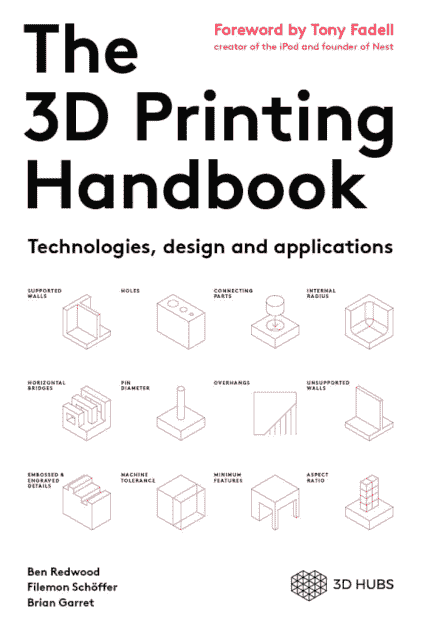
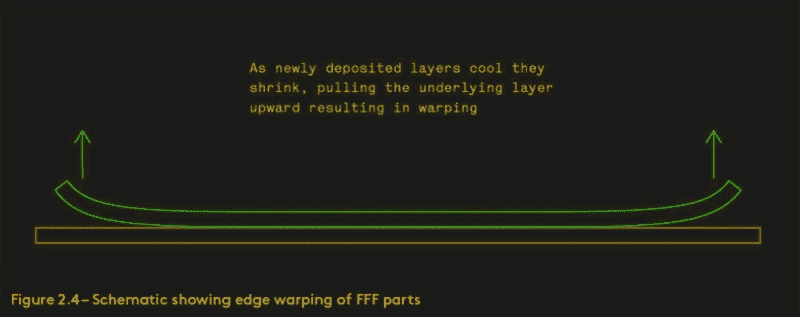

# 你应该读的书:3D 打印手册

> 原文：<https://hackaday.com/2017/12/18/books-you-should-read-the-3d-printing-handbook/>

3D 打印是在 80 年代发明的，二十年过去了，专利到期了，然后 3D 打印技术的几种不同用途被发现了。因此，3D 打印的技巧和技术——尤其是基于细丝的打印——几乎完全在互联网上讨论和记录，主要是在聊天室、论坛和 YouTube 视频中。你想知道的关于 3D 打印的一切都可以在网上找到，但这并不意味着你能找到。

 这些年来，已经有几十本书作为 3D 打印的指导手册出版，其中一些甚至是第二版。是的，尽管 3D 打印机从 TechCrunch 的头条新闻中消失了，尽管公众对计算机控制的热胶枪的幻想破灭了，但仍然有人想了解 3D 打印机。3D 打印指南实际上是有市场的，人们正在购买。

最新的 3D 打印指南是来自 3D Hubs 的 3D 打印手册。3D Hubs 已经存在了一段时间，最好被描述为“3D 打印即服务”。3D hub 的常见用例是，有人会上传一个 3D 模型到 3D hub，然后从拥有 3D 打印机的*某人*那里得到报价。这句话可能来自一个专业的 3D 打印设备，对于车库里有 LulzBot 或 Prusa 的人来说，这些设备的价格比一栋房子还高。当人们意识到你也可以在服务上进行数控铣削时，3D Hubs 将会变得非常棒。

这本书的作者是本·雷德伍德、费勒蒙·舍弗和布莱恩·加雷特，他们都是 3D Hubs 的员工。以这样或那样的方式，3D Hubs 参与了每一种可以想象的 3D 打印技术，这本书旨在介绍这些技术的用途，以及如何正确使用 3D 打印技术的指南。这本书有一个问题:它能不负众望吗？就此而言，任何一本书能不负众望成为“3D 打印指南”吗？

### 如何写一本关于 3D 打印的书？

3D 打印是你今天能找到的最容易理解的复杂技术。现代汽车所需的知识深度要大得多，但在现实中，很少有人会为日常驾驶重新编程他们的燃油喷射系统。电脑会思考，但是想做 Facebooks 的人不需要知道什么是寄存器。3D 打印则不同。你实际上需要知道喷嘴直径、步进电机角度和灯丝直径之间的相互作用，以创建一个良好的打印。一台 3D 打印机实际上只是几十个变量的堆叠，所有变量都相互关联，必须平衡才能打印出一个低聚口袋妖怪或坐立不安旋转器的良好副本。有没有可能写一本涵盖所有这些变量，它们之间的相互作用，并能很好地指导如何在通用 3D 打印机上创建一个漂亮的打印作品的书？有没有可能做到这一点，同时包括非长丝为基础的机器？

我们以细丝直径为例。为什么灯丝直径有两种不同的标准？几乎每个人都对这件事有自己的看法，但是选择灯丝直径的工程决策很有趣。例如，直径为 1.75 毫米的细丝可以挤压得更快——对于给定的体积来说，长度更长——更高的表面积与体积之比意味着它在高温下加热得更快。那么，为什么有人会选择更大的灯丝呢？传统—第一批 RepRap 使用塑料焊条，其直径为 1/8 英寸，或真正接近 3 毫米。关于灯丝直径的整个讨论带来了热力学、RepRap 项目的历史和材料科学。

你想谈谈运动平台吗？当然，我们有 H 型机器人，D 型机器人，孟德尔 90 式机器人，床在 Z 轴移动的机器人，床在 Y 轴移动的机器人，床根本不移动的机器人，这些只是笛卡尔运动平台。这还不包括 deltas 或任何其他异常古怪的运动平台。

这是任何一本关于 3D 打印的书都必须面对的问题。有太多的材料，太多不同的想法和观点，太多的做事方式，以至于简单地提及所有这些想法就能填满两本书。更不用说深入解释所有这些想法和技术了。再加上现代出版商的要求，比如引用——你不得不读两遍——你得到的是一份几乎没有内容的出版物。

根据这一观察，你该如何写一本关于 3D 打印的书呢？对于一个对 3D 打印知之甚少的编辑来说，最容易、最简单和最简单的想法就是对技术进行调查。一本关于 3D 打印的书可以简单地列出不同类型的 3D 打印技术及其功能。专门用一章来描述基于灯丝的打印机，但一定要称它们为“FFF”打印机，因为技术人员和极客喜欢毫无意义的缩写。花另一章讨论基于树脂的打印机，但一定要区分立体平版印刷和基于视频投影仪的打印机，因为 3D 打印社区仍然专注于毫无意义的命名。

一方面，一本关于 3D 打印的书必然会在定义、术语和其他项目上花费过多的时间，而任何阅读 3D 打印书的人都已经对这些内容略知一二。由于互联网上不断变化的信息的深度和广度，任何关于 3D 打印的书籍都必然是不完整的。另一方面，必须有可能写一本关于 3D 打印的书，不辜负最疲惫的评论家的期望，为任何接触 3D 打印的人以及我们这些实际上对这项技术有所了解的人提供指南。这是我评论的基础:3D Hubs 的 *3D 打印手册*能击中所有这些标记吗？

### 这本书涵盖了什么，为什么要涵盖它

*3D 打印手册*确实涵盖了每一种 3D 打印技术。你会发现如何使用基于细丝的机器的例子，如何将层压纸变成 3D 打印物体的解释，以及如何使用电子束制造金属零件的描述。这是任何人都应该从一本向任何人介绍 3D 打印的书中期待的。

The 3D Printing Handbook is filled with excellent, minimalist schematics of printing processes and problems.

虽然这不是一本文本密集的书——我认为这是因为现代书籍设计实践将空白视为内容——但它确实涵盖了所有 3D 打印技术的基础。这本书会告诉你用 ABS 印刷大的平板不是一个好主意，你应该用 PLA 代替。这本书将告诉你电子束光刻的公差和分辨率。

然而，如果你刚买了第一台基于灯丝的 3D 打印机，这不是你想要的书。没有覆盖工具链，没有提到如何创建 3D 模型，您也不会了解到 OpenSCAD 是人类最高成就之一。在这里，我们进入这本书存在的原因，以及这本书是为谁而写的。

这本书的作者是 3D Hubs，一家专注于“3D 打印即服务”的公司。为此，这不是一本书，所以读者可以得到一个 3D 打印机启动和运行，校准，并开始生产良好的零件。这是一本关于 3D 打印背后的技术，以及如何*订购*3D 打印零件的书。这不是在挖苦作者；这只是一本关于如何使用 3D 打印服务的指南。在*的 3D 打印手册*中，你的期望将被修改以适应现实，你将了解 3D 打印机能做什么，并且你将能够订购一个零件。

从这个角度来看，这是一本非常棒的书。尽管任何人都可以花不到 200 美元买一台基于灯丝的机器，但很多人不会这么做。3D 打印机是工作，学习如何打印一个零件需要时间和耐心。大多数人不会也不应该拥有 3D 打印机。在每个桌面上都没有数控热胶枪的情况下，3D Hubs 是一项非常有能力的 3D 打印服务，这是一本关于如何使用这项服务的手册。

### 这里有一个出版方面的教训

像库存、一箱书的实际重量以及出版公司内部的规划等问题都超出了书评的范围，在这种情况下，这些真的无关紧要；你可以购买电子书形式的 3D 打印手册，送货就像通过电线发送几个电子一样简单。

对于这本书的印刷版本来说，有些东西出了严重的错误。这本书只通过亚马逊上的一个卖家出售——卡尔·弗劳尔(Carl Flower)——他的卖家评论对他作为亚马逊店面的未来不是一个好兆头。3D 打印手册的印刷版本*目前还未上市，二手版本售价高达 195 美元。我劝你不要花那么多钱。这篇评论是基于电子书版本的。我想我订的精装书最终会到的。不管分配发生了什么，有人搞砸了。我期待着媒体上关于这个问题的帖子。*

尽管这本书的发行存在问题，但对于任何对 3D 打印感兴趣的人来说，这都是一个非常好的资源。不，这不是一个如何使用你的新的，闪亮的 Prusa 的用户指南，但这不是重点。这是一本关于 3D 打印服务的预期，不同 3D 打印技术的实际可能性，以及如何使用这些技术完成项目的书。在这方面，这是一个很好的参考书，属于任何汉堡制造商的书架。