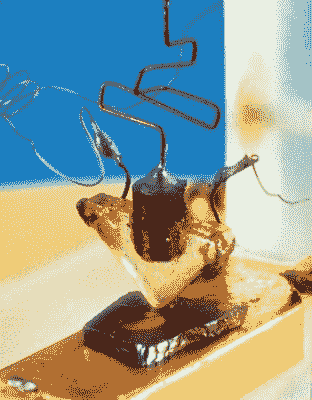

# 你应该读的书:创意工厂

> 原文：<https://hackaday.com/2017/07/20/books-you-should-read-the-idea-factory/>

你可能听说过贝尔实验室，但除了说出该实验室最著名的发现之外，你可能无法说出更多:晶体管的发明。这是技术研究的一项非凡成就，是我们所有现代数字社会赖以建立的电子开关。但是贝尔实验室的故事远远超出了这个单一的发现。事实上，晶体管的发展是实验室本身的缩影。

对纯科学的追求为伟大的发现奠定了基础。是的，晶体管是在实验室里构思、原型、验证，然后可靠地制造出来的。但使这成为可能的框架是材料研究人员和原型忍者，他们弥合了理论和物理之间的差距。这项技术是建立在现在的普通材料上的；如果没有实验室对开发纯物质工艺的改进，半导体物质是不可能的。纯物质经过可靠的掺杂，产生 n 型和 p 型物质，使二极管和晶体管成为可能。

第一个点接触晶体管【via[】](http://www.computerhistory.org/revolution/digital-logic/12/273)

首先要考虑的是为什么半导体器件是必要的，作者格特纳巧妙地讲述了这个故事。T 是一家通信公司，其早期的成就是用有线通信穿越整个大陆。传输的距离带来了信号衰减的问题，这是由于系统中每英尺铜的电阻都在增加。使这种链接起作用的唯一方法是通过一系列放大器来传递信号，这些放大器最初是用真空管建造的，而且数量巨大。使这成为可能的秘密，同样重要的是使其有利可图，是完善制造过程，导致长期持久和可预测的性能管。贝尔实验室送来了。

即使在可靠性上有了这样的飞跃，电子管仍然需要消耗相当多的能量来运行，并且需要定期更换。在洲际航线上，更换真空管是可能的。但是跨洋航线完全是另一回事。虽然北美和欧洲之间的成功连接是通过集成在电缆中的真空管放大器实现的，但电缆的构建又严重依赖于实验室的材料科学，显然需要更可靠的东西，这导致了半导体的发展，产生了固态晶体管。

顺便说一句，历史的其余部分干涉了这一努力。如果第二次世界大战没有发生的话，晶体管可能比现在早几十年出现，这转移了实验室的注意力。但正如这本书所详述的，即使这样也导致了惊人的发现，这些发现构建了我们的现代世界，因为来自贝尔实验室的大量科学家加入了战争努力，并随着无线通信和可能更重要的雷达的进步，移动了无线电技术的大山。

## 文档文档文档

也许贝尔实验室的故事最引人注目的是它的历史记录。使复述成为可能的不是一群历史学家，而是每一个工程师对文档的强制执行，就像宗教一样。每位研究人员都拿到了皮面工程笔记本，上面有一套简单的指南。

在贝尔实验室，没有餐巾纸背面计算这种东西。所有的事情都记录在这些笔记本上。每一个想法都被记录下来，任何被认为有前途的想法都由实验室的另一名成员签名见证。页面既没有被添加，也没有被撕掉，不正确的信息被整洁地划掉，并由这样做的人签名。这样做是为了专利程序的目的。但结果是一个惊人的过程库，它导致了人类历史上一些最伟大的科学飞跃。

## 令人眼花缭乱的天才

通过实验室的人才是伟大思想的集合。这一部分是时代的产物；大萧条期间和之后，从大学毕业的最聪明的人找不到更好的谋生方式。有了足够数量的人才，就不仅仅是金钱或稳定性，而是加入有史以来最优秀的思想家和技术人员群体的渴望。

## 贝尔实验室的教育学

乔恩·格特纳有一种真正的诀窍，让做出这些发现的人变得人性化。为了分享一个轶事，我重读了一个故事中的几段，这个故事是关于一个有前途的年轻学生在 20 世纪 30 年代上驾驶课的。他在麻省理工学院的教授听说了他的课外活动——对那个时代来说有点危险——并考虑让他停下来，以免他伟大的思想被人类遗忘。这是信息论之父克劳德·香农的介绍。

在组织内外分享知识和经验是贝尔实验室文化的一部分。在工作周和私人住宅举办跨学科研讨会是很平常的事。工程师和技术人员被鼓励在他们严格的任务之外工作，并在全国和国外旅行，出席研讨会，传播科学界的知识，而不是把信息锁在有围墙的花园里。

这些故事超越了贝尔实验室本身，涉及到像实验室校友比尔·肖克利创立英特尔这样的事情。他有发现人才的习惯，在创办新公司时，他把戈登·摩尔拉了进来。戈登的同名当然是摩尔定律。这本书里有太多这样的连接词，多得数不清。那些在实验室工作的人继续创建和发展加速技术革命的公司。

## 通信的历史

美国电话电报公司的故事是通信的故事。从一根电线，到一个因晶体管而成为可能的微波中继网络，这一切似乎都是为了直接连接。贝尔实验室开发了第一颗反射器形式的通信卫星，将信号从一个海岸反射到另一个海岸。随后是主动中继卫星，这是我们今天使用的卫星的最早祖先。

但直接连接的带宽仍然是可取的，对我来说，听到一个波导技术的巨大网络的故事是很了不起的，这个网络在被光纤的卓越性能推到一边之前几乎已经实现了。两件事使得纤维成为可能。一是快速开关激光技术的完善。激光器本身并不是贝尔实验室发明的，但允许快速开关、耐用激光器的技术却是。第二项发展是实验室设想的玻璃纤维制造的外部完善，但康宁的机构知识使之成为可能。

将系统连接在一起的是第一台现场可编程计算机。它们取代了机械交换，在面向未来的一次飞跃中，使美国电话电报公司系统成为一个信息网络，而不仅仅是一个电话系统。它们是早期蜂窝网络形成的关键，这种网络在贝尔实验室的辉煌时代即将结束时形成。

## 政府支持垄断

贯穿整个故事的是马贝尔的故事，这是美国电话电报公司数十年来的垄断，最初得到美国政府的支持，最终被美国政府打破。这篇评论太过简短，无法涵盖一切，但至少在几个方面，垄断使得这项科学研究成为可能。

作为垄断企业，美国电话电报公司有充足的资金支持他们的研发。贝尔实验室所有工程师的第一天工作包括为他们通过工作获得的所有专利支付 1 美元。作为维持垄断的让步，该公司将其所有专利许可给任何其他美国公司，几乎在所有情况下都是免费的。想一想吧。

从技术上讲，今天仍然有一个贝尔实验室的祖先。但这本书实际上并不是公司本身的故事。这是一个关于一群人的故事，是环境把他们聚集在一起，并挑战他们通过他们的工作来改变整个人类。你生活在他们创造的世界里。阅读乔恩·格特纳的《创意工厂》将会把你听过的无数故事串联起来，但你永远也不会理解它们作为一个整体有多么紧密的联系和迷人。