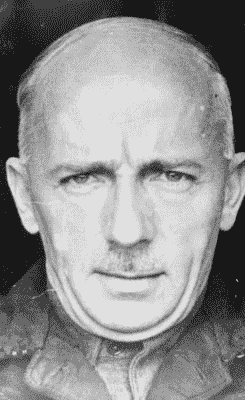
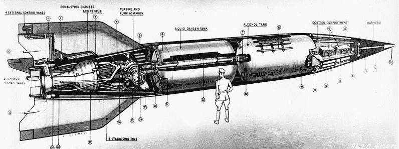

# 你应该读的书:沃尔特·多恩伯格的 V-2

> 原文：<https://hackaday.com/2017/11/03/books-you-should-read-v-2-by-walter-dornberger/>

在这个时代，我们可以在 YouTube 上观看巴克·罗杰斯(Buck Rogers)风格的火箭尾部着陆直播，很难想象甚至连最基本的火箭学概念都在激烈辩论的时代。当时，许多人认为,[液体燃料火箭的概念是不可能的,](https://hackaday.com/2017/08/11/books-you-should-read-ignition/),任何设计实用火箭动力运载工具的工作都是浪费时间和金钱。载人飞船、卫星通讯，更不用说登陆其他星球了；所有这些都被认为只不过是给儿童或特别爱幻想的成年人的娱乐。

Walter Dornberger (Bundesarchiv, Bild 146-1980-009-33 / CC-BY-SA 3.0)

这就是德国火箭开发项目负责人沃尔特·多恩伯格(Walter Dornberger)所写的 V-2 发生的世界。A-4/V-2 火箭计划(T3)的整个历史都在这本书里展开，从很早的时候多恩伯格和他的团队用火柴发射火箭，一直到二战结束时德国面对日益确定的失败疯狂地试图调动仍然不完整的 V-2 火箭。

对于像我一样对早期太空探索和 V-2 火箭开发着迷的人来说，这本书本质上是无与伦比的。它完全是以第一人称，通过多恩伯格自己的眼睛写的，在大多数地方读起来就像是对他在皮内姆 and 陆军研究中心的火箭开发基地的个人参观。多恩伯格参观了皮涅姆ünde 的实验室和工厂，描述了正在进行的研究和工作中的工程师的个人细节，这是你在其他任何地方都无法获得的。

但这本书不仅是对世界上第一个到达太空的人造物体如何被创造的个人描述，也是对工程师和支付账单的管理层如何经常与灾难性结果发生冲突的现实案例研究。多恩伯格和他的团队希望创造一种交通工具，有朝一日让人类到达太空，而纳粹政府有一个更加邪恶和紧迫的目标。但这不是一本关于战争的书——你将在 V-2 中读到的唯一的战斗发生在会议室，在那里，理解他们任务的巨大困难的工程师们徒劳地试图解释为什么德国军方想要的时间表和生产数量根本无法满足。

## 韦纳·冯·布劳恩

Wernher von Braun

被普遍认为是美国太空计划之父，也是二战中德国火箭发展的幕后策划者，[韦纳·冯·布劳恩](https://en.wikipedia.org/wiki/Wernher_von_Braun)自然在 *V-2* 中占有相当突出的位置。多恩伯格是冯·布劳恩在德国火箭项目中的上司，虽然他经常评论这位年轻工程师的才华，但他明确表示，V-2 火箭的开发不是任何一个人的成就。

像任何优秀的领导者一样，多恩伯格承认团队每个成员的贡献，从在皮涅姆ünde 开发超音速风洞的工程师到负责用手持摄像机记录每枚火箭试射的人。多恩伯格从来没有把 V-2 火箭的创造者归功于任何一个人，甚至是他自己。事实上，在书的结尾，他说这样的想法在如此规模的项目中是不可能的:

> “无论是 V-2 还是 V-1，或者是近几十年来任何其他伟大的技术发明，都不能与任何一个人的名字联系在一起。孤独的创造性天才的时代已经结束了。这样的成就只能是一个匿名的研究专家团队无私、严肃、和谐工作的成果。”

## 早期火箭发展

历史爱好者可能知道，在德国认真发展火箭的十多年前，[罗伯特·戈达德](https://en.wikipedia.org/wiki/Robert_H._Goddard)已经发射了几枚(尽管很小)液体燃料火箭；证明这个概念是可能的。但戈达德的资金相对有限，他的工作在美国从未得到应有的重视。当时还在上大学的冯·布劳恩对戈达德的成就非常着迷，并相信他展示的基础技术可以放大到更大的飞行器上。

在第二次世界大战之前，不断恶化的美德关系使得直接的信息交流变得不可能，而且由于缺乏具体的信息，多恩伯格的团队将不得不基本上从零开始研制他们自己的火箭。从不同形状的燃烧室和喷嘴到发动机本身的材料，许多想法都在短时间内被尝试和判断。在这一阶段出现了许多灾难性的失败，在 V-2 到达发射台之前很久就记录了该计划的第一批人员伤亡。

Apollo LES Test

早些年，就连汽车的基本外形也备受争议。一些实验飞行器发射时，火箭发动机在机头，从倾斜的排气喷嘴发射，但很快发现不切实际。有趣的是，这种安排最终找到了用途:几乎所有载人航天器上都有发射逃逸系统。

稳定飞行中的飞行器是另一个问题。早期的想法是让火箭像炮弹一样在它的长轴上旋转，但这将导致推进剂由于离心力而沿着坦克的侧面上升。一个折衷方案是让火箭头部的一个加重部分独立于火箭本身旋转，以达到陀螺效应，但这被证明太复杂了。

经过多次反复，V-2 火箭的最终形式被开发出来。运载工具的总体布局:后置点火发动机、四个稳定翼和直列式推进剂贮箱，构成了我们今天仍然沿用的火箭设计的基础。

## 开发与生产

在这本书的中途，多恩伯格开始从开发 V-2 的技术方面转移，转到将其投入生产的物流方面。由于这是一种武器，数百，最终数千，将需要制造；在核武器出现之前的日子里，拥有几枚这样的远程导弹对战争来说是无关紧要的。

当多恩伯格迫切要求更多的资源来使火箭进入大规模生产时，他与一个专门制造机车的小组合作。军方对生产火箭的复杂性一无所知，他们认为建造火车的经验足以使他们胜任这项任务。火箭的各个部分被送到不同的工厂，每个工厂每月生产多少个部件的时间表被制定出来。

鉴于(当时)极其复杂的部件设计，很少有工厂能够接近他们的生产目标，即使他们交付了承诺数量的部件，质量也远远低于要求的标准。多恩伯格称，在生产初期组装火箭的成功率为 10-20%。

工程师不断改进和完善 V-2 的愿望使情况变得更加复杂。由于设计没有被冻结，实际上在某些方面甚至没有完成，工厂偶尔会发现自己在过时的蓝图上运作。当生产团队向工程部门询问新计划以便更新生产线时，工程部门会回答说他们还需要更多时间。多恩伯格最终冻结了所有的设计，除了最关键的变更，但到了那个时候，由于沟通不畅，大量的时间和金钱被浪费了。

## 纳粹的麻烦

你不可能写一本关于 1940 年代德国武器发展的书而不提到纳粹，而 *V-2* 也不例外。书中有各种各样的纳粹，包括与希特勒本人的几次会面，但总体而言，多恩伯格将他遇到的纳粹官员描绘成更多的*霍根的英雄*而不是*夺宝奇兵。*

几乎在每一个案例中，多恩伯格都把他们描绘成暗淡的漫画，经常详细描述他们偶尔超重或不健康的外表。每当一个纳粹分子出现在佩内姆 nde，多恩伯格或他的一名工程师总是用一个完美的反驳来结束他们的抱怨，让他们匆匆离开，直到下一次遭遇。所缺少的只是一个小胡子的旋转或者一声大喊“下次我会抓到你的！”让他与他们之间的卡通式互动变得完整。

但这并不奇怪，在事件发生仅 10 年后写这本书，多恩伯格显然想与政权保持距离。尤其是自从他受雇于贝尔飞机公司并在当时为美国国家航空航天局开发 X-15 之后。

## 为什么你应该阅读 *V-2*

我承认我对 V-2 火箭有点着迷。在我的书架上，有一个从皮涅姆ünde 坠毁的 V-2 上回收的燃料喷射器，就放在我根据德国原始蓝图设计的 3D 打印的汽车剖面模型旁边。所以当我看到这本关于易贝的书的早期精装版时，我必须拥有它。

虽然我最初拿起这本书是因为我个人对这个项目的兴趣，但读完这本书后，我意识到在阅读如此详细地描述如此规模的工程项目时，有许多经验可以借鉴。许多“不可能”的问题不得不用非常规的方法来解决。坚持假设和实验的科学原则的重要性被反复解释。构建大规模生产的现实与构建一次性测试文章的现实之间存在着巨大的差异。

我认为，多恩伯格在书中很早就使用的一句话或许可以最好地表达出 V-2 的整体意义:

> “我们很可能会被我们面前任务的多样性所吓倒。幸运的是，大部分困难我们还完全不知道。我们以缺乏经验的勇气来解决我们的问题，没有考虑到解决这些问题可能需要的时间。”

幸运的是，我们中没有人会发现自己参与生产大规模毁灭性武器；但是在第五章第二节中详细描述的方法对于那些想要从无到有的人仍然有效，对于那些曾经看到一个问题并且想知道是否有更好的方法来解决它的人仍然有效。