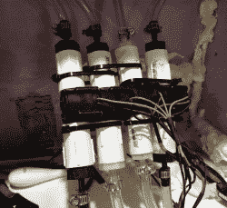

# 布泽尔告诉互联网你喝了多少酒(如果你想让它知道的话)

> 原文：<https://hackaday.com/2018/05/28/boozer-tells-the-internet-how-much-you-drink-if-you-want-it-to/>

在过去的几年里，Reddit 用户[callingyougoulet]已经[创造了 Boozer](https://imgur.com/a/7jnrc) ，这是一个 DIY 啤酒分配器，可以记录你的小桶里还剩多少啤酒。安装在 Keezer(一个包含啤酒桶和水龙头的冰柜)中的[callingyougoulet]的分配器使用树莓 Pi 来跟踪事情。一系列的流量传感器确定有多少液体通过它们，当饮料被倒出来时，可以计算出你倒了多少和你还剩多少。

从卧式冰柜开始，[callingyougoulet]建造了一个漂亮的木制围栏，并在顶部安装了一个塔来支撑水龙头。冰柜的顶部覆盖着漂亮的花岗岩瓷砖，一些 LED 重点照明为最终产品增添了色彩。然而，为了拿到桶里面的花岗岩要花一些时间(大约 20 分钟)。)

冰箱内有 Ra  spberry Pi 和四个流量传感器，每个传感器都连接到 Pi 上的一个 GPIO 端口。经过一些校准后，Pi 上运行的 Python 代码可以计算出一个非常接近的液体注入量估计值。冰箱里还有一个温度传感器，这样你就可以知道你的啤酒有多凉。

如果构建就此停止，这将是一个很棒的项目，但是[callingyougoulet]添加了 twitter、Slack 和 MQTT 输出选项，这样家庭自动化系统(或整个互联网)就可以知道你喝了多少，什么时候喝的，更重要的是，你可以知道你的桶里还剩多少！网站上有一些非常酷的小桶冷却装置，例如，[一个从头开始建造的小桶冷却装置](https://hackaday.com/2016/05/19/beautiful-kegerator-built-the-hard-way/)和[一个非常优雅的廉价小桶冷却装置](https://hackaday.com/2014/01/19/an-elegant-kegerator-for-less-than-100/)看看它们的创意吧！

Via [Reddit](https://www.reddit.com/r/Homebrewing/comments/8lc1wp/introducing_boozer_raspberrypi_controlled/?st=jhi7e85v&sh=9a6b7afd) 。