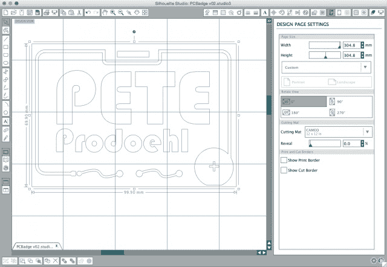
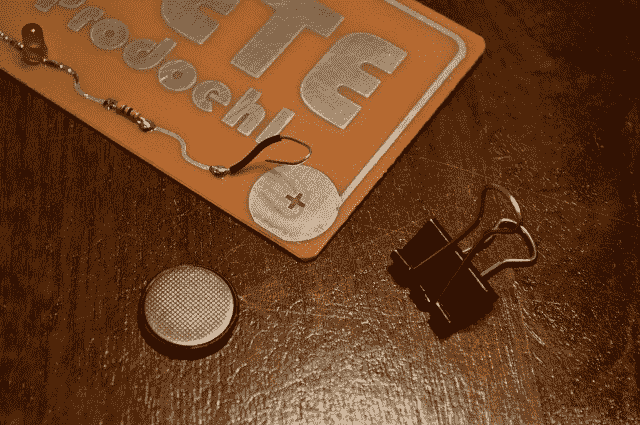

# 名字标签的好主意

> 原文：<https://hackaday.com/2016/06/27/bright-idea-for-a-name-tag/>

正在寻找一个快速的 DIY 项目，以便在下一次商业活动或创客博览会上脱颖而出？以[Pete Prodoehl]的书为蓝本，制作自己的姓名标签[，并配以闪烁的 LED](http://rasterweb.net/raster/2016/06/14/pcb-name-tag/) ！

极简，却又华而不实(抱歉！)，这个快速的项目可以用很少的资源在几个小时内完成，是展示你 DIY 手工作品的好方法。

在 Inkspace 中布局基本设计并将其导出为 DXF 文件，[Prodoehl]在 Silhouette Studio 中打开它，以便可以剪切乙烯基模板，然后粘贴到他手头的一个姓名标签大小的铜板上。在 75 分钟的蚀刻过程中，这个切口非常方便——他使用了过氧化氢、醋和盐的混合物——在快速涂上一层液态锡后，他准备开始焊接。

由于缺乏足够小的钻头，[Prodoehl]临时凑合着将一个脉冲红色 LED 和电阻焊接到名字标签的表面，你几乎看不到这是一个经验丰富的制造商的标志！一个活页夹将 CR2032 电池固定在适当的位置，并通过一根短电线完成电路。钻一个洞，加上一个名签夹，这个项目很快就完成了。

虽然我们之前在 Hackaday 上看到过一些非常复杂的名字标签，但[Pete Prodoehl 的]设计优雅简洁，是新的和有经验的制造商展示他们技能的好方法。

[via [RasterWeb](http://rasterweb.net/raster/2016/06/14/pcb-name-tag/)