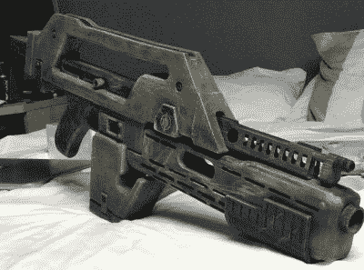
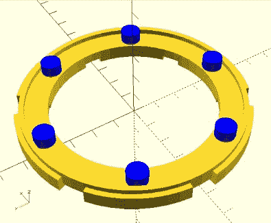
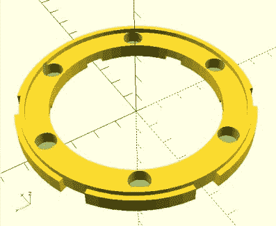
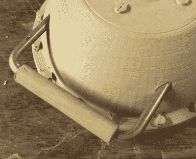
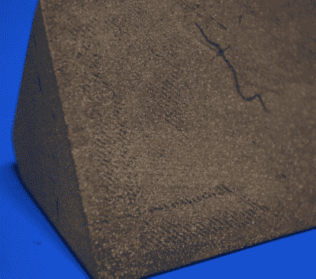
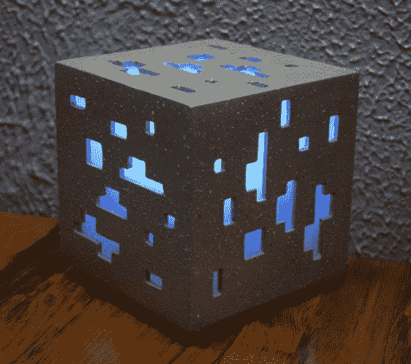
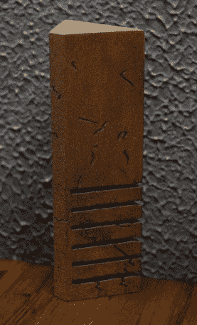

# 用 3D 打印将小说变成现实

> 原文：<https://hackaday.com/2018/04/02/bringing-fiction-to-life-with-3d-printing/>

我几乎每天都打印一些东西，在过去的几年里，我已经创造了数百个实用的项目。修理我的汽车的零件，专用工具，科学仪器，等等。对我来说，很难想象回到一个我没有能力在家快速创造和复制实物的时代。我可以完全诚实地说，对我个人来说，这绝对是一项改变生活的技术。

但对我生活中的其他人，我的朋友和家人来说，3D 打印机是一个神奇的盒子，可以从他们最喜欢的游戏和电影中生产小工具、武器和角色。没人想看我在早上上班前为让我女朋友的 1980 年本田重新上路而做的零件，他们想看我为我女儿做的《我的世界》积木。我无法让任何人对我制作的检测水样中藻类密度的装置感兴趣，但他们都想让我为他们从*的第五元素*中提取一组石头。

我最近刚刚完成了这样一个项目，一个 3D 打印的帽贝地雷，来自*战地 1* ，我想我会分享一些关于把小说变成非小说的最佳实践的想法。

## 获取模型

在打印之前，您需要对其进行建模。或者理想情况下，让别人为你做模型。一般来说，当涉及到有相当多粉丝的游戏或电影时，你应该能够很容易地找到 3D 模型来工作。除非它是只有你和你的朋友圈子才感兴趣的晦涩难懂的东西，否则很有可能有人已经在努力制作一个高质量的 3D 模型，你可以以此作为你项目的基础。

[*Alien* Pulse Rifle](https://www.myminifactory.com/object/3d-print-aliens-alien2-pulse-rifle-57965) by Nathan Williams

如果你幸运的话，你可以在像 [Thingiverse](https://www.thingiverse.com/explore/popular/models/props) 或 [MyMiniFactory](https://www.myminifactory.com/category/cosplay) 这样的网站的“道具”类别中找到一个合适的模型，理想的情况是甚至有一些最终喷漆产品的图片来给你一个指导。这些模型可能不是 100%适合你的需求，但它们可能会让你非常接近，而不是从头开始。

如果你在普通网站上找不到你想要的东西，并且你很想把它做出来，你可以把搜索范围扩大到像 [CGTrader](http://www.cgtrader.com/) 或 [Renderosity](https://www.renderosity.com) 这样的网站。但是请记住，这些模型并不总是适合打印。有许多*人只是为了好玩而简单地从他们最喜欢的虚构世界中 3D 建模一些东西，从来没有打算真的打印出来。其特点是模型要么没有合适的真实尺寸，要么有太多的表面细节，无法在标准的桌面 3D 打印机上打印。你仍然可以使用这些模型，但它们需要一些工作。*

## 修改 STLs

在一个完美的世界里，你可以找到你需要的精确模型，并且它可以被打印出来，而不需要任何麻烦。但是我们并不是生活在一个完美的世界里，所以更多的时候你需要摆弄 STL 来得到你需要的设计。然后你会发现，如果你还不知道的话，修改 STL 文件 ***会吸*** 。

问题是，STL 文件并不是真的要被修改。这非常类似于 GIMP 或 Photoshop 中导出的图像是如何被“平面化”的，失去了用于创建它的单独图层。STL 是一个单独的对象，它不容易被分解成主要的组件。理想情况下，你下载的任何模型都应该有用来创建 STL 的“源”,但是在大多数情况下，它们没有，所以我们必须玩好手中的牌。

总的来说，这意味着你必须加载你想要修改的 STL 文件，或者增加或者减少新的元素来获得想要的效果。对于 limpet 矿，我很幸运地在 Thingiverse 上找到了一个很好的模型，但是我想删除原始模型的某些部分。

为了腾出空间在底座内插入钕磁铁，我将底座的原始 STL 导入 OpenSCAD，创建了一个排列成圆形的短圆柱体阵列，最后使用`difference()`命令将其从原始 STL 中减去。

  Aligning the cylinders  Subtracting from the original STL

类似的伎俩被用来删除矿井顶部的“钥匙”，在它的位置留下一个空洞。

## 不要印刷你不需要的东西

 这就引出了下一点:不要浪费时间和材料去印刷一些你可以从别处获得的东西。你可以在网上找到的许多设计都会在设计中加入螺母、螺栓和螺钉头。如果你想用最少的努力敲出一些东西，打印这些小细节就足够了，但为什么不使用真正的硬件呢？给你的打印项目添加真实的硬件将会给它们一个更加真实的最终外观，你需要做的就是在 STL 上打一个洞来插入它。

对于帽贝矿，我走遍了易贝，直到我发现了一个古老的发条钥匙，它看起来足够接近游戏中使用的那个，大小也差不多。然后，我只是把它插入上一步创建的洞。我甚至没有把它粘进去，转动和取出钥匙的能力是最终产品的一个很好的交互功能。

我还用我在钻床上挖空的圆钢和木榫代替了印刷的把手。我对这个添加特别满意，因为它给了最终的矿一个更真实的外观，这是很难用塑料颜料复制的。

## 结束工作

Print striations barely visible under textured paint

毫无疑问，制作一个好看的道具最重要的部分是收尾工作。打印它，甚至添加真正的硬件，也只能做到这一步。除非你把精力放在打磨和油漆印刷模型上，否则它看起来永远也不会像挤出的塑料和一些金属。

我已经详细介绍了完成 3D 打印的基本方法，所以我在这里不再赘述。但是有一点我在上一篇文章中没有真正提到:事情并不总是需要完美的。事实上，他们*很少*需要完美。现实世界中的物体通常是粗糙的，你可以在完成过程中利用这一点。

如果你在制作某种类型的武器，战斗伤害是必不可少的。如果你在印刷品上有一个丁或尼克，考虑利用这一点，而不是试图填补它。尝试用金属色画低点，然后在它上面画最后的颜色。然后你可以用一些砂纸有策略地去除上面的颜色，露出下面的“金属”。这将产生凹痕的效果，使油漆剥落。

同样，如果物体的纹理很粗糙，不要浪费时间打磨光滑。几层填充底漆和纹理漆会掩盖印刷条纹。

    

## 熟能生巧

这是我在最近的这个项目中想到的一些小技巧，但是要制作好看的道具，不仅仅是在网上阅读一些提示。像任何其他技能一样，将这些想法付诸实践需要练习。这是一种恶性循环:为了擅长生产高质量的 3D 打印物体，你需要不断制造更多的 3D 打印物体。你的货架上很快就会摆满各种完成程度的道具和玩具。当然，还有比被整洁的小饰品包围更糟糕的命运。

Hackaday 的好读者们有没有自己的技巧和诀窍来把塑料卷变成值得在你的货架上展示的东西？